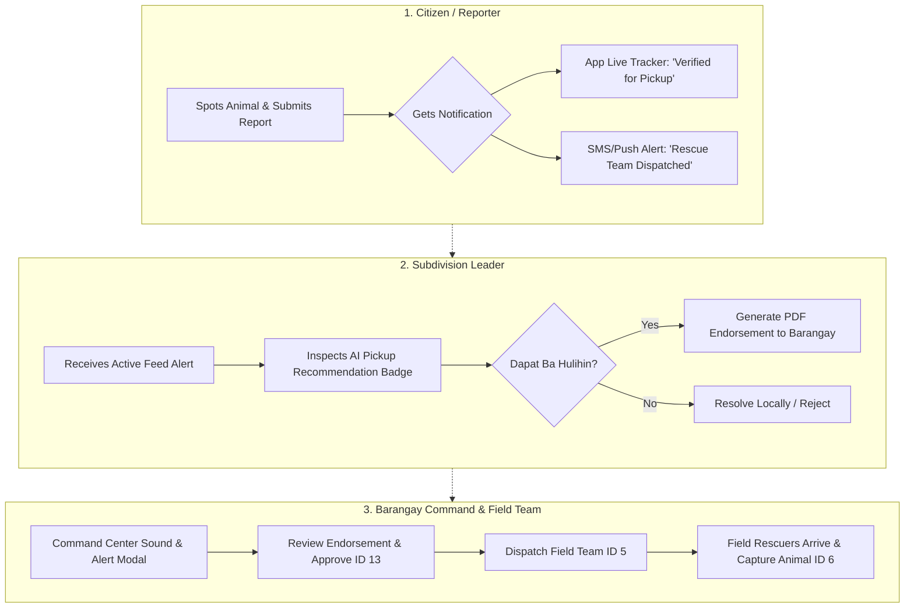

# 🐾 StraySafe 2.0: Animal Pickup Determination & Stakeholder Notification Guide

This document defines **how each stakeholder role—Resident/Citizen, Subdivision Leader, and Barangay Command & Field Rescue Team—determines if a stray animal requires physical pickup (rescue/impoundment)**, and **how the system notifies each role** throughout the report lifecycle.

---

## 🎯 Executive Summary & Core Objective

In stray animal management, **not every reported animal requires immediate impoundment or field pickup**. 
- Picking up an accompanied pet causes unnecessary conflict and facility congestion.
- Failing to pick up an aggressive or injured animal creates severe safety hazards.

To streamline operations, StraySafe 2.0 uses an **AI-Assisted Pickup Readiness Scorecard**, **Role-Specific Notification Channels**, and a **3-Tier Decision Matrix** to inform all parties when an animal must be picked up.

---

## 📊 1. Pickup Determination Criteria Matrix ("Dapat Ba Hulihin o Hindi?")

The table below outlines the criteria used by AI, Subdivision Leaders, and Barangay Staff to determine whether physical pickup is required.

| Category | Decision | Criteria & Behavioral Indicators | System AI Flag | Mandatory Action |
| :--- | :---: | :--- | :--- | :--- |
| **CRITICAL / EMERGENCY** | 🔴 **MUST PICK UP IMMEDIATELY** | • Aggressive behavior (bites, growling, chasing residents)<br>• Suspected Rabies (excessive salivation, disorientation, unprovoked attacks)<br>• Severe physical injury, open wounds, or bleeding<br>• Trapped in dangerous areas (drainage, highway)<br>• Deceased animal causing biohazard | `Priority: EMERGENCY`<br>`Urgency: 10/10`<br>`Pickup: REQUIRED` | Auto-escalate to Barangay Staff Command Center. Immediate dispatch of Field Rescue Team. |
| **HIGH / MODERATE** | 🟡 **CONDITIONAL PICKUP** | • Roaming pack (2+ strays causing disruption)<br>• Unattended stray without collar/tag in public zone<br>• Sick, malnourished, or weak stray animal<br>• Repeat roaming offender reported multiple times<br>• Unidentified animal near school/playground | `Priority: HIGH / MEDIUM`<br>`Urgency: 6-8/10`<br>`Pickup: RECOMMENDED` | Leader reviews report, verifies location, and generates PDF Endorsement to Barangay for scheduled pickup. |
| **LOW / RESOLVED LOCALLY** | 🟢 **DO NOT PICK UP** | • Owned pet briefly roaming inside private yard<br>• Pet wearing registered QR Tag/Collar with owner nearby<br>• Ear-notched community stray (TNR Program - Sterilized)<br>• Animal already left the area prior to verification<br>• Claimed locally by owner before dispatch | `Priority: LOW`<br>`Urgency: 1-3/10`<br>`Pickup: NOT NEEDED` | Subdivision Leader marks status as `Resolved Locally` (Status ID 11) or `Rejected` (Status ID 3). |

---

## 🔔 2. How Stakeholders Know If Animal Needs Pickup (Role Breakdown)



---

### 👤 2.1 Resident / Citizen (Reporter & Community)

How the reporter or surrounding community knows an animal needs to be picked up, and stays informed:

#### 🟢 Notification Indicators:
1. **AI Pickup Assessment Badge on Report Summary:**
   - After submitting a report, the citizen sees an initial AI assessment banner:
     - `⚠️ Pickup Recommended: High Safety Risk` or `ℹ️ Local Verification Pending`.
2. **Real-Time Visual Progress Tracker (`/citizen/reports`):**
   - The status step-bar updates dynamically:
     - `Reported` ➡️ `Verified (Pickup Recommended)` ➡️ `Approved for Rescue` ➡️ `Rescue Team Dispatched` ➡️ `Picked Up`.
3. **Automated SMS & In-App Push Notifications:**
   - **Verification Alert:** *"Your report for the stray dog at Elm St. has been verified by the Subdivision Leader for Barangay Pickup."*
   - **Dispatch Alert:** *"Barangay Field Rescue Team #2 is en route to your reported location. Estimated arrival: 15 mins."*
   - **Completion Alert:** *"The stray animal has been successfully secured by rescuers and brought to the Barangay Holding Facility."*
4. **Community Hazard Alert Feed (For Neighbors):**
   - If an aggressive stray requires urgent pickup, residents within the same geofence receive a broadcast safety warning: *"Alert: High-risk stray pickup active near Central Park. Please keep pets indoors."*

---

### 🛡️ 2.2 Subdivision Leader (First Responder / HOA Verifier)

How the Leader determines if an animal needs to be picked up, and notifies authorities:

#### 🟢 Decision & Notification Indicators:
1. **Active Feed Recommendation Banners (`/subd/reports`):**
   - Incoming report cards feature visual system indicators:
     - **Badge `[RECOMMEND PICKUP: HIGH RISK]`** (Red): AI detected rabies symptoms, aggression, or severe injury.
     - **Badge `[CHECK LOCAL OWNER]`** (Yellow): AI detected possible collar or pet match.
2. **Interactive Decision Checklist (Endorsement Assistant):**
   - When reviewing a report, the leader opens a modal asking:
     - [ ] *Is the animal aggressive or posing immediate hazard to residents?*
     - [ ] *Is the animal severely injured or sick?*
     - [ ] *Is the animal uncollared and without a local owner claiming it?*
   - Checking 1 or more boxes automatically sets **Pickup Required = True**.
3. **PDF Endorsement Generator:**
   - If pickup is required, tapping **Verify & Escalate** automatically embeds the pickup reason into an official **Barangay Endorsement PDF** and sends it directly to the Barangay Command Center (Status ID 4).
4. **Dispatch Status Notification:**
   - The leader receives an SMS/App notification when the Barangay accepts the endorsement and dispatches a team: *"Barangay Staff has approved endorsement #REP-2026-089. Rescue team assigned."*

---

### 🏛️ 2.3 Barangay Operations Staff & Field Rescue Team

How the operational staff knows an animal needs pickup, assigns field units, and executes field operations:

#### 🟢 Decision & Notification Indicators:
1. **Command Center Tactical Queue (`/brgy/rescue-requests`):**
   - Verified reports automatically sort to the top of the **Pickup Queue** based on Priority Level (`EMERGENCY` > `HIGH` > `MEDIUM`).
   - Reports marked for pickup display a high-contrast **"PICKUP REQUIRED"** alert header with estimated location coordinates.
2. **Audio & Popup Emergency Notification:**
   - For high-priority pickup requests (e.g., rabies risk, biting incident), the Command Center triggers a high-audibility chime and full-screen alert modal:
     - *"NEW URGENT PICKUP REQUEST: Aggressive Stray reported in Selera Homes - Block 4."*
3. **Field Rescue Team Mobile / PWA Task Card (`/brgy/operations`):**
   - The assigned field rescue team receives a mobile notification with direct operational payload:
     - **Animal Photo & Description:** (e.g., Brown Medium Stray Dog, Limping).
     - **GPS Map Navigation:** Direct route to reported street/landmark.
     - **Pickup Urgency & Hazard Notes:** (e.g., *Caution: Aggressive, carry catch-pole and protective crate*).
4. **Digital Proof of Pickup Confirmation:**
   - Upon securing the animal, field rescuers tap **"Mark as Picked Up"** (Status ID 6) on their PWA interface and upload visual proof photo.
   - This instantly updates the status across the entire system, notifying both the **Subdivision Leader** and the **Citizen Reporter**.

---

## 🛠️ 3. Technical Implementation & Data Schema

To support pickup detection and notifications in the StraySafe codebase, the following fields and routes are integrated:

### 🗄️ Database Schema Additions (`reports` table)

```sql
ALTER TABLE reports ADD COLUMN requires_pickup BOOLEAN DEFAULT FALSE;
ALTER TABLE reports ADD COLUMN pickup_urgency_score INT DEFAULT 0; -- 1 to 10
ALTER TABLE reports ADD COLUMN pickup_reason VARCHAR(255); -- e.g., 'Rabies Risk', 'Biting Hazard', 'Severe Injury'
ALTER TABLE reports ADD COLUMN field_team_assigned_id INT NULL;
```

### 📡 API Notification Trigger Workflow (`backend/app/routes/reports.py`)

```python
@router.post("/reports/{report_id}/verify-pickup")
def verify_pickup_and_notify(report_id: int, payload: PickupVerificationSchema):
    # 1. Update report state to Escalated (Status 4) or Approved (Status 13)
    report = db.get_report(report_id)
    report.requires_pickup = True
    report.pickup_reason = payload.reason
    report.status_id = 4 # Escalated to Barangay
    db.commit()

    # 2. Trigger Notifications
    # Notify Barangay Command Center
    send_brgy_command_alert(
        title="New Pickup Required",
        message=f"Report #{report_id} verified for pickup: {payload.reason}"
    )

    # Notify Citizen Reporter
    send_push_notification(
        user_id=report.user_id,
        title="Pickup Verified",
        body="Your report has been endorsed for Barangay animal pickup."
    )

    return {"status": "success", "message": "Pickup status updated and notifications sent."}
```

---

## 🎨 4. Frontend Visual Indicators & Badges

| UI Component | Role | Visual Indicator | Meaning |
| :--- | :--- | :--- | :--- |
| **Pickup Status Badge** | Citizen / Subd Leader | `<Badge color="red">🚨 Urgent Pickup Required</Badge>` | High priority rescue team needed immediately. |
| **Local Action Badge** | Subd Leader | `<Badge color="yellow">🏠 Local Check Needed</Badge>` | Verify if pet belongs to neighbor before calling Barangay. |
| **Dispatch Ready Pill** | Barangay Staff | `<Badge color="blue">🚛 Ready for Dispatch</Badge>` | Endorsement letter verified; operational team ready. |
| **Secured Badge** | All Roles | `<Badge color="green">✅ Picked Up & Secured</Badge>` | Animal is safely captured and en route to holding. |

---

## 💡 5. Key Recommendations for Operational Excellence

1. **Automated AI Pre-Scoring:** Allow the backend AI model (YOLOv8 + OpenCV risk engine) to calculate an initial `pickup_urgency_score` (1-10) during Step 3 of submission so leaders immediately see high-risk cases.
2. **SMS Alerts for Offline Rescuers:** Send fallback SMS notifications to field rescue personnel in areas with poor cellular data signal.
3. **Transparent Status Tracking:** Ensure citizens see *why* an animal was picked up or why pickup was deferred (e.g. *Animal claimed by owner locally*), reducing community confusion and duplicate reporting.
