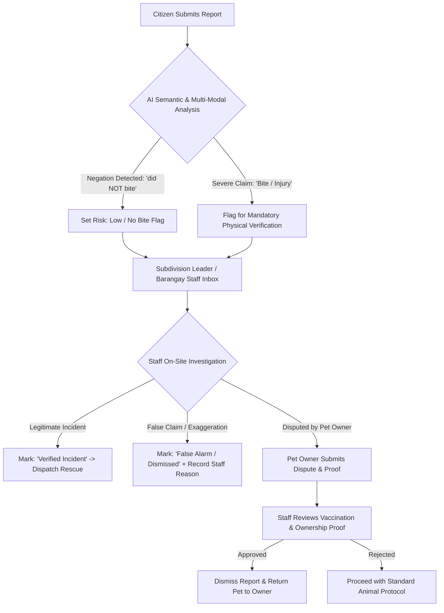

# StraySafe 2.0: False Report Prevention & Dispute Management System Specification

## 1. Executive Summary & Problem Context

In stray animal management and community safety systems, reports submitted by citizens are occasionally **inaccurate, exaggerated, or intentionally fabricated**. Common real-world scenarios include:

1. **Linguistic Misunderstanding vs. Keyword Confusion:**
   - A reporter writes: *"Tahol nang tahol yung aso sa tapat ng gate pero hindi naman nangagat kahit kanino."* (The dog kept barking in front of the gate but did NOT bite anyone).
   - If an automated system relies on naive keyword matching, the word *"nangagat"* (bite) might wrongly trigger an emergency "High Risk Bite" alert.
2. **Exaggerated or Malicious False Reports:**
   - A resident files a report falsely stating that a neighbor's dog bit a child to force rapid animal control impoundment, when in reality no physical bite or injury occurred.
3. **Misidentification of Owned Resident Pets:**
   - A peaceful resident pet that briefly stepped out of the owner's gate is reported as a dangerous stray animal.

To protect both **community safety** and **animal welfare**, StraySafe 2.0 establishes a multi-tiered defense consisting of **AI Semantic Negation**, **Staff On-Site Verification**, and **Pet Owner Dispute Mechanisms**.

---

## 2. Architecture & Multi-Tiered Defense Model



---

## 3. Core Feature Specifications

### 3.1 AI Semantic Analysis & Credibility Layer
- **Full-Context Negation Understanding:**
  - The Gemini model analyzes complete sentences and negations across English, Tagalog, and Taglish (`"hindi naman nangagat"`, `"wala namang kinagat"`, `"never bit anyone"`).
  - Explicitly separates **Actual Bites** from **Near-Misses / Attempted Bites** and **Human Fear**.
- **Evidence Cross-Checking:**
  - When severe flags (`behaviorActualBite: true` or `behaviorInjury: true`) are detected without matching visual trauma in uploaded media, the system marks the assessment as **`"Unverified Claim - Physical Verification Required"`**.
- **AI as Decision Support:**
  - AI outputs are clearly labelled as **Suggestions** for human staff, ensuring automated algorithms never trigger punitive or impoundment actions without human review.

---

### 3.2 Staff Investigation & Workflow Management

#### Report Status Lifecycle:
| Status | Description | Actionable By |
| :--- | :--- | :--- |
| `Pending Review` | Report newly filed, awaiting staff screening. | Subd Leader / Brgy Staff |
| `Under Investigation` | Staff is inspecting the location or interviewing witnesses. | Subd Leader / Brgy Staff |
| `Verified Incident` | Staff confirmed the incident is genuine; rescue or capture dispatched. | Subd Leader / Brgy Staff |
| `False Alarm / Dismissed` | Staff found no evidence or confirmed false/exaggerated claim. | Subd Leader / Brgy Staff |
| `Disputed` | Pet owner submitted a formal dispute against the report. | Pet Owner / Resident |
| `Resolved` | Case closed, animal rescued, claimed, or dismissed. | Admin / Staff |

#### Staff Review Actions in UI:
When reviewing reports in `SubdViewReport.tsx` or `BrgyRescueRequests.tsx`:
1. **Quick Action: "Mark as False Alarm / Invalid"**
   - Modal prompt asking for staff findings:
     - Reason category: `No Animal Found`, `Exaggerated/No Bite Occurred`, `Neighbor Dispute / Harassment`, `Duplicate Report`.
     - Investigation Notes: Textarea for field inspection details.
2. **Audit Trail:**
   - Records which staff member dismissed the report, timestamp, and verification findings.

---

### 3.3 Pet Owner Dispute & Claim Mechanism

For registered pet owners whose pets are falsely reported:
1. **Counter-Claim / Dispute Submission:**
   - Accessible via `PetClaimsDashboard.tsx` or `ResidentPet.tsx`.
   - Allows owner to upload:
     - **Anti-Rabies Vaccination Certificate**
     - **Proof of Home Confinement / Photo of Pet at Home**
     - **Owner Statement** explaining the circumstances.
2. **Notification to Subd Leader:**
   - Alerts the Subdivision Leader that a dispute has been lodged before animal control actions are finalized.

---

### 3.4 Reporter Accountability & Anti-Abuse Controls

1. **Pre-Submission Disclaimer:**
   - When filing a report with high-severity categories (e.g., "Animal Bite / Attack"), show a warning dialog:
     > *"Submitting false incident reports or fraudulent bite claims is a violation of community bylaws and barangay ordinances."*
2. **Reporter Trust Rating:**
   - The backend tracks the ratio of verified vs. dismissed reports per user account.
   - Accounts with repeated dismissed false reports are flagged for review by Admin/Subdivision Leaders.

---

## 4. Recommended Database Schema Additions

```sql
-- Extensions to the reports table
ALTER TABLE reports ADD COLUMN IF NOT EXISTS verification_status VARCHAR(50) DEFAULT 'unverified';
-- Values: 'unverified', 'verified_true', 'false_alarm', 'disputed'

ALTER TABLE reports ADD COLUMN IF NOT EXISTS verification_notes TEXT;
ALTER TABLE reports ADD COLUMN IF NOT EXISTS verified_by_user_id INTEGER REFERENCES users(id);
ALTER TABLE reports ADD COLUMN IF NOT EXISTS verified_at TIMESTAMP;

-- Table for resident disputes against false reports
CREATE TABLE IF NOT EXISTS report_disputes (
    id SERIAL PRIMARY KEY,
    report_id INTEGER NOT NULL REFERENCES reports(id) ON DELETE CASCADE,
    resident_user_id INTEGER NOT NULL REFERENCES users(id),
    dispute_reason TEXT NOT NULL,
    vaccination_card_url VARCHAR(255),
    supporting_photo_url VARCHAR(255),
    status VARCHAR(50) DEFAULT 'pending', -- 'pending', 'accepted', 'rejected'
    reviewer_notes TEXT,
    created_at TIMESTAMP DEFAULT CURRENT_TIMESTAMP,
    resolved_at TIMESTAMP
);
```

---

## 5. UI/UX Component Specifications

### 5.1 AISuggestionPanel (`AISuggestionPanel.tsx`)
- Display an **Evidence Verification Notice** when a bite or injury is detected:
  ```tsx
  {behaviorActualBite && (
      <div className="bg-rose-500/10 border border-rose-500/20 p-2.5 rounded-xl flex items-center gap-2">
          <span className="text-base">⚠️</span>
          <p className="text-[10px] text-rose-300 font-semibold">
              Bite claimed in report description. On-site staff verification and victim interview recommended before dispatch.
          </p>
      </div>
  )}
  ```

### 5.2 Subdivision Review Modal (`SubdViewReport.tsx`)
- Add button: **"Flag / Dismiss as False Report"** with a confirmation dialog and notes field.

---

## 6. Implementation Roadmap

1. **Phase 1: Status & UI Badges (Immediate)**
   - Add `"False Alarm / Dismissed"` and `"Disputed"` status tags in the frontend and backend status enums.
   - Display on-site verification reminders in `AISuggestionPanel.tsx`.

2. **Phase 2: Staff Investigation Workflow**
   - Add modal for Subdivision Leaders and Barangay Staff to record field inspection findings and dismiss false reports.

3. **Phase 3: Citizen Dispute & Pet Protection**
   - Implement the dispute form in `PetClaimsDashboard.tsx` allowing resident pet owners to counter-claim false accusations with vaccination proof.
