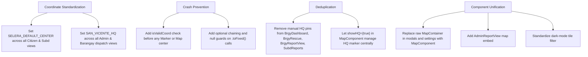

# 🗺️ StraySafe 2.0 — Comprehensive Map System Audit Report

**Date:** October 6, 2026  
**Auditor:** Antigravity AI Pair Programmer  
**Target Application:** StraySafe 2.0 (React 19 + TypeScript + Leaflet / React-Leaflet + Tailwind CSS)  
**Scope:** All 25 portal pages, modals, and 6 core mapping modules across Admin, Barangay Staff, Subdivision Leader, and Citizen portals.

---

## ✅ Verification & Fix Status (re-checked against the code, 2026-10-06)

Each claim below was checked in the current code. A fix counts as **done** only if the old value is gone and the new code is in place (`tsc` passes).

### Accuracy of the original audit
| Claim | Verdict |
|---|---|
| #1 Tarlac fallback in Resident Settings | ✅ True |
| #2 Quezon City default in `MapComponent` | ✅ True |
| #3 Bocaue/Marilao fallback in QR Scanner | ✅ True (7 places, not 2) |
| #4 Admin Report View has no map | ❌ **False**: it renders a `MapContainer` (~line 1550) |
| #5 Fake owner location in Pet Match Review | ✅ True; the same bug was also in Brgy/Subd Pet Claims (missed by the audit) |
| #6 Missing-coordinate crashes | 🟡 Partly true: `PetClaimsDashboard` didn't crash, it showed fake pins; `AdminReport` only fails on `""` |
| #7 Duplicate HQ pins | ✅ True, a few metres apart; also on 4 pages the audit missed |
| Broken default marker icons | ❌ **False**: both pages set their own icon |
| Legend over "Selera Homes" button | ✅ True on Admin, and also on Subd and Brgy dashboards |
| Polygon + 1,000 m circle, no dark tiles, missing redraw, missing attribution | ✅ True |

### Fix checklist (all items resolved, `tsc` passes)
- [x] **#1** Resident Settings fallback (Tarlac) → `SELERA_DEFAULT_CENTER`
- [x] **#2** `MapComponent` default center (Quezon City) → `SELERA_DEFAULT_CENTER`; an invalid center also falls back to it
- [x] **#3** QR Scanner fallback (7 places) → `SELERA_DEFAULT_CENTER`
- [x] **#4** Admin Report View: map already existed. It now shows "No map location was recorded for this report" instead of breaking when the report has no location
- [x] **#5** Pet Match Review: no invented home pin or route; "Distance: Unknown" plus a note to save a home location; "Same Subdivision ✓" only with a real location
- [x] **#5 (missed by audit)** Brgy and Subd Pet Claims: no invented owner pin
- [x] **#6** All `MapComponent` maps skip pins with missing/invalid coordinates (`isValidLatLng` in `coverageArea.ts`). Raw maps were reviewed: form-based ones always have a value, Resident Profile and Resolve Lost Pet were already guarded, and Admin Report View is now guarded
- [x] **#7** All 8 pages: one HQ pin (a page's own HQ pin is skipped when the map draws the official one)
- [x] `PetClaimsDashboard`: no fake sighting/owner pins; "Not recorded" / "No home location saved"; OpenStreetMap attribution added
- [x] **Sighting fallbacks** (`14.8018, 121.0035`): a sighting without a saved location now gets no pin (Pet Claims ×2, Pet Match Review); the map just centers on Selera Homes
- [x] **Legend covering the "Selera Homes" button**: the button moved to the bottom-right (above the map credit), so it no longer collides on Admin, Subd or Brgy dashboards
- [x] **Approximate default centers**: replaced by the official constants: HQ views use `SAN_VICENTE_HQ` (`BRGY_OFFICE` ×6, Admin expanded map, Animal Journey, Brgy Settings); neighbourhood views and pin pickers use `SELERA_DEFAULT_CENTER` (Subd Dashboard ×2, Subd View Report ×17, Subd Settings, `14.801313` ×10 in report/profile/pet forms)
- [x] **Dark-mode map tiles**: `index.css` darkens only the street tiles in dark mode; pins, routes and popups keep their colors
- [x] **Map redraw**: new `MapControls/MapAutoResize.tsx` re-measures the map when its box changes size; added to all 16 raw maps that lacked it (settings tabs, profile pickers, drawers, Admin Report View)
- [x] **Polygon + 1,000 m circle**: **kept on purpose.** Report submission is checked against the 1,000 m circle from the Selera center (backend `is_inside_reporting_coverage`), so the circle is the real rule; hiding it would hide where people can report
- [x] **Brgy dashboard mobile legend vs zoom buttons**: ❌ false. The legend is top-right and the zoom buttons top-left
- [x] **Preset pins lack hover labels** (Report Stray Page): ❌ false. Landmark pins have tooltips (lines ~1657, ~2072)
- [x] **`ResolveLostPetModal` own facility icon**: true, but cosmetic only (it uses its own `L.divIcon`); left as is

### Notes
- Historical facility points such as `histFacLat = 14.8069` are real facility locations, not fallbacks, and were left unchanged.
- Not yet seen in a browser: please click through the maps (especially dark mode and the settings tabs) to confirm visually.

---
## 📌 Executive Summary

An exhaustive codebase audit was conducted across every page, modal, and utility involving interactive geographic maps in StraySafe 2.0. While the core mapping components (`MapComponent.tsx`, `RoutingControl.tsx`, `HeatmapLayer.tsx`) provide rich capabilities including OSRM road-network routing, dynamic database landmark loading, and heatmap clustering, the audit revealed **significant architectural fragmentation, critical coordinate anomalies, unhandled crash vectors, and duplicate visual overlays**.

### Key Statistics
- **Total Map Implementations Audited:** 25 pages & modals (plus 6 core map engine files).
- **Critical & High Severity Issues:** 7
- **Medium Severity Inconsistencies:** 8
- **Low Severity & Polish Issues:** 5
- **Identified Coordinate Centroid Variations:** 11 differing fallback coordinates across the codebase (including two located 5 km and 80+ km out of jurisdiction).

---

## 🚨 Critical & High Severity Bugs

### 1. [CRITICAL] Out-of-Jurisdiction Coordinates in Resident Settings (Tarlac Province) — ✅ FIXED
- **File:** [`ResidentSettings.tsx`](file:///c:/Users/User/Desktop/Straysafe2.0/frontend/src/pages/citizen/ResidentSettings.tsx#L1521-L1535)
- **Lines:** 1521–1522, 1533–1534, 1540–1541
- **Issue:**
  ```tsx
  center={[
      editData.latitude ? parseFloat(editData.latitude) : 15.4802,
      editData.longitude ? parseFloat(editData.longitude) : 120.5979
  ]}
  ```
  The fallback coordinates `[15.4802, 120.5979]` point to **Concepcion, Tarlac**, over **85 kilometers away** from the system's operational jurisdiction of Barangay San Vicente / Selera Homes, Santa Maria, Bulacan (`14.801042, 121.003648`).
- **Impact:** Any resident opening their settings who does not yet have coordinates saved is dropped into a different province in Central Luzon.
- **Remedy:** Replace fallback with `SELERA_DEFAULT_CENTER` from `coverageArea.ts`.

---

### 2. [CRITICAL] Out-of-Jurisdiction Fallback in Core `MapComponent.tsx` (Quezon City) — ✅ FIXED
- **File:** [`MapComponent.tsx`](file:///c:/Users/User/Desktop/Straysafe2.0/frontend/src/components/MapComponent.tsx#L905)
- **Line:** 905
- **Issue:**
  ```tsx
  const MapComponent = ({
      height = "100%",
      center = [14.6760, 121.0437], // Quezon City, Metro Manila!
      zoom = 13,
      ...
  ```
- **Impact:** The foundational map component for the entire application defaults to **Quezon City Circle, Metro Manila** instead of Bulacan. Any view that mounts `<MapComponent />` without an explicit `center` prop will instantly position the user in another metropolitan region.
- **Remedy:** Change default center to `SELERA_DEFAULT_CENTER` or `SAN_VICENTE_HQ`.

---

### 3. [CRITICAL] Stray Pinpoint in Bocaue / Marilao in QR Scanner Modal — ✅ FIXED
- **File:** [`QRScannerModal.tsx`](file:///c:/Users/User/Desktop/Straysafe2.0/frontend/src/components/Modals/QRScannerModal.tsx#L1518-L1532)
- **Lines:** 1518, 1531
- **Issue:**
  ```tsx
  center={[lat || 14.8211, lng || 120.9575]}
  position={lat !== null && lng !== null ? [lat, lng] : [14.8211, 120.9575]}
  ```
  `[14.8211, 120.9575]` is located ~5 km west near Bocaue / Marilao borders, completely outside Selera Homes.
- **Impact:** When a user clicks "Pinpoint Map" on pet recovery without active GPS, the marker defaults to a distant municipality.
- **Remedy:** Import and use `SELERA_DEFAULT_CENTER`.

---

### 4. [HIGH] Missing Map Canvas in Admin Report View — ❌ FALSE (the map exists, line ~1550); now also guarded for reports with no location
- **File:** [`AdminReportView.tsx`](file:///c:/Users/User/Desktop/Straysafe2.0/frontend/src/pages/Admin/AdminReportView.tsx#L25-L44)
- **Lines:** 25–44
- **Issue:** `AdminReportView.tsx` imports `MapContainer`, `TileLayer`, `Marker`, `Popup`, `Polygon`, `SELERA_POLYGON_BOUNDS`, and Leaflet asset icons, yet **no `<MapComponent>` or `<MapContainer>` element is ever rendered in the JSX**.
- **Impact:** Administrators inspecting individual incident reports can see timestamps, photos, and AI triage, but **cannot see the incident location on an interactive map**, unlike the Subdivision Leader (`SubdViewReport.tsx`) and Barangay Staff (`BrgyReportView.tsx`) counterparts.
- **Remedy:** Embed `<MapComponent>` in the location card using `report.latitude` and `report.longitude`.

---

### 5. [HIGH] Fake Synthetic GPS Offsetting & Road Routing in Pet Match Review — ✅ FIXED (also in Brgy/Subd Pet Claims)
- **File:** [`PetMatchReview.tsx`](file:///c:/Users/User/Desktop/Straysafe2.0/frontend/src/pages/citizen/PetMatchReview.tsx#L543-L563)
- **Lines:** 543–544, 561–562, 845–858
- **Issue:**
  ```tsx
  const registeredLat = rawRegisteredLat !== null ? rawRegisteredLat : (sightingLat - 0.0004);
  const registeredLng = rawRegisteredLng !== null ? rawRegisteredLng : (sightingLng - 0.0003);
  ```
  If an owner's pet or profile has no saved GPS coordinates, the system synthesizes artificial coordinates by subtracting 0.0004 / 0.0003 from the sighting location (~50 meters away) and runs OSRM road routing:
  ```tsx
  <MapComponent
      showConnectingLine={true}
      markers={[
          { id: 1, lat: sightingLat, lng: sightingLng, title: sightingAddress },
          { id: 2, lat: registeredLat, lng: registeredLng, title: registeredAddress }
      ]}
  />
  ```
- **Impact:** The citizen is informed "Route from your registered pet address to the sighting location", but the map displays an entirely fabricated point and route on the street.
- **Remedy:** If `rawRegisteredLat` is null, do not render a synthetic second pin or route line; display a notice requesting the user pinpoint their home address in settings.

---

### 6. [HIGH] Unhandled `NaN` / `null` LatLng Crash Vector across Map Views — ✅ FIXED (all `MapComponent` maps; raw maps reviewed and guarded)
- **Files Affected:**
  - [`MapComponent.tsx`](file:///c:/Users/User/Desktop/Straysafe2.0/frontend/src/components/MapComponent.tsx#L1260-L1263)
  - [`AdminReport.tsx`](file:///c:/Users/User/Desktop/Straysafe2.0/frontend/src/pages/Admin/AdminReport.tsx#L1468-L1469)
  - [`BrgyPetClaims.tsx`](file:///c:/Users/User/Desktop/Straysafe2.0/frontend/src/pages/Barangay_Staff/BrgyPetClaims.tsx#L1147-L1169)
  - [`PetClaimsDashboard.tsx`](file:///c:/Users/User/Desktop/Straysafe2.0/frontend/src/pages/citizen/PetClaimsDashboard.tsx#L714-L730)
  - [`ResiViewReport.tsx`](file:///c:/Users/User/Desktop/Straysafe2.0/frontend/src/pages/citizen/ResiViewReport.tsx#L1584-L1587)
  - [`SubdReports.tsx`](file:///c:/Users/User/Desktop/Straysafe2.0/frontend/src/pages/Subd_Leaders/SubdReports.tsx#L1695)
- **Issue:** Several pages pass `[parseFloat(item.latitude), parseFloat(item.longitude)]` directly into `<Marker>` or `<MapContainer center={...}>` without verifying `!isNaN(...)`. For example, in `PetClaimsDashboard.tsx`:
  ```tsx
  <Marker position={[selectedClaim.pet.registered_latitude, selectedClaim.pet.registered_longitude]}>
  ```
  If `registered_latitude` is `null` or `""`, Leaflet throws:
  `Error: Invalid LatLng object: (NaN, NaN)` or `(undefined, undefined)`.
  This is a fatal unhandled React runtime error that crashes the entire view.
- **Remedy:** Guard all coordinate parsing with:
  ```ts
  const isValidCoord = (lat: any, lng: any) => 
      typeof lat === 'number' && typeof lng === 'number' && !isNaN(lat) && !isNaN(lng) && lat !== 0 && lng !== 0;
  ```
  Filter markers before passing them to Leaflet and supply safe fallback centers.

---

### 7. [HIGH] Duplicate Overlapping Barangay HQ Markers — ✅ FIXED (all 8 pages)
- **Files Affected:**
  - [`BrgyDashboard.tsx`](file:///c:/Users/User/Desktop/Straysafe2.0/frontend/src/pages/Barangay_Staff/BrgyDashboard.tsx#L403-L411)
  - [`BrgyRescueRequests.tsx`](file:///c:/Users/User/Desktop/Straysafe2.0/frontend/src/pages/Barangay_Staff/BrgyRescueRequests.tsx#L1625-L1631)
  - [`BrgyReportView.tsx`](file:///c:/Users/User/Desktop/Straysafe2.0/frontend/src/pages/Barangay_Staff/BrgyReportView.tsx#L2350-L2355)
  - [`SubdReports.tsx`](file:///c:/Users/User/Desktop/Straysafe2.0/frontend/src/pages/Subd_Leaders/SubdReports.tsx#L1710-L1715)
- **Issue:** `MapComponent.tsx` has a built-in feature:
  ```tsx
  {showHQ && barangayHQ && (
      <Marker position={[parseFloat(barangayHQ.hq_lat), parseFloat(barangayHQ.hq_lng)]} icon={createBarangayHQIcon(currentZoom)} />
  )}
  ```
  `showHQ` defaults to `true`.
  However, each of the above 4 pages manually injects an additional HQ marker into the `markers` prop:
  ```tsx
  { id: -1, lat: BRGY_OFFICE[0], lng: BRGY_OFFICE[1], title: "Barangay Hall HQ", category: "Barangay Office" }
  ```
- **Impact:** Two separate HQ pins (one from `MapComponent`'s dynamic database loader, and one from the parent page's hardcoded array) render directly on top of each other. Clicking or hovering causes flickering and z-index fighting.
- **Remedy:** Remove manual `{ id: -1, category: "Barangay Office" }` markers from parent arrays and let `showHQ={true}` handle HQ rendering centrally.

---

## 🧭 Inconsistency Matrix Across All Pages

### 1. Default Coordinate Inconsistency Table
Notice the lack of a single source of truth for coordinates across pages:

| Page / Component | Defined Center Coordinate | Identified Location | Status |
| :--- | :--- | :--- | :--- |
| **`coverageArea.ts` (`SELERA_DEFAULT_CENTER`)** | `[14.801042, 121.003648]` | Selera Homes Polygon Centroid | ✅ **Authoritative Source** |
| **`coverageArea.ts` (`SAN_VICENTE_HQ`)** | `[14.806906, 121.0039297]` | Brgy. San Vicente Operations HQ | ✅ **Authoritative HQ** |
| **`ReturnToSeleraButton.tsx`** | `[14.8013, 121.0031]` | Selera Homes (approximate) | ⚠️ Inconsistent with Centroid |
| **`SubdDashboard.tsx`** | `[14.8013, 121.0036]` | Selera Homes (approximate) | ⚠️ Inconsistent with Centroid |
| **`SubdViewReport.tsx`** | `[14.8018, 121.0028]` | Selera Homes Northwest | ⚠️ Inconsistent with Centroid |
| **`PetMatchReview.tsx`** | `[14.8018, 121.0035]` | Selera Homes North | ⚠️ Inconsistent with Centroid |
| **`ResiProfile.tsx` (Edit Modal)** | `[14.801313, 121.003109]` | Selera Homes West Gate | ⚠️ Inconsistent with Centroid |
| **`AdminDashboard.tsx` (Expanded Modal)**| `[14.8093, 121.0028]` | North of San Vicente HQ | ⚠️ Inconsistent with HQ |
| **`BrgyRescueRequests.tsx` (`BRGY_OFFICE`)**| `[14.8069, 121.0039]` | Truncated 4 decimal places | ⚠️ Inconsistent with `SAN_VICENTE_HQ` |
| **`QRScannerModal.tsx`** | `[14.8211, 120.9575]` | Bocaue / Marilao border (~5km away) | ❌ **Wrong Jurisdiction** |
| **`ResidentSettings.tsx`** | `[15.4802, 120.5979]` | Concepcion, Tarlac (~85km away) | ❌ **Wrong Province** |
| **`MapComponent.tsx` (Default Prop)** | `[14.6760, 121.0437]` | Quezon City, Metro Manila | ❌ **Wrong Jurisdiction** |

---

### 2. Architectural Fragmentation: `MapComponent` vs Raw `MapContainer`
The application is split between using the centralized `<MapComponent>` wrapper and ad-hoc `<MapContainer>` implementations:

| Portal | Uses Central `<MapComponent>` | Uses Raw `<MapContainer>` |
| :--- | :--- | :--- |
| **Admin** | `AdminDashboard.tsx`, `AdminHeatMap.tsx`, `AdminReport.tsx` | `AdminAccountSettings.tsx` (2 instances) |
| **Barangay Staff** | `BrgyDashboard.tsx`, `BrgyRescueRequests.tsx`, `BrgyReportView.tsx`, `BrgyViewHistory.tsx`, `BrgyPetClaims.tsx` | `BrgySettings.tsx` (2 instances), `BrgyProfile.tsx` |
| **Subdivision** | `SubdDashboard.tsx`, `SubdReports.tsx`, `SubdViewReport.tsx`, `SubdViewHistory.tsx`, `SubdPetClaims.tsx` | `SubdSettings.tsx` (2 instances), `SubdProfile.tsx` |
| **Citizen** | `ResiViewReport.tsx`, `PetScanPage.tsx`, `PetScanHistoryPage.tsx`, `PetMatchReview.tsx` | `ResiHomePage.tsx` (2 instances), `ReportStrayPage.tsx` (2 instances), `ResiProfile.tsx` (3 instances), `ResidentSettings.tsx`, `PetClaimsDashboard.tsx`, `AnimalJourneyMap.tsx` |
| **Modals** | — | `SubdReportModal.tsx`, `ResolveLostPetModal.tsx`, `QRScannerModal.tsx` |

**Consequences of this fragmentation:**
1. **Broken Default Marker Icons:** Raw `<MapContainer>` instances in `PetClaimsDashboard.tsx` and `ResidentSettings.tsx` do not configure `L.Icon.Default.mergeOptions()`, causing Leaflet's default pin images (`marker-icon.png`) to fail with 404s on Vite production builds.
2. **Missing Resize Invalidation:** When modals or tabs open, maps inside `PetClaimsDashboard.tsx`, `AdminAccountSettings.tsx`, and `BrgySettings.tsx` fail to trigger `map.invalidateSize()`, resulting in grey unrendered grid tiles until the user clicks and drags.
3. **Inconsistent Geofencing:** `MapComponent` renders the official Selera boundary polygon (`SELERA_POLYGON_BOUNDS`), while `ResiHomePage.tsx` and `SubdReportModal.tsx` render both the polygon AND a 1,000m green circle (`<Circle>`), creating visual confusion over whether the zone is circular or polygonal.

---

### 3. UI & Overlay Collisions

#### A. Admin Dashboard Legend vs "Return to Selera" Button
- **File:** [`AdminDashboard.tsx`](file:///c:/Users/User/Desktop/Straysafe2.0/frontend/src/pages/Admin/AdminDashboard.tsx#L536-L540)
- **Issue:** In `AdminDashboard.tsx`, the Status Legend is positioned at `absolute bottom-4 left-4 z-[1000]`. Meanwhile, `ReturnToSeleraButton.tsx` (rendered inside `MapComponent`) also positions its portal button at `bottom: 16px; left: 16px; z-index: 1000`.
- **Result:** The legend card sits directly on top of the "Return to Selera" button, making the button unclickable and obscuring the legend.
- **Fix:** Pass `showReturnToSelera={false}` in `AdminDashboard.tsx` (as already done in `AdminHeatMap.tsx`) or shift the legend to `bottom-4 right-4`.

#### B. Dark Mode Tile Inversion in `AnimalJourneyMap.tsx`
- **File:** [`AnimalJourneyMap.tsx`](file:///c:/Users/User/Desktop/Straysafe2.0/frontend/src/pages/citizen/AnimalJourneyMap.tsx#L450-L460)
- **Issue:** The page has a dark theme (`dark:bg-[#0E131F]`), but loads default standard OpenStreetMap raster tiles (which are stark white and light blue), creating a harsh visual contrast.
- **Fix:** Apply a dark-mode CSS tile filter (`dark:[&_.leaflet-tile-pane]:filter-[brightness(0.7)_invert(1)_contrast(1.3)_hue-rotate(180deg)]`) or load CartoDB Dark Matter tiles when in dark mode.

---

## 🛠️ Detailed Audit by Portal & Page

### 1. Admin Portal

#### 1.1 `AdminDashboard.tsx`
- **Center:** `SAN_VICENTE_HQ` on main widget (`zoom={14}`); but expanded modal uses hardcoded `[14.8093, 121.0028]` (`zoom={15}`).
- **Bugs:**
  1. Expanded modal map has a different center coordinate and zoom level than the main card.
  2. Main map bottom-left legend collides with `ReturnToSeleraButton`.
  3. Expanded modal does not support route navigation or marker click details.

#### 1.2 `AdminHeatMap.tsx`
- **Center:** `SELERA_DEFAULT_CENTER` (`zoom={16}`).
- **Status:** Good implementation. Correctly sets `showReturnToSelera={false}` to avoid legend collision. Dynamically toggles between heatmap density and pinpoints.

#### 1.3 `AdminReport.tsx`
- **Center:** `[initLat, initLng]` (`zoom={17}`).
- **Bugs:** `parseFloat(String(rawInitLat))` does not check for `isNaN`. If `initial_latitude` is `""`, `initLat` becomes `NaN`, crashing the map.

#### 1.4 `AdminReportView.tsx`
- **Status:** **CRITICAL DEFECT.** All Leaflet imports exist, but map JSX was never placed on the page.

#### 1.5 `AdminAccountSettings.tsx`
- **Center:** `hqPos` (HQ picker) and `[landmarkForm.latitude, landmarkForm.longitude]` (Landmark picker).
- **Bugs:**
  1. Uses raw `<MapContainer>` twice without `InvalidateMapSize` on tab changes.
  2. Hardcoded fallback coordinates duplicated across state initializers.

---

### 2. Barangay Staff Portal

#### 2.1 `BrgyDashboard.tsx`
- **Center:** `hqCoords` (`zoom={15}`).
- **Bugs:**
  1. Injects manual HQ marker (`id: -1`) into `mapMarkers` while `<MapComponent showHQ={true}>` is also active, resulting in duplicate HQ pins.
  2. Mobile legend toggle z-index conflicts with leaflet controls on small screens.

#### 2.2 `BrgyRescueRequests.tsx`
- **Center:** `[currentLat, currentLng]` (`zoom={16}`).
- **Bugs:**
  1. Injects manual HQ marker `{ id: -1, title: "Barangay Hall", category: "Barangay Office" }` creating duplicate HQ pin.
  2. Uses truncated `BRGY_OFFICE = [14.8069, 121.0039]` instead of canonical `SAN_VICENTE_HQ`.

#### 2.3 `BrgyReportView.tsx`
- **Center:** `[sightingLat, sightingLng]` (`zoom={15}` on widget, `16.5` on modal).
- **Bugs:**
  1. Injects manual HQ marker `{ id: 2, title: 'Barangay San Vicente HQ', category: 'HQ' }` creating duplicate HQ pin.
  2. Uses truncated `BRGY_OFFICE_COORDS = [14.8069, 121.0039]`.

#### 2.4 `BrgyPetClaims.tsx`
- **Center:** `[selectedClaim.sighting_lat, selectedClaim.sighting_lng]` (`zoom={16}`).
- **Bugs:**
  1. If `selectedClaim.pet?.registered_latitude` is null/undefined, marker 2 passes `lat: undefined`, crashing Leaflet.
  2. `selectedClaim.sighting_lat` has no fallback if null.

#### 2.5 `BrgySettings.tsx` & `BrgyProfile.tsx`
- **Bugs:** Raw `<MapContainer>` lacks resize invalidation when switching between settings tabs.

---

### 3. Subdivision Leader Portal

#### 3.1 `SubdDashboard.tsx`
- **Center:** Hardcoded `[14.8013, 121.0036]` (`zoom={16.5}`).
- **Bugs:** Center coordinate differs slightly from authoritative `SELERA_DEFAULT_CENTER` (`[14.801042, 121.003648]`).

#### 3.2 `SubdReports.tsx`
- **Center:** `[viewReport.latitude, viewReport.longitude]` (`zoom={17}`).
- **Bugs:**
  1. Duplicate HQ marker injected in `markers` with `showHQ={true}`.
  2. Crashes if `viewReport.latitude` is null/undefined.

#### 3.3 `SubdViewReport.tsx`
- **Center:** `[currentLat ?? 14.8018, currentLng ?? 121.0028]`.
- **Bugs:** Fallback coordinates `14.8018, 121.0028` point northwest rather than the neighborhood center.

#### 3.4 `SubdProfile.tsx`
- **Center:** Uses `SAN_VICENTE_HQ` (`[14.806906, 121.0039297]`) as default center for subdivision leader's personal home location picker instead of Selera Homes centroid.

---

### 4. Citizen / Resident Portal

#### 4.1 `ResiHomePage.tsx`
- **Bugs:**
  1. Renders both Selera polygon AND 1000m green circle, which visually overlap and clash.
  2. Uses raw `<MapContainer>` with duplicate landmark rendering logic instead of `<MapComponent>`.

#### 4.2 `ReportStrayPage.tsx`
- **Status:** Robust stepper integration with `InvalidateMapSize`.
- **Inconsistency:** Renders both polygon and radius circle. Custom landmark clicks update form values, but preset pins lack hover tooltips.

#### 4.3 `AnimalJourneyMap.tsx`
- **Bugs:**
  1. Dark mode tile clash (bright white tiles on dark UI).
  2. Fallback center `[14.8069, 121.0039]` is truncated.
  3. Lacks `InvalidateMapSize` or resize observer.

#### 4.4 `PetClaimsDashboard.tsx`
- **Bugs:**
  1. `selectedClaim.pet.registered_latitude.toFixed(6)` throws a fatal error if the pet has no coordinates saved.
  2. Missing TileLayer attribution string.
  3. Missing `InvalidateMapSize` on drawer open.

#### 4.5 `PetScanPage.tsx` & `PetScanHistoryPage.tsx`
- **Bugs:**
  1. `PetScanHistoryPage.tsx` defaults center to `SAN_VICENTE_HQ` rather than Selera Homes.
  2. `PetScanPage.tsx` hides the map entirely if GPS coordinates are not yet available instead of presenting an interactive map where the user can click to drop a pin.

#### 4.6 `ResidentSettings.tsx`
- **Bugs:** **CRITICAL.** Fallback center is `[15.4802, 120.5979]` in Concepcion, Tarlac.

---

### 5. Modals

#### 5.1 `SubdReportModal.tsx`
- **Status:** Functional with `InvalidateMapSize` and `ReturnToSeleraButton`.
- **Inconsistency:** Renders both polygon and circle boundary.

#### 5.2 `ResolveLostPetModal.tsx`
- **Status:** Well-crafted facility picker with interactive selection.
- **Inconsistency:** Re-implements facility icon logic independently of `createHoldingFacilityPinIcon` in `landmarkIcons.ts`.

#### 5.3 `QRScannerModal.tsx`
- **Bugs:** **CRITICAL.** Fallback coordinates `[14.8211, 120.9575]` drop the pin near Bocaue / Marilao.

---

## 📋 Comprehensive Action Plan & Recommendations



### Action 1: Standardize Geographic Constants
Create and strictly enforce two canonical points in `coverageArea.ts`:
```ts
// 1. Residential & Incident Center (Selera Homes Centroid)
export const SELERA_DEFAULT_CENTER: [number, number] = [14.801042, 121.003648];

// 2. Command, Dispatch & Admin Center (Barangay San Vicente HQ)
export const SAN_VICENTE_HQ: [number, number] = [14.806906, 121.0039297];
```
- Replace all instances of `[15.4802, 120.5979]` (Tarlac), `[14.8211, 120.9575]` (Marilao), `[14.6760, 121.0437]` (QC), and approximate offsets with these two constants.

### Action 2: Add Coordinate Validation Guard in `MapComponent.tsx`
In `frontend/src/components/MapComponent.tsx`, filter incoming `markers` and validate center:
```ts
const isValidLatLng = (lat: any, lng: any): boolean => {
    const nLat = Number(lat);
    const nLng = Number(lng);
    return !isNaN(nLat) && !isNaN(nLng) && nLat !== 0 && nLng !== 0 && Math.abs(nLat) <= 90 && Math.abs(nLng) <= 180;
};
```
Filter markers before rendering:
```tsx
const validMarkers = markers.filter(m => isValidLatLng(m.lat, m.lng));
```

### Action 3: Remove Duplicate HQ Markers
In `BrgyDashboard.tsx`, `BrgyRescueRequests.tsx`, `BrgyReportView.tsx`, and `SubdReports.tsx`, delete the `{ id: -1, category: "Barangay Office" }` entry from the page-level marker arrays.

### Action 4: Fix `AdminReportView.tsx`
Add the incident map card back into `AdminReportView.tsx` right under the Incident Details section:
```tsx
{isValidLatLng(report.latitude, report.longitude) && (
    <div className="w-full h-64 rounded-2xl overflow-hidden border border-slate-100">
        <MapComponent
            center={[parseFloat(report.latitude), parseFloat(report.longitude)]}
            zoom={16}
            showHeatmap={false}
            markers={[{
                id: report.report_id,
                lat: parseFloat(report.latitude),
                lng: parseFloat(report.longitude),
                title: report.landmark || 'Incident Location',
                category: report.animal_type || 'Stray'
            }]}
        />
    </div>
)}
```

### Action 5: Resolve Fake Route in `PetMatchReview.tsx`
If `rawRegisteredLat` is null or invalid, do not display a synthetic route line. Render a single sighting marker and display an alert prompting the user to update their home location.
