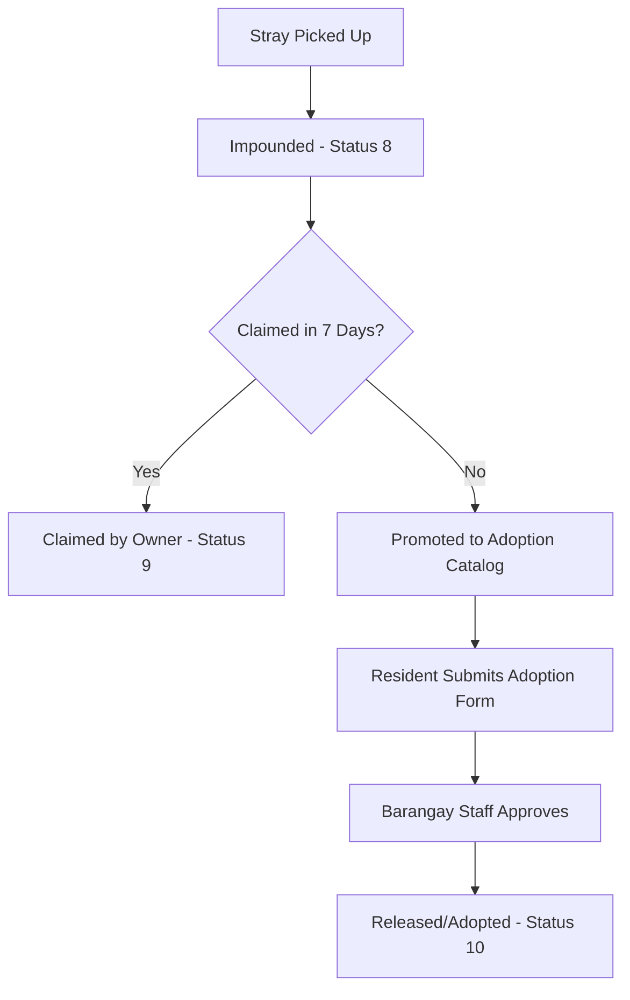
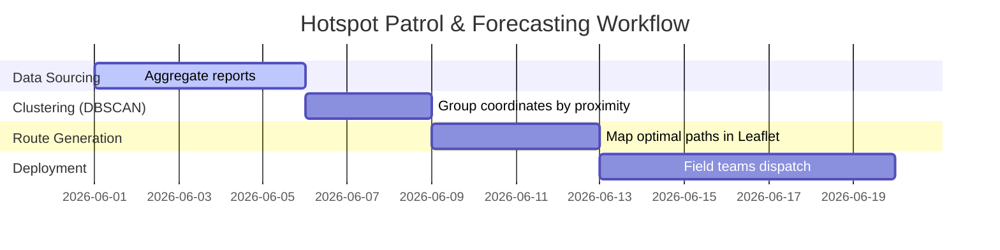

# Recommended Feature Additions: StraySafe 2.0 🛡️🐾

This document outlines recommended feature additions, enhancement plans, and technical specifications to take StraySafe 2.0 to the next level of operational excellence and community integration.

---

## 📋 Table of Contents
1. [AI-Driven Visual Matcher for Lost Pets (Computer Vision)](#1-ai-driven-visual-matcher-for-lost-pets-computer-vision)
2. [Holding Facility to Public Adoption Portal Pipeline](#2-holding-facility-to-public-adoption-portal-pipeline)
3. [GPS-Triggered Geolocation QR Scan Tracker](#3-gps-triggered-geolocation-qr-scan-tracker)
4. [Geofenced Push & SMS Sighting Notifications](#4-geofenced-push--sms-sighting-notifications)
5. [Field Rescue Team Mobile-First Progressive Web App (PWA)](#5-field-rescue-team-mobile-first-progressive-web-app-pwa)
6. [Preventive Patrol Route Planning & Hotspot Forecasting](#6-preventive-patrol-route-planning--hotspot-forecasting)
7. [Subdivision Volunteer Task Coordination network](#7-subdivision-volunteer-task-coordination-network)

---

### 1. AI-Driven Visual Matcher for Lost Pets (Computer Vision)
* **Target Role:** Resident / Citizen, Subdivision Leader, Barangay Staff
* **Value Proposition:** Reduces manual inspection time by using visual similarity scoring to automatically detect if a reported stray matches an active registered lost pet.

#### ⚙️ Technical Architecture & Implementation
* **Frontend (`/citizen/pet-match-review`):**
  - Integrate a similarity indicator panel displaying a comparison percentage.
  - Display side-by-side visual analysis highlighting overlapping attributes (e.g., matching primary color, breed structure, size).
* **Backend (`backend/app/utils/cv_matcher.py`):**
  - Implement a feature extraction pipeline utilizing a pre-trained CNN (e.g., MobileNetV3 or ResNet via PyTorch/TensorFlow) or OpenCV feature matching (SIFT/ORB) to extract color histograms and structural keypoints.
  - Calculate cosine similarity scores between the incoming report photo and registered active/lost pet photos.
* **Database Updates (`Database.txt`):**
  - Add `embeddings` (Vector/JSON representation) in `pets` and `reports` table to pre-compute and store visual signatures, accelerating comparisons.

---

### 2. Holding Facility to Public Adoption Portal Pipeline
* **Target Role:** Resident / Citizen, Barangay Staff
* **Value Proposition:** Streamlines stray rehoming. Animals in the holding facility that are unclaimed after a set grace period (e.g., 7–14 days) are automatically transitioned to an adoption catalog, promoting rehoming rather than long-term impoundment.

#### ⚙️ Technical Architecture & Implementation
* **Frontend Routes:**
  - `[NEW]` `/adopt` — Public catalog where residents can browse adoptable animals, view age, breed, vaccine status, and personality details.
  - `[NEW]` `/adopt/apply/:id` — Adoption request form.
  - `[MODIFY]` `/brgy/holding-facility` — Add a "Promote to Adoption Feed" button for staff, along with an adoption application management queue.
* **Backend Routes (`backend/app/routes/adoptions.py`):**
  - `POST /adoptions/apply` - Submits adoption requests.
  - `GET /adoptions/catalog` - Fetches eligible impounded animals.
  - `PUT /adoptions/review/{id}` - Barangay approval workflow updating animal status to `Adopted/Released` (Status 10).

---

### 3. GPS-Triggered Geolocation QR Scan Tracker
* **Target Role:** Resident / Citizen (Pet Owner)
* **Value Proposition:** Allows anyone scanning a lost pet's QR code to easily send their current GPS coordinates back to the owner with one click, showing where their pet was spotted on an interactive timeline.

#### ⚙️ Technical Architecture & Implementation
* **Frontend (`/pet-scan/:qr_code`):**
  - Update the public QR landing page to check for browser Geolocation API permissions (`navigator.geolocation.getCurrentPosition`).
  - Provide a prominent button: *"📍 Share Sighting Location with Owner"*.
  - Prompt a simple photo upload or message field so the finder can send real-time visual proof.
* **Backend Routes (`backend/app/routes/pet_qr.py`):**
  - Modify the QR scan logging endpoint (`POST /pet_qr/scan/{code}`) to accept optional `latitude`, `longitude`, `sighting_photo`, and `finder_note`.
* **Database Updates (`claims` or `pet_scans` table):**
  - Add columns: `latitude`, `longitude`, `photo_url`, `notes` to store scan-specific location telemetry.

---

### 4. Geofenced Push & SMS Sighting Notifications
* **Target Role:** Resident / Citizen
* **Value Proposition:** Instantly alerts residents if a high-priority aggressive stray or rabies-risk animal is verified by a Subdivision Leader near their location, promoting immediate local community safety.

#### ⚙️ Technical Architecture & Implementation
* **Backend Integration (`backend/app/utils/sms.py`):**
  - Integrate an SMS API gateway (e.g., Twilio) or WebPush API.
  - When a leader changes a report status to `Verified` (Status 2) and the AI priority is `EMERGENCY` or `HIGH`, trigger a broadcast task.
* **Geofence Matching:**
  - Fetch all registered residents within the report's subdivision boundary using GPS point-in-polygon calculations.
  - Dispatch SMS/Push notifications containing the warning: *"Alert: Aggressive stray animal verified in [Subdivision Name]. Please exercise caution in the vicinity."*

---

### 5. Field Rescue Team Mobile-First Progressive Web App (PWA)
* **Target Role:** Barangay Staff (Field Teams)
* **Value Proposition:** Field teams need a fast, distraction-free interface optimized for outdoor mobile use with offline support for recording rescues in areas with poor network coverage.

#### ⚙️ Technical Architecture & Implementation
* **Frontend Config:**
  - Convert the React frontend into a PWA using `vite-plugin-pwa` with custom service workers.
  - Cache core routes: `/brgy/operations` and `/brgy/profile`.
  - Use `IndexedDB` or `localStorage` to save offline updates (e.g., changing status to `Picked Up`, adding description details, capturing a photo).
  - Sync updates to the FastAPI server automatically as soon as internet connection is restored.
* **Mobile-First Layout:**
  - Clean, touch-friendly UI featuring large buttons, high-contrast text, a native camera interface integration, and single-tap status updates.

---

### 6. Preventive Patrol Route Planning & Hotspot Forecasting
* **Target Role:** Admin, Barangay Staff
* **Value Proposition:** Converts reactive reporting into proactive animal management. Analyzes high-density report clusters over time to suggest optimal daily patrol routes for field teams.

#### ⚙️ Technical Architecture & Implementation
* **Frontend Route (`/brgy/operations` / `/admin/heatmap`):**
  - Integrate a Leaflet routing plugin (e.g., `leaflet-routing-machine`) to draw calculated optimal paths between verified hotspots.
  - Add filters for report density by day-of-week and time-of-day.
* **Backend Analysis (`backend/app/routes/analytics.py`):**
  - Build clustering queries using MySQL geospatial spatial index functions or spatial python libraries (e.g., `scikit-learn` DBSCAN) to group reports by coordinate clusters.
  - Return ordered checkpoints representing dense stray hotspots to create patrol routing templates.

---

### 7. Subdivision Volunteer Task Coordination Network
* **Target Role:** Resident / Citizen, Subdivision Leader
* **Value Proposition:** Bridges the gap between citizens and formal authorities. Leaders can request help for minor tasks (such as checking a sighting, leaving water, or searching for a registered lost pet) from a pool of vetted local residents.

#### ⚙️ Technical Architecture & Implementation
* **Frontend Routes:**
  - `[NEW]` `/subd/volunteers` — Dashboard for Subdivision Leaders to view registered local volunteers and post low-risk mission requests.
  - `[NEW]` `/citizen/volunteer` — Citizen portal to opt-in as a volunteer, receive notifications for help requests, and accept micro-tasks.
* **Task Lifecycle:**
  - Volunteer tasks have their own simplified state machine: `Open` ➡️ `Assigned` ➡️ `Completed` ➡️ `Verified`.
  - Keeps community members engaged without interfering with critical/dangerous rescue missions managed solely by Barangay staff.
