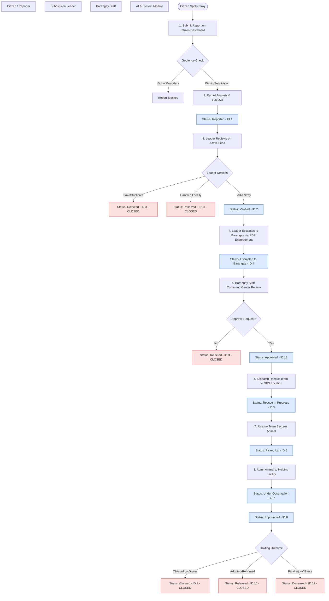

# 📋 StraySafe 2.0: Comprehensive Report Lifecycle & Flow

This document details the complete end-to-end flow of a stray animal report, indicating which user roles handle the report at each stage, what actions they take, and how the system processes the state transitions.

---

## 🗺️ Visual Report Flow Diagram

---

## 🔄 Detailed Lifecycle Stages

### Stage 1: Detection & Submission
*   **Who Handles It:** **Citizen (Reporter)**
*   **Action Taken:** 
    *   Citizen fills out the report form on `/citizen/home` (`ResiHomePage.tsx`).
    *   Uploads raw photos/videos of the stray animal.
    *   Pins the exact location on the interactive Leaflet Map.
    *   Selects a reporting category (*Injured Animal, Aggressive Stray, Possible Rabies Risk, Roaming Pack, Animal Rescue Needed*).
*   **System Processing:**
    *   **Geofence Verification:** Frontend checks if user location pin is inside `SELERA_POLYGON` boundary. If outside, submission is blocked.
    *   **YOLOv8 Analysis:** Backend (`reports.py`) runs YOLOv8 on uploaded images to detect if there is a dog/cat present, estimate visual size ratio, and extract dominant colors.
    *   **Gemini/Heuristic Copilot:** The AI suggestions module analyzes the photo metrics and user description to classify risk levels, suggest priority, and provide a conversational reason.
*   **Database Impact:** Creates a new row in the `reports` table. Sets `current_status_id = 1` (`Reported`).

---

### Stage 2: Verification & Filtering
*   **Who Handles It:** **Subdivision Leader (First Responder)**
*   **Action Taken:** 
    *   Leader logs in at `/staff/login` and views incoming reports on `/subd/reports`.
    *   Inspects the location, user comments, and the AI-generated classification reports.
*   **Possible Decisions & State Transitions:**
    1.  **Reject:** If the report is a fake entry, duplicate, or spam, the leader taps **Reject**. 
        *   *Result:* Status changes to `3` (`Rejected`). Moves to archived history (`/subd/history`).
    2.  **Resolve Locally:** If the stray has already left or was claimed locally without needing Barangay intervention, the leader taps **Resolve**. 
        *   *Result:* Status changes to `11` (`Resolved`). Moves to history.
    3.  **Verify & Escalate:** If valid, the leader taps **Verify** (Status `2`), then uploads an official PDF Endorsement Letter endorsing the case to the Barangay.
        *   *Result:* Status changes to `4` (`Escalated to Barangay`). The report is sent to the Barangay Staff's operational feed.
*   **Key Restriction:** Once escalated (Status `4`), control shifts entirely to the Barangay; the Subdivision Leader can no longer resolve the report.

---

### Stage 3: Operational Command & Dispatch
*   **Who Handles It:** **Barangay Staff (Personnel)**
*   **Action Taken:**
    *   Staff reviews incoming verified reports on `/brgy/rescue-requests`.
    *   The dashboard automatically sorts cases based on AI-determined urgency (aggression or injuries).
*   **Decisions & Transitions:**
    1.  **Approve Request:** Staff reviews the leader's PDF endorsement. Tapping **Approve** changes status to `13` (`Approved`).
    2.  **Dispatch Team:** From the Operations page (`/brgy/operations`), staff dispatches a field rescue team, assigning personnel and trucks. Tapping **Dispatch** changes status to `5` (`Rescue In Progress`).
*   **Citizen Feed Visibility:** Citizens can see the status progress tracker update live to *Rescue In Progress*.

---

### Stage 4: Field Rescue & Pickup
*   **Who Handles It:** **Barangay Field Rescue Team**
*   **Action Taken:**
    *   The field team uses the map navigation interface to locate the animal.
    *   Rescuers secure the animal using appropriate equipment.
    *   Uploads visual proof/evidence of the secured animal from the field.
*   **Transition:** Rescuer changes status to `6` (`Picked Up`). 

---

### Stage 5: Holding Facility & Observation
*   **Who Handles It:** **Barangay Staff / Kennel Managers**
*   **Action Taken:**
    *   The animal is brought to the physical Barangay holding facility.
    *   Staff registers the animal's arrival details (kennel slot number, initial medical notes, name, etc.) under `/brgy/holding-facility`.
    *   An audit timeline is created under `holding_timeline`.
*   **State Transitions:**
    *   **Status 7 (Under Observation):** The animal stays under medical observation for 3 days to check for behavioral aggression, rabies, or contagious illness.
    *   **Status 8 (Impounded):** If unclaimed after 3 days, the animal is moved into a long-term holding kennel slot.

---

### Stage 6: Outcome & Resolution (Archive)
*   **Who Handles It:** **Barangay Staff & Citizens**
*   **Action Taken:**
    *   The holding manager records the final case resolution:
        *   **Claimed by Owner (Status 9):** Citizen verifies scanning the QR code or browsing the lost records, matching the animal, and claiming it.
        *   **Released/Adopted (Status 10):** The stray animal is adopted out or rehomed.
        *   **Deceased (Status 12):** The animal does not survive due to severe injuries/disease.
*   **Final System State:** The status is updated to `CLOSED` (Status 9, 10, 11, or 12). The report is hidden from all active citizen feeds and archived under historical databases.

---

## 📊 Quick-Reference Status Transitions Table

| Status ID | Status Name | Role Handling | Trigger Action | Feed State |
| :---: | :--- | :--- | :--- | :--- |
| **1** | **Reported** | Citizen ➡️ Leader | Initial Citizen Submission | Active Feed |
| **2** | **Verified** | Subdivision Leader | Leader clicks "Verify" | Active Feed |
| **3** | **Rejected** | Leader ➡️ Barangay Staff | Report marked as spam/fake or declined | Archived ⛔ |
| **4** | **Escalated** | Subdivision Leader | Endorsement Letter PDF uploaded | Active Feed |
| **13** | **Approved** | Barangay Staff | Barangay approves escalated request | Active Feed |
| **5** | **Rescue In Progress** | Barangay Staff | Operations team dispatched to map coordinates | Active Feed |
| **6** | **Picked Up** | Field Rescue Team | Rescuers secure animal and upload photos | Active Feed |
| **7** | **Under Observation** | Kennel Staff | Animal admitted to holding facility | Active Feed |
| **8** | **Impounded** | Kennel Staff | Animal moves to permanent cage assignment | Active Feed |
| **9** | **Claimed by Owner** | Owner ➡️ Barangay Staff | Owner presents registration and picks up pet | Archived ✅ |
| **10** | **Released** | Barangay Staff | Animal is adopted or rehomed | Archived ✅ |
| **11** | **Resolved** | Leader ➡️ Barangay Staff | Case marked as completed or settled | Archived ✅ |
| **12** | **Deceased** | Barangay Staff | Animal passes away due to trauma/illness | Archived ✅ |

---

## 🚀 Recommended Process Optimizations

To improve the efficiency of the report lifecycle, the following workflow optimizations are recommended:

1.  **AI-Assisted Emergency Auto-Escalation:**
    *   *Issue:* High-priority emergencies (like aggressive or rabid strays) wait in the "Reported" state until a Leader manually checks their dashboard.
    *   *Fix:* If the backend AI classifies an incident as **"High Risk"** or **"Emergency"** with high confidence, auto-escalate the report to the Barangay command center immediately while notifying the leader.

2.  **Supporting Multi-Animal and Roaming Pack Reporting:**
    *   *Issue:* The current YOLO validator rejects submissions containing more than one animal.
    *   *Fix:* Accept multi-animal submissions. If `animal_count > 1` is detected by YOLO, automatically classify the report under the "Roaming Pack" category and mark it as High Priority.

3.  **Field-First Offline Progressive Web App (PWA):**
    *   *Issue:* Rescuers operating in low-signal areas fail to log status changes (like "Picked Up").
    *   *Fix:* Implement service workers and local caching (IndexedDB) to log states offline and sync them in the background when connectivity is restored.

4.  **Proactive Patrol Routing via Hotspot Density Clustering:**
    *   *Issue:* Operations are entirely reactive, leading to inefficient dispatches.
    *   *Fix:* Run DBSCAN coordinates clustering weekly on historical report data to construct daily patrol templates and optimize fuel/resource allocation.

5.  **Unclaimed Stray Adoption Pipeline:**
    *   *Issue:* Animals remain in holding facilities indefinitely or require tedious manual discharge tracking.
    *   *Fix:* Automatically promote healthy stray animals to a public `/adopt` portal if they remain unclaimed after the 7-day holding duration.

