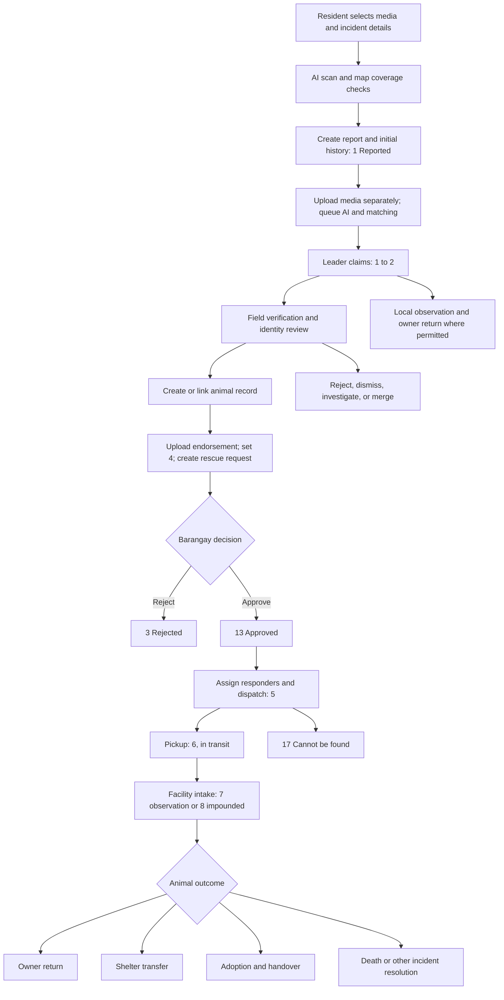

# StraySafe 2.0 — Report Workflow and Resolution Audit

Audit date: October 10, 2026 (Asia/Manila). Scope: the current working tree, including existing uncommitted changes.

## 1. Assessment and evidence limits

The resident → subdivision → barangay → rescue → holding workflow exists, along with pet matching, ownership confirmation, case merging, claims, QR recovery, and adoption. It does **not** enforce one consistent report lifecycle across these entry points. Several alternate routes bypass the protections in the primary status route. A report can be closed before physical handover, while an animal remains in custody, or by an actor who lacks the appropriate case authority.

The highest priorities are authenticated actor enforcement, eliminating generic status-write bypasses, separating claim approval from physical return, and making all closure paths enforce the same custody and evidence rules.

Method: source tracing of React handlers, FastAPI dependencies and route bodies, Pydantic schemas, SQLAlchemy models and hooks, SQL schema/seed definitions, and existing isolated integration tests. Code references below use repository-relative paths and line numbers at audit time. Line numbers can shift after edits. Findings marked **static** are demonstrated by the current source path, but were not reproduced through a running production deployment. An inferred consequence is identified as such.

Validation performed:

| Existing suite | Result | What it establishes |
|---|---|---|
| `backend/tests/test_case_gating.py` | **20/20 passed** | Main status/verification routes reject unclaimed leader actions; status 4 blocks barangay operations until approval; animal-record gating works on tested paths. |
| `backend/tests/test_case_closure.py` | **9/9 passed** | Closing an existing report through an ORM status change closes open rescues and assignments; observation remains open. |
| `backend/tests/test_owner_return.py` | **51/51 passed** | Shared return validation, scoped account lookup, manual owners, report-bound proof, privacy, holding discharge, and pending ownership acceptance work on tested paths. |

The suites ran with `.venv/Scripts/python.exe`, each using its own throwaway SQLite database. Sandbox execution initially failed because SQLite could not open temporary databases; approved execution outside the sandbox passed. The default system Python lacked FastAPI. Deprecation warnings appeared but did not fail the suites. No application code was changed for this audit.

These 80 passing checks are not comprehensive end-to-end certification. Browser flows, Cloudinary delivery, GPS accuracy, actual AI inference, production MySQL constraints/concurrency, notification delivery, and production data were not exercised. Database findings distinguish ORM/SQL definitions and isolated persistence tests from live deployment state; no production records or credentials were inspected. Existing tests sometimes deliberately assert the inconsistent behavior identified here, such as holding owner-return closing as report status 11.

## 2. End-to-end workflow

### Current intended path



This diagram shows the intended user journey, not a backend-enforced transition graph. In particular, claiming already sets the label “Verified” before field verification; generic routes permit many jumps; holding impoundment can close the incident; and claims/QR recovery can close reports independently.

### Stage-by-stage audit

“Expected” below is a recommended product invariant, not a claim that it already exists. Resolution details are expanded in section 4.

| Stage / role | Current behavior and status before → after | Expected behavior / required validations | API and database operations | Issues / fixes |
|---|---|---|---|---|
| Compose / resident | Multi-step media, animal, location, review/declaration form. Camera/GPS or manual map point; default coordinates are available. AI primarily analyzes the selected primary file. No report yet. | Dog/cat, positive bounded animal count, valid finite coordinates, coverage, accurate incident time/location, required media or documented exception. Record whether GPS, manual pin, or default was used. AI failure should lead to explicit manual review. | `ReportStrayPage.tsx:421, 578, 635, 659`; `/reports/analyze-media`, `/reports/coverage-area`. | UI checks exceed API checks; default map point is not proof of GPS observation. F03, F04. |
| Create / authenticated user | JSON report is committed before uploads. Actor is correctly forced to signed-in user. A valid client status is accepted rather than forcing 1. Linked lost pet becomes `Lost`. Initial coordinates/history and linked pet photo saved. None → supplied status, normally 1. | Force initial 1; resident may link only an authorized pet. Derive jurisdiction server-side; reject supplied verification facts. Bind media and analysis to a submission draft/token; finalize once ready. | `reports.py:2182`; insert `reports`, `status_history`, optional `report_media`; update `pets`; enqueue AI follow-up; notify subdivision leaders; `CREATE_REPORT` audit. | Status injection, pet authorization, client facts, media-free reports, no idempotency. F03–F05. |
| Media / reporter or scoped staff | File or Cloudinary URL inserted separately; non-evidence image/video queues AI. Evidence may attach to latest history entry for a status. Report status unchanged. | Validate asset ownership/type, report ownership, history membership, role allowed to mark evidence, content limits, and explicit event binding. All required files must persist before success. | `reports.py:3535`; `ReportMedia`; `utils/uploads.py`; AI job queue and worker. | UI swallows upload failures; URL path avoids byte checks; arbitrary history association and client AI fields accepted. F04, F14. |
| Receive / leader | New report notifications target role 2 in selected subdivision. List/detail routes filter access; no claim yet. | Notify active appropriate officers only; derive subdivision from authorized location/coverage; expose unassigned cases and SLA alerts. | `reports.py:1057, 2182, 2393`; reports query, notifications. | Caller-selected subdivision can misroute a report; notification transactions are inconsistent. F03, F15. |
| Claim / leader, admin proxy | Row lock checks one handler; same-handler claim is idempotent; another receives 409. 1 → 2; handler, claim time, history/audit/colleague notifications saved. | Claim should mean “Under Review,” separate from verified truth. Closed cases must be refused. Admin actor and target handler must both be recorded. | `/reports/{id}/claim`, `reports.py:4329`; `SELECT FOR UPDATE`, report/history/audit/notifications. | Locking is a good safeguard, but label conflation and missing general terminal-state checks remain. F06, F11. |
| Verify / claimed leader; scoped staff/admin | `/verify-incident` sets 2 and `verified_true`, findings, officer/time, notes, and pet behavior. Unclaimed leaders blocked; leaders lose this path after escalation. Prior state → 2. | Field evidence and investigation record; allowed prior states only; consistent finding flags; forbid implicit reopen; separate claim from verification. | `reports.py:5157`; report, status history, pet behavior refresh, reporter notification, audit. | Optional findings/notes, no mandatory evidence; claiming is labeled verified without this action. F06, F11. |
| Reject / authorized reviewer | Main status route requires ≥5-character reason. Leader can reject only 1/2/15/16 before escalation; assigned barangay staff/head/admin can use their branch. → 3. | Restrict stage/authority for every role; no custody abandonment; preserve rejected reason and structured event. | `reports.py:3628`; report/history/notification/audit; closure hook rejects rescue and cancels assignments. | Generic patch/create paths bypass checks. F02, F03, F11. |
| Dismiss / investigating officer | Specialized route looks up body `user_id`; sets 14, `false_alarm`, findings/history, reporter notice. Prior →14. | Authenticated officer, role and case scope, assigned handler, evidence/reason, allowed stage. | `reports.py:5273`; report/history/notification/audit. | Unauthenticated actor impersonation; old status logged after overwrite. F01, F15. |
| Animal identity / leader; eligible barangay/admin | Staff adds/links pet record; pet/report matches have manual decisions and owner answers. Inherited identity needs recheck for trusted actions. Report status normally unchanged. | Verified animal identity, case conflict checks, explicit provenance, reject unrelated pet linking, never equate visual match with physical recovery. | `/reports/{id}/link-pet`, `/matches/{id}/verify`, owner feedback/verification; `pets`, `report_matches`, confirmations/claims, case utilities. | Substantial safeguards exist here but create/edit/claim closure paths bypass them. F02, F03, F07, F08. |
| Endorse / claimed leader | Frontend uploads letter, patches to 4, then creates rescue/letter in three requests. Animal record required in main path. →4; rescue pending. | Must be verified or have documented emergency override; structured letter bound to evidence; atomically create endorsement, rescue, history, recipients. | `SubdViewReport.tsx:646`; `reports.py:3628`; `rescue.py:148`; `endorsement_letters`, `rescues`. | Partial escalation possible; rescue create lacks jurisdiction/handler checks and trusts leader/status. F09, F13. |
| Approve / barangay head or assigned staff; admin | Status 4 permits only 13 or 3 for role 3. Non-head still must already be assigned. →13 /3. | Define approving role explicitly. Provide triage ownership before approval; never require a dispatch assignment that cannot be made before approval. | `reports.py:3273, 3628`; `rescue.py:344`; approval maps report 13 to rescue 2. | Head can approve; unassigned ordinary staff may be deadlocked. Admin and leaders have bypass paths. F09, F18. |
| Assign / authorized dispatch coordinator | Team API accepts IDs; replaces only `Assigned` rows, picks first lead; notification/history/audit. Status often unchanged. | In-scope head/dispatcher, approved open canonical case, 1–5 unique active eligible responders, lock/version, cancel all previous active phases. | `rescue.py:920`, plus assignment branch in update and direct report status; `rescues`, `rescue_assignments`. | No equivalent authority/scope/size enforcement across paths; stale teams and race conditions. F09, F12. |
| Dispatch / assigned responders/head/admin | Report 5; rescue generally 5; starts timestamp, history/notifications. UI requires a responder. | Approved mission and committed valid team; dispatch evidence/time/location; enforce on API. | `rescue.py:344` or `reports.py:3628`. | No complete transition guard; assigned leaders can use rescue route after escalation. F09, F11. |
| Pickup / response team | →6; custody “Animal Picked Up”; clears facility link and kennel if existing holding record. Not normally new intake. | Pickup confirmation, animal count/identity, health, responder, location/time, destination and receipt pending. | Status routes; report/rescue/history; optional holding transfer timeline. | Admin analytics treats pickup as final success; existing holding row may still be active while in transit. F10, F16. |
| Observe/intake / responsible facility staff | →7/8 can auto-create holding row; facility selected/defaulted. Existing row reused. Standalone intake creates row and timeline but need not update report. | Active in-scope facility, physical receipt, capacity/kennel validation, unique episode, required medical/observation record. | `reports.py:4000` onward; `rescue.py:750` onward; `/holding`, `holding.py:476`; report, holding, timeline. | Scope gaps; arbitrary/invalid facility fallback; one row per report is only application-checked; no guaranteed state agreement. F09, F10, F12, F17. |
| Facility escalation / leader or facility staff | Transfers a local holding animal into barangay workflow; checks some leader subdivision conditions. Rejects already resolved holding states. | Receiving facility acceptance, same barangay, custody transfer vs actual transport distinguished, approval gate retained. | `/holding/{id}/escalate`, `holding.py:722`; report/rescue/letter/history/holding timeline. | Fallback can select any barangay facility; general common authority checks needed. F09, F17. |
| Resolve / outcome-specific actor | Multiple routes update report directly. ORM closure hook closes rescues/assignments. Outcome-specific custody/pet/history/notifications vary. | One transactional resolution operation per canonical case; verified final outcome, no pending custody obligation, authoritative evidence, recipients and audit. | Report/rescue status, holding update, claims, QR confirmation, adoption completion. | See outcome matrix and F07–F11, F15. |
| Correct / reviewer/admin | Unmerge restores 1/2 and resyncs identity; match reversal and wrong-sighting disputes exist. Generic status writes can reopen cases without reconciliation. | Versioned correction with reason, original event retained, scope/custody/rescue/pet compensation and notifications. | `/unmerge`, identity-dispute decisions, `/matches/{id}/reverse`; generic patch/status. | No complete resolution reversal; rescues only synchronize toward closure. F11, F19. |

## 3. Status inventory and transition semantics

### Report statuses

Source: `frontend/src/utils/reportStatus.ts:1`; `Database3.3.txt:285`; `backend/app/models/report.py:21`.

| ID | Label | Intended meaning | Terminal according to shared report closure set? |
|---|---|---|---|
| 1 | Reported | Submitted, awaiting review | No |
| 2 | Verified | Also used as claimed/under review | No |
| 3 | Rejected | Report/request refused | Yes |
| 4 | Escalated to Barangay | Awaiting barangay decision | No |
| 5 | Rescue In Progress | Dispatch/field work | No |
| 6 | Picked Up | Transport, before facility intake | **No**; admin analytics incorrectly closes/counts it |
| 7 | Under Observation | Holding/medical observation | No; history lists include it |
| 8 | Impounded | Custody/impound stage | **No** in shared closure hook; **yes** in reports/matches/case identity filters |
| 9 | Claimed by Owner | Returned/reunited | Yes; claims approval sets this prematurely |
| 10 | Released | Release outcome | Yes |
| 11 | Incident Resolved | Generic incident completion | Yes; also holding/adoption/QR outcome |
| 12 | Deceased | Death outcome | Yes |
| 13 | Approved | Barangay authorization | No |
| 14 | False Alarm / Dismissed | Also reused for resident cancellation | Yes |
| 15 | Disputed | Investigation challenged | No; QR route incorrectly excludes it as terminal |
| 16 | Under Investigation | Needs review/follow-up | No |
| 17 | Animal Cannot Be Found | Search failed, case closed | Yes; merge closed list omits it |
| 18 | Merged — Duplicate | Child report linked to canonical case | Child closed administratively; animal case remains active |

Shared closure set: `{3,9,10,11,12,14,17,18}` in `utils/case_closure.py:16` and frontend shared utility. Report/match “resolved” sets and `CLOSED_CASE_STATUS_IDS` additionally contain 8. Admin closed set additionally contains 6, while successful resolved counts use `{6,10,11}` and omit 9. There is no single authoritative definition of finality.

### Rescue and holding status namespaces

Runtime rescue logic uses 1 Pending, 2 Approved, 3 Rejected, 4 Started, 5 Dispatched, 6 Resolved (`rescue.py:506` onward; `case_closure.py:18`). Rescue update input `status_id` is actually a **report status** mapped to a rescue status. Creation accepts a **rescue status**, and response exposes a rescue status. Clients must not treat these as interchangeable.

**Schema seed mismatch:** `Database3.3.txt:317` defines rescue 1 Pending Assignment, 2 Rescuer Assigned, 3 En Route, 4 On Site, 5 Animal Secured, 6 Failed / Cancelled. This contradicts runtime semantics: rejecting writes 3 (seed says En Route) and resolving writes 6 (seed says Failed / Cancelled). This is a confirmed repository inconsistency; which labels are deployed requires a read-only production lookup.

Holding statuses: 1 Need Treatment, 2 Healthy, 3 Claimed by Owner, 4 Deceased, 5 Transferred to Shelter, 6 For Adoption, 7 Adopted/Released, 8 Impounded. `holding.py:32` classifies `{3,4,5,7,8}` as resolved/discharged. Treating impoundment as discharge conflicts with actual continued custody unless it explicitly represents transfer to a separate impound authority.

Assignment statuses: Assigned, In Transit, On Site, Completed, Cancelled (`models/report.py:328`). Reassignment cancels only Assigned, while closure handles all three active phases.

### Implemented transitions versus recommended transitions

| Trigger | Explicit current transition | Recommended rule |
|---|---|---|
| Submit | None → any valid supplied report status | None →1 only |
| Claim | 1→2; otherwise handler assigned without necessarily changing state | 1→Under Review; closed case cannot be claimed |
| Verify | Prior→2, `verified_true` | Only active investigation/review states; documented verification |
| Endorse | Main route prior→4; rescue create auto changes 1/2→4 | Verified case →4; explicit emergency override audited |
| Barangay approve/reject | 4→13/3 on guarded barangay paths | 4→13/3 by designated reviewer |
| Dispatch / pickup | Submitted report status maps to rescue; no comprehensive graph | 13→5→6; exceptions justified and scoped |
| Observation | Status 7/8 auto-intake or reuse existing holding row | 6→7 after receiving facility confirmation; local intake is a documented alternate path |
| Formal dispute | Prior→15; accept→14; reject→16 | Preserve previous operational phase and actually enforce any operational pause |
| Claim approval | Prior→9; pet→Active | Leave incident open; identity approved, awaiting handover |
| Physical return | Prior→9, or holding outcome→11 | Consistent final owner-return outcome after custody/evidence checks |
| Holding outcome | Active holding→3/4/5/7/8; report→11; history 8 for impound otherwise 11 | Preserve outcome identity; custody status independent; impound stays active |
| QR recovery | Eligible pet-linked reports→11, regardless of category | Close only the relevant recovery incident, with custody reconciliation |
| Merge/unmerge | Child→18; unmerge→1/2 | Canonical-case operations; restore snapshot/compensate resources on separation |
| Generic report edit | Staff can assign `current_status_id` directly | No status field in descriptive edit schema |

## 4. Every discovered outcome and its conditions

The table distinguishes **actual required conditions** from **recommended evidence**. Evidence marked recommended is not currently mandatory merely because the UI offers an upload.

| Outcome / entry point | Responsible role and actual conditions | Records, evidence and side effects | Finality and correction |
|---|---|---|---|
| Returned to Owner / Reunited: report or rescue status 9 | Main route: scoped claimed local leader, authorized assigned barangay staff/head, or admin, subject to applicable gates. Shared validator requires selected active in-scope resident account, or manual name plus phone/address; report requires animal record; rescue gating only checks dog/cat types. | Report-bound handover/reunion media ID mandatory. ID type and 4 numeric digits unless waived by trusted existing owner or account self-retrieval. Ownership proof URLs reused/recorded but absence is **not rejected**. `ReportReturn`, history, owner notification, pet history/status, active holding discharge; unowned pet proposes ownership for owner acceptance, never silently overwrites another owner. | Final physical return if authentic; no dedicated full undo. Existing return can be reused/replaced; immutable correction history needed. Incorrect recipient can currently be recorded even if different from registered owner (F08). |
| Resident self-reunion: `/confirm-reunited` | Any reporter, direct registered owner, **or any staff role**; rejects listed closed states including 8 and non-null facility link. No required animal record, owner proof, trusted inherited identity, or mandatory reunion photo. | Snapshot marks reporter as ownership-verified; current user becomes recipient; report→9, pet may become Active, return/claim/chat sync, leader notice. Optional media ID must belong to report. | Intended final recovery; authorization and evidence weaker than shared return path. No full correction operation. F07. |
| Claim Approved | Any staff role; no required previous claim state, case scope/assignment, or physical handover. | Claim→Approved, report→9, pet→Active, history; closure hook ends rescue. No `ReportReturn`/handover necessarily exists. | **Intermediate ownership decision incorrectly treated as final report resolution.** Keep incident open. F07. |
| Claim Handover Complete | Any staff role; photo/ID logic exists, but bypass option can use old pet/proof photos and fabricated last4. No common stage/scope guard. | Shared return/discharge and pet synchronization; report and case members→9, custody updated, histories, chats closed, notices. Cloudinary photo validation failure is swallowed. Case member loop can replace child status18 with9. | Physical handover intended final. Require approved claim, verified recipient, real proof and explicit exception governance; preserve merged child classification. F07, F08, F19. |
| Claim Pet Received | Direct pet owner or any staff; no mandatory previous handover or mandatory photo. | Report→9; pet→Active; optional return/media; direct branch does not call shared holding discharge helper. | Intended final receipt, but can close held animal without discharge. Correction must reconcile all modules. F07, F10. |
| Holding Claimed by Owner (facility3) | Staff/admin, with partial leader restrictions. On transition into3 shared owner validator runs. | Holding discharge; report→11 (not9); custody Claimed by Owner; return/pet effects; holding and report histories. Dedicated reporter status-update notification is absent in this handler. | Final handover, outcome mislabeled in report. Moving between already-resolved holding outcomes skips much of reconciliation. F08, F10. |
| Successfully Rescued / Picked Up | Authorized response role on guarded paths; main stage validation incomplete. No distinct terminal report status called Successfully Rescued. | Report5/6, rescue5; pickup in transit; no automatic intake unless later stage. UI/admin can imply success. | **Intermediate**, not final welfare/custody outcome. A rescue task may complete on confirmed facility receipt while animal case remains open. F16. |
| Transferred to Shelter (holding5) | Staff roles through holding update; no mandatory receiving shelter, acceptance, transport document, or media. | Holding discharge; report→11; outcome timeline records label; clears report facility and restores origin. No guaranteed linked pet-status update or receiving facility record. | Final for local case only after receiving authority accepts responsibility; intermediate for animal welfare tracking. No dedicated reverse transfer. F10, F17. |
| Released (report10) | Scoped main status actor; animal record required. Rescue path only checks dog/cat type. | History/report notification/audit; closure hook resolves rescue. Does not generically discharge holding or synchronize pet status. No mandatory release document/location/media. | Final only when lawful release and no remaining custody obligation are documented. Can be reopened via unsafe generic writes. F10, F11. |
| Incident Resolved (report11) | Main route requires animal record; authorized role gates, but no outcome-specific completion proof. Also written by holding, claims-related paths, adoption and QR. | History/notifications vary by route; report closure hook ends rescue/active assignments. No automatic global holding/pet outcome reconciliation. | Final incident result only with structured reason/outcome; currently overloaded. Generic corrections do not restore associated work. F10, F11. |
| Animal Deceased: report12 / holding4 | Main role checks or partial holding checks; no required death confirmation/media/document. Report route allows death without animal record. | Direct12 closes rescue; holding4 stores custody Deceased but report11. Linked pet is not explicitly marked Deceased by these generic paths. | Final animal outcome; correction requires higher authority and linked-record reconciliation. No dedicated correction. F10. |
| Rejected Report (report3 / rescue3) | Main reason≥5 characters; leader stage restrictions; assigned barangay/head/admin. Rescue update accepts report3. | Report history/notification; rescue rejected/cancelled through hook. No pet ownership transfer; any holding may remain unresolved. | Final administrative refusal, not proof of animal disposition. Correction through explicit reopen needed. F02, F11. |
| False Alarm / Dismissed (report14) | Specialized route trusts supplied user; generic status allows authorized actors without specialized verification details. Accepted formal dispute also writes14. | Specialized verification fields/history/reporter notice/audit; closure hook resolves rescue. Dispute accept notifies disputed owner/reporter path; proof files optional at filing. | Final invalid-incident decision; must not dismiss a real bite merely because animal is owned/vaccinated. Cancellation shares this status. F01, F20. |
| Resident Cancelled | Report's own reporter, any lifecycle stage; no reason or stage requirement. | Sets14 and audit; no dedicated cancellation history/handler notification/holding reconciliation. | Request withdrawal is administrative, not necessarily final for an active safety incident. Should be request-for-withdrawal once handled. F05. |
| Animal Cannot Be Found (report17) | Main assigned authority; no mandatory search attempt count, date, location, photo, or reason. | History/status notice, closes rescue/assignments; no pet ownership change; holding can remain. | Final unsuccessful local search, reopenable after new sighting. Cannot logically coexist with active custody. F10, F11, F19. |
| Duplicate / Merged (report18) | Authenticated staff; scope/review restrictions, same species/compatible breed, ≥5-character notes, case pet-conflict guard; group primary is first-filed; max25. Cross-subdivision requires barangay/admin. | Links child to canonical report; histories/notices/audit; consolidates handlers, claims/identity and rescues. Media stays associated with original report and is presented through case aggregation; original observations retained. | Child closed **administratively**, primary remains live. Explicit unmerge exists, restoring1/2, resyncing identity, marking match Not a Match. Rescue/holding resource restoration incomplete. F19. |
| Adopted/Released (holding7 via adoption) | Dedicated adoption process: eligible holding animal, application review/agreement workflow, staff handover and adopter receipt both required for finalization. Generic holding patch can set7 without this workflow. | Dedicated completion frees kennel/facility, restores origin, creates/ensures adopter pet record, report→11/custody Adopted, histories/notices; post-adoption monitoring starts. Generic holding patch lacks equivalent ownership/document processing. | Report incident can finish at accepted handover; adoption remains active through monitoring/success stage. Generic route bypass is F10. |
| Impounded (holding8 or report8) | Holding branch restricts to barangay/admin; prevents8→6/7 adoption. Generic report/rescue8 does not share all rules. | Holding8 is marked discharged/resolved, report→11/custody Impounded, but history8; main report8 remains non-terminal to closure hook and can intake healthy/treatment holding row. | **Custody stage**, unless documented transfer to a separate impound authority. Current paths disagree on whether final. F10, F16. |
| For Adoption (holding6), Healthy2, Need Treatment1, Observation7 | Facility staff; generic holding status edits; impounded adoption block on some transitions. | Holding treatment/observation history and medical notes; dedicated adoption listing routes have additional eligibility. | **Intermediate** care/availability states, not incident completion. |
| Separate Incident / Wrong Identity Upheld | Authorized case reviewer and owner dispute workflows. | Identity conflict/unlink/recheck, match status and case provenance updates; can separate incorrectly merged observation. | Identity correction, **not animal resolution**. Use explicit unmerge/separate incident and assess custody independently. |
| Hard Deleted Report / Holding Record | Barangay/admin can delete report; staff can delete holding subject to partial leader scope. | Deletes incident and related operational evidence/rows; deletion audit remains. | Not a resolution outcome. Removes history rather than preserving a disposition. Archive/correction policy recommended. F21. |

Sources: `reports.py:3019,3055,3628,5273,5378,5655,5951`; `rescue.py:344`; `holding.py:532`; `claims.py:374`; `pet_qr.py:508`; `adoptions.py:698,737,3392`; `utils/owner_returns.py:105,156,201,243,260,315`.

### Common closure behavior and its limits

`models/__init__.py:51` loads the SQLAlchemy `before_flush` hook. For a **dirty existing Report** whose current status changes to a shared terminal status, it sets each open rescue to3 for rejection or6 otherwise, sets completion time, and completes/cancels assignments. It does not provide a full resolution event, rescue timeline or notifications itself. It does not reopen rescues, discharge holding generally, validate evidence/permissions, or apply to arbitrary bulk SQL updates/new reports. Consequently creating a report already closed is not equivalent to closing it through the audited route.

The owner-return helper is more complete: it discharges active holding rows for the passed report, clears kennels, changes appropriate pet statuses to Active, proposes ownership instead of directly assigning unowned pets, leaves another registered owner intact, synchronizes claims/case custody and closes report/direct chats. It does not discharge every holding row across the entire merged case automatically; callers must use canonical case resources.

## 5. Role responsibilities and permission assessment

| Role | Intended responsibility | Effective implementation |
|---|---|---|
| Resident1 | Create/edit own pending report; provide sightings/proof; confirm own pet identity/recovery; request withdrawal; receive updates | Authenticated creation and own-only edits/media exist. Submission accepts excessive authority fields. Cancellation unrestricted by stage; self-reunion treats any reporter as owner. |
| Subdivision Leader2 | Claim own-subdivision case; field verify; identify animal; local care/return; reject/dismiss with findings; endorse to barangay; monitor afterward | Main routes enforce subdivision and claim. Row locks protect claim/transfer. Rescue/holding/claim alternate routes do not consistently preserve the handoff boundary. |
| Barangay Staff3 | Triage endorsed case, coordinate approved rescue, respond if assigned, manage authorized facility/custody | Main status/rescue update check assigned staff or head. Creation/team/holding/claims routes lack equivalent case/jurisdiction checks. |
| Barangay Head Officer | Approve/reject; assign/reassign personnel; exceptional operational oversight | `is_head_officer` is a flag on role3, not a separate role. Main status gate permits head without prior assignment; team API does not restrict assignment to head/coordinator. |
| Admin4 | Cross-system oversight; documented override/correction; read audit logs | Broad overrides and deletion supported. Some proxy actions can attribute history to body user while audit header may supply actor; record actor and subject separately. |
| Registered owner | Confirm identity and actual receipt; accept proposed ownership | Match dual confirmation and pending ownership acceptance are useful safeguards. Claim/self-reunion/QR closure rules differ from shared return rules. |

Main scope utility is `utils/auth.py:368`; it scopes leaders to subdivision and barangay users to inferred barangay where supplied. A barangay account with no barangay assignment can fall through as unrestricted; missing jurisdiction should fail closed for operational mutations.

## 6. Findings ranked by severity

All findings below are static unless an existing suite result is explicitly referenced. Severity reflects the impact of the reachable path, not a claim that someone exploited it.

### Critical

**F01 — Dismissal endpoint permits unauthenticated actor impersonation.** `reports.py:5273` has no authenticated-user dependency and obtains the actor from `false_in.user_id`. The router and app have no global authentication dependency (`reports.py:104`, `main.py:1487,1594`). Supplying an eligible claimed leader ID can invoke that leader's dismissal authority; scope and claim checks operate on the supplied user. No explicit officer-role allowlist is applied in that handler either. Fix: authenticated staff dependency, force actor from JWT, common scope/assignment/stage checks; reject body-based actor delegation except a separately audited admin operation.

**F02 — Generic staff edit bypasses status, owner-return and handler validation.** `reports.py:3294` maps `ReportUpdate.status_id` straight to `current_status_id` and allows direct `pet_id` changes after only scope checking. It does not call claim, approval, identity, animal-record, evidence, or assigned-responder checks and creates no transition history/notification/audit. A scoped unclaimed leader can set9 without return evidence, or replace a pet link. The closure hook may still end rescues, magnifying the bypass. Fix: remove status/pet link from descriptive edit; funnel through dedicated services.

**F03 — Creation trusts workflow authority and unrelated pet linkage.** `reports.py:2182` honors any valid `status_id`, accepts existing subdivision IDs, and checks linked pet existence/death but not resident ownership. A caller can start as approved/resolved and mark someone else's linked pet Lost when category6. `ReportBase` also exposes verified behavior fields, arbitrary custody/facility and AI authenticity fields. Many generated AI suggestions are overwritten server-side, but verification/authenticity facts are not uniformly protected. Fix: dedicated minimal create schema, force1 and unverified, authorize pet, derive jurisdiction, use server-held analysis provenance.

### High

**F04 — Success can mean a report with no saved evidence.** `ReportStrayPage.tsx:737–790` commits the report first, catches individual Cloudinary/registration errors, then shows success regardless. `SubdReportModal.tsx:649` has the same pattern. API requires neither saved media nor successful analysis; JSON can skip UI animal detection. Creation has no idempotency key; retry after an ambiguous response can duplicate a committed report. Fix: draft/finalization transaction with required asset IDs, persistent upload state, retries attached to same submission, explicit partial-success UI.

**F05 — Reporter can cancel a handled or closed incident.** `reports.py:3019` checks report ownership only, changes any state to14, and logs cancellation without status history or responsible-staff notification. This can shut down rescue through the hook while leaving holding/care active. Fix: immediate cancellation only before handling; later withdrawal request requires responsible reviewer; preserve safety obligations and a distinct cancellation reason/outcome.

**F06 — Claiming is represented as verified truth.** `reports.py:4329` sets1→2 without `verification_status=verified_true` or field evidence; `/verify-incident` separately performs verification. Downstream screens/analytics interpret status2 as verified. Endorsement is not uniformly conditional on `verified_true`. Fix: introduce Under Review or retain1 on claim; verified status requires verification record and emergency bypass reason where necessary.

**F07 — Ownership and physical receipt paths close too early.** `claims.py:374` Approved closes report9 and activates pet before handover. Pet Received has optional photo and no prior-state requirement; Handover Complete lacks required Approved predecessor. `reports.py:3055` accepts any reporter or staff as recovered owner, permits missing photo, and marks reporter ownership verified. Staff need no case scope there; facility guard only tests report facility pointer. Fix: distinct approved/awaiting handover state, registered trusted owner or approved verified claimant, scope/assignment, canonical active custody check, mandatory genuine receipt evidence or documented restricted exception.

**F08 — Return evidence proves neither recipient entitlement nor actual handover consistently.** Shared validator accepts handover media that merely belongs to report without checking Image type, upload purpose, freshness or ownership proof sufficiency. `_update_pet_record` explicitly permits handover to a different account while retaining original ownership. Claim proof fallback selects latest non-Rejected claim by report/pet without recipient/approved-state check. `_sync_pet_claims_on_return` changes matching-owner claims to Handover Complete without excluding Rejected or other incompatible states. Claims handover swallows photo URL validation errors and bypass option invents ID last4 from user ID/0000. Fix: bind verified claimant/recipient and approved proof; restrict discrepancies to documented authorized agent/ownership dispute workflow; use explicit ID-exempt flag instead of fabricated data; retain immutable proof classification.

**F09 — Alternate rescue/holding/claim routes weaken scope and operational authority.** `rescue.py:148` accepts leader/status fields without report jurisdiction/claimed-handler validation; assignment at920 has no head/assigned-actor or jurisdiction requirement, only role dependency and role3 status4 gate. Update at344 permits same-subdivision leaders after escalation, unlike report route. `holding.py:476,532` lacks common subdivision scope checks; update's leader protection checks barangay custody/adoption, not whether local animal belongs to that leader's subdivision. Claims status at374 lacks scope/assignment checks. QR confirmation at508 allows any staff without pet/case scope. Fix: one action authorization service on all routes and aliases, with canonical case scope and explicit coordination roles.

**F10 — Holding closure, generic closure, pet state and adoption diverge.** Holding3/4/5/7/8 all set report11; impound sets discharge, history8 but current11. Generic report/rescue10/11/12/14/17 do not automatically disposition holding rows; death does not explicitly update linked pet to Deceased. Standalone intake does not necessarily secure report custody. Holding allows direct7 without adoption/owner transfer, bypassing dedicated dual-confirmation adoption finalization (`adoptions.py:737`). Resolved→resolved status changes and resolved→active corrections skip outcome reconciliation/retain discharge date. Fix: structured outcome plus independent custody state; centralized animal/pet/holding synchronization; guard adoption route; clear/recompute discharge only through correction events.

**F11 — No comprehensive transition graph or compensated reopening.** Main update/status, rescue update and verify paths accept many backwards/skipped/closed-state changes. UI finalized/progress locks (`BrgyReportView.tsx:849`) are not equivalent backend enforcement. Closure hook handles only closing, so reopening does not reactivate rescue or restore assignments/holding/notifications. Fix: explicit allowed transitions with optimistic version/lock; separate privileged correction action with compensation rules.

**F12 — Concurrent assignment/intake/merge/resolution remain unsafe.** Claim/takeover/transfer use row locks, but status/rescue/team/holding/merge mutations lack an equivalent shared lock/version. Rescue and holding creation use check-then-insert without unique report/active-episode constraints in ORM definitions (`models/report.py:242,352`). Reassignment cancels only Assigned, leaving In Transit/On Site old teams; ordinary assigned responders can reassign through some paths. Team size/unique/active-role requirements are mostly UI rules. Fix: lock canonical case, version status and custody, unique active resources, validate team, retire all old active phases. Verify MySQL locking separately; SQLite tests do not establish row-lock behavior.

**F13 — Endorsement is not atomic and document association is ambiguous.** Frontend patches4 before rescue/letter creation. A later failure leaves escalated report without rescue/letter; retries can duplicate notices. Rescue create chooses latest `is_evidence` media, not a specified endorsement document ID/type. Missing letter/evidence is allowed. Fix: upload to draft, then one atomic endorse request referencing validated document and authenticated issuer.

**F14 — Media integrity and privacy are inconsistent.** URL registration validates URL rather than asset bytes/size and permits caller `media_type` override and AI-photo fields; `history_id` is not checked for report membership. Evidence status may be supplied by resident. `validate_cloudinary_url` uses `netloc.endswith('cloudinary.com')` instead of exact allowed hostname boundary, and only enforces configured cloud if set. Rescue detail endpoints (`rescue.py:310,325`), holding detail/list/metrics and claim detail (`claims.py:155`) lack authenticated-user dependencies and can expose operational or ownership/evidence data through their response populators. Fix: authenticated scoped/redacted reads; exact host/resource checks, signed verified asset metadata, event ownership/type validation, protected server analysis fields.

**F15 — Audit/notification transactions can commit partial operations.** `utils/audit.py:7` defaults to committing the caller's session and catches failure with rollback. Used midway through operations, this can prematurely commit work and release row locks; caught rollback can discard caller changes while route continues. Several routes separately commit before audit/notifications/AI enqueue, making response failure after successful save possible. Specialized verify/dismiss audit old status is captured after overwrite. Escalation notifications broadcast all role3/4 users rather than the correct barangay and may duplicate from status + rescue creation. Holding outcomes do not consistently notify reporter. Fix: caller-owned transaction, `commit=False`, explicit actor and pre-change snapshot, transactional notification/outbox with recipient scope and deduplication.

**F23 — QR recovery can close unrelated animal incidents.** `pet_qr.py:508,558` calls its query “active Lost Reports” but filters only pet ID and a status exclusion list, without category6/lost-incident filtering or trusted identity/custody check. It can close a bite/injury investigation as11 and change pet toActive without shared return proof or holding discharge. The exclusion list omits Rejected3 and includes Disputed15, so rejected incidents can be rewritten as resolved while disputed recovery cases are skipped. Fix: select the relevant recovery case, enforce trusted identity and custody, use authoritative terminal set, and retain independent safety incidents.

### Medium

**F16 — Finality and analytics contradict custody reality.** Admin `{6,10,11}` resolved set counts pickup as success and omits owner return9; closed set removes6 from active work (`admin.py:18`). Report/match/active case rules treat8 as finished while shared closure hook does not. History views group7/8 with historical/final records and label both as impounded, so observed animals distort impound totals (`BrgyHistoryReports.tsx:111,160`; `SubdHistoryReport.tsx:107`). SQL rescue seeds contradict runtime meanings. Fix: one status/outcome metadata definition, separate operational completion/success/custody counts, migrate seed labels safely after checking deployed data.

**F17 — Facility selection and shelter transfer lack receipt validation.** Main status route accepts any found Landmark for7/8 without consistently checking holding flag, active status, jurisdiction, capacity or receiving officer; can create holding without a valid facility. Defaults/fallbacks can select global facilities (`reports.py:3762`; `rescue.py:600`; `holding.py:722`). Shelter transfer outcome lacks structured destination/acceptance. Fix: validate destination, record transfer pending/accepted with signed receiving officer and physical receipt; immutable custody episodes instead of deriving present facility only from mutable report.

**F18 — Approval authority can deadlock non-head staff.** Ordinary barangay staff need existing assignment to approve report/rescue, but team assignment refuses status4; fresh requests normally have no responders. Head officer path works, so this is a conditional operational deadlock, not total system failure. Fix: require head/triage reviewer approval and expose queue accordingly, or create a separate review assignment that is allowed before dispatch approval.

**F19 — Merge/unmerge is only partially reversible and terminal rules differ.** Strong existing controls include species/breed, pet-conflict, scope, reason, group size, first-filed root, identity provenance/recheck and owner wrong-sighting correction. However `MERGE_CLOSED_STATUSES` omits17 (`reports.py:5367`), so closed Cannot Be Found can be a merge candidate/root. `_merge_one` consolidates rescues but not holding rows/physical custody conflicts; no distance/time/animal-count evidence is mandatory. Unmerge restores1/2 rather than pre-merge operational snapshot and does not restore transferred/closed rescue assignments. Handover loop can overwrite merged child18 with9. Fix: one terminal set, custody conflict checks, lock group, root-level resources, preserve pre-merge snapshot and compensating separation. New reports after final resolution should be new incident cases with a historical same-animal link, not reopened/merged old cases.

**F20 — Disputes change status without a complete pause/resume policy.** Formal dispute sets15 and timeline says animal-control operations paused, but rescue/team routes do not enforce an operational pause. Review reject resets16 instead of restoring prior approved/custody phase; accepted dispute marks14 with “Pet Safely Owned / False Accusation” even though ownership/vaccination alone does not disprove an incident. Optional pet/match/proof requires further linkage policy. Fix: distinct identity versus incident-fact disputes; preserve prior phase; explicit allowed emergency safety actions and documented factual findings before dismissal.

**F21 — Deletion and evidence edits can remove operational history.** Report deletion at2963 removes holding/claims/chats/matches; holding delete at995 removes timeline. Staff can delete report media within scope, including evidence on finalized cases (`reports.py:4238`), without dedicated evidence-deletion audit/replacement version. Fix: archive with retention, protect physical custody/active adoption dependencies and final proof, preserve correction events and immutable media references.

**F22 — Comments can impersonate users and inject apparent history context.** `/reports/{id}/comments` (`reports.py:4180`) has no authentication dependency and trusts `comment_in.user_id`; arbitrary author/parent ID can be inserted and notifications dispatched. Not the protected chat channel, but part of report communication. Fix: authenticate, force author, authorize private report access, validate parent belongs to report, rate-limit and validate content.

**F24 — Timed holding follow-up and startup cleanup use conflicting rules.** `holding.py:33` sets `IMPOUND_DAYS=0` with an immediate-testing comment; metrics can therefore flag newly admitted animals for impoundment. `tasks/unassigned_checker.py:104` uses a3-day stay threshold and one-time overdue flag. It excludes impounded8 from continued care alerts but includes For Adoption6, unlike metrics. Barangay recipient filtering relies on `report.barangay_id`, which is not a mapped Report field; its fallback can broadcast across barangays. The unassigned-report check's terminal list includes active6/7/8 but omits closed17. Startup SQL at `main.py:1068` clears facility/location for discharged/impounded holding rows regardless of incident phase, reinforcing custody loss after inconsistent corrections. Fix: validated configured durations shared by metrics/watcher, derive barangay through subdivision/facility, repeated acknowledged care tasks, authoritative finality, and versioned migrations instead of unconditional startup data repair.

**F25 — Return record corrections lose method and timing provenance.** `OwnerReturnInfo` accepts `return_method` and `returned_at`, but the persisted ReportReturn lacks return-method storage and the record helper never applies supplied returned_at; existing upserts keep original database timestamp while replacing recipient/proof/actor. A historical return corrected today can display old time with new details and no full revision chain. Fix: immutable versioned return events with actual event time, recorded time, method, correcting actor and reason; validate event dates. Preserve the original snapshot.

## 7. Cross-module integration verdict

| Module | Existing integration | Audit verdict and necessary action |
|---|---|---|
| Registered Pets | Lost creation/status updates; add/link animal; behavioral refresh; return PetHistory | Partial: create/edit can link unrelated pet; generic closure/death does not consistently update pet. Use trusted case identity and outcome-specific updates. |
| AI Pet Matching | Queued media/follow-up jobs, similarity review, staff/owner confirmation, verification requests | Useful identity safeguards; AI recommendations are not reliable ownership or recovery proof. Protect provenance fields and test unavailable model/worker, low confidence and late result after closure. |
| Duplicate detection / merging | ReportMatch suggestions; group/single merge; first-filed root; conflict checks; explicit separation/reversal | Partial: terminal mismatch, custody resources, concurrency and reversibility need correction. Keep suggestions advisory; do not auto-reject new incident after old resolution. |
| Rescue | Approval mapping, team records, timestamps/history/notifications, aliases; closure hook | Partial: alternate authority bypasses and seed/status namespace disagreement; reopen synchronization absent. |
| Holding | Auto-intake, local/barangay transfer, care logs, outcomes | High-risk inconsistencies: impound-as-discharge, generic report closure leaves holding, direct adopted status bypass. Model custody independent of incident outcome. |
| Owner confirmation / verification | Account/manual recipients; scoped search; proposed owner acceptance; match dual confirmation and inherited identity trust | Shared path tested; alternate reunion/claim paths undermine checks. Pending ownership acceptance is distinct from confirmed legal/operational recipient and physical return. |
| Notifications | Report submission, claim, transitions, matching, handover; self-only reads/updates and admin dispatch | Access controls in notification module are good; callers broadcast/omit/duplicate or commit partially. Central scoped event recipients/outbox. |
| Messaging | Dedicated chat participant/closure mechanisms and return-time closing of case inquiry/report threads | Separate unauthenticated comments path; closure only synchronized for selected outcomes; merged/root links and reopen need event-driven consistency. |
| History / timeline | Report history with coordinates/facility/media, holding care/outcomes, pet history, case aggregation | Strong data structures, inconsistent usage: generic edit/cancel lacks proper timeline; holding outcome current status differs from history; latest-status media association races. |
| Dashboard / analytics | SQL-derived admin metrics and frontend history counts | Incorrect success/closed definitions and loss of outcome category. Derive from structured immutable resolution/custody events. |
| Audit logs | Central helper, admin-only read, many mutation records | Attribution and transaction boundaries inconsistent; snapshots sometimes incorrect; evidence mutation/correction gaps. |

## 8. Database and persistence assessment

`Report.current_status_id` is a nullable FK to a lookup table, not a state-machine constraint. Animal type/size/visibility/priority use enums, while custody is a free string; verification is a separate enum. This permits combinations such as status Verified with verification unverified, or closed Incident Resolved with Healthy holding and non-null kennel. GPS, animal count, valid state predecessors and proof are mostly route/UI concerns; schema does not encode their business bounds.

`StatusHistory` supports separate report/rescue IDs, actor and coordinates/facility; `ReportMedia` can link report history and holding log. Simple FKs do not establish that a media record and referenced history belong to the same report. `HoldingAnimal` stores discharge/kennel/status, but facility identifiers displayed in responses are transient fields populated from report/history rather than an independent immutable custody-transfer record. Clearing report facility on closure can impair consistent facility attribution.

`ReportReturn` is queried/upserted as one record per report but ORM `report_id` is indexed, not unique (`models/report.py:737`). Concurrent returns can produce multiple records unless deployed schema adds a stronger constraint. Rescue/holding creation likewise checks for existing records without an ORM unique active-case constraint. SQL dump and ORM are both evidence sources; neither establishes actual deployed constraints. Verify deployed indexes and schema versions before migration.

Background work is part of the lifecycle: `main.py:1469` starts the unassigned/overdue watcher every60 seconds. Unclaimed reports older than30 minutes generate follow-up notices; holding stays generate notices and a timeline entry, **not automatic lawful impoundment or physical transfer**. Metrics'0-day default and watcher's3-day default are inconsistent (F24). A local holding endorsement keeps the animal at its source with custody “Awaiting Barangay Pickup,” sets report4, and creates pending rescue/letter (`holding.py:810`); destination selection alone does not prove transport or receipt.

Persistence was verified in isolated SQLite tests for return snapshots, account/manual recipients, ownership acceptance and rescue closure. Submit + all media + endorsement + custody + final outcome were **not** verified as one transaction because current implementation splits them. SQLAlchemy SQLite configuration does not explicitly enable foreign-key enforcement (`database/session.py:17`), so these tests cannot validate all production referential failures. Add foreign-key enforcement in test fixtures and run production-engine integration tests.

Recommended read-only deployed-data checks (aggregate counts and incident IDs, no resident contact export):

1. Closed reports with active holding status1/2/6, non-null kennel, or missing discharge.
2. Report9 without return/verified handover; Approved claims whose reports are already9.
3. Holding4 with report not12; linked pets notDeceased for confirmed death outcomes.
4. Report4 without rescue/endorsement; dispatch without approved phase or active valid team.
5. Multiple active rescues/holding episodes/return rows per canonical case; old In Transit/On Site assignments alongside replacement team.
6. Status18 without canonical pointer, child status9 with merge pointer, cycles or conflicting case pets/holding resources.
7. Terminal→active transitions with closed rescue/discharged holding still attached.
8. Rescue lookup ID/name values versus runtime mapping; status6 pickup counted as resolved; status8 finality disagreement.
9. Cross-report media/history links; return proof references missing/deleted or non-image media.
10. Notification/audit/history absence for known transitions and duplicate endorsement notifications.

Review affected data manually before any repair; do not infer actual owner or physical disposition from a label alone.

## 9. Implementation plan in dependency order

1. **Close immediate authorization bypasses.** Authenticate dismissal/comments/private rescue/holding/claim reads; remove actor IDs from resident/staff payload authority; protect generic edit status/pet fields; enforce ownership/jurisdiction in report creation. Add negative API tests before changing broader lifecycle behavior. Covers F01–F03, F09, F14, F22.
2. **Define one domain vocabulary.** Agree on case state, verification state, custody state, rescue task state and resolution outcome separately. Publish shared metadata to frontend. Treat pickup, observation, impound and claim approval as intermediate; preserve merged child status. Resolve rescue seed mismatch through migration, never by blind ID reassignment. Covers F06, F10, F16, F19.
3. **Implement a transactional case action service.** Resolve canonical root, authorize actor/action, lock/version case, validate predecessor and resources, write state/history/audit and scoped outbox records together. Keep audit helper non-committing. Route aliases and generic status handlers call same service. Covers F09, F11, F12, F15.
4. **Make submission and endorsement recoverable.** Create draft/upload tokens, asset verification and finalization, idempotency key, UI retry against existing draft; one endorsement operation with explicit document and verified findings/emergency reason. Covers F04, F13, F14.
5. **Separate identification approval from actual recovery.** Claims require explicit allowed transitions; Approved does not close report. Require authorized recipient + trusted pet/case link + approved proof + physical receipt. Replace synthetic IDs with structured exemptions. Enforce canonical active-custody check for resident retrieval and restrict QR resolution to the related recovery case. Covers F07, F08, F23.
6. **Normalize custody and animal outcomes.** Store custody episodes and transfers with source/destination and receipt; validate facility/capacity/team. Final outcome service updates report, linked pet, holding discharge/kennel, rescues/assignments and history consistently. Generic holding updates cannot perform adoption or owner transfer. Confirmed death updates pet only after trusted identity check. Covers F10, F17.
7. **Make corrections explicit.** Version resolution/return events, correction reason and prior state. Reopen/separate operations restore or recreate appropriate rescue/custody work, never silently resurrect an animal or transfer ownership. Merge validation handles active holding/rescue conflicts; unmerge retains provenance and prior snapshot. Covers F11, F19–F21, F25.
8. **Repair communication and metrics.** Deduplicate/scoped outbox notifications, close/reopen chat according to events, derive analytics from outcomes and custody. Configure common observation/stay thresholds and acknowledged follow-up tasks. Preserve source report visibility while counting canonical cases separately. Covers F15, F16, F22, F24.
9. **Migrate and reconcile existing data.** Add required unique/FK/check constraints after deployed schema/data review. Backfill explicit outcomes using original history/documents and human review of ambiguous cases. Archive rather than delete final records. Stage migrations against a restored production-like dataset.

## 10. Testing plan and release acceptance

### API and database test matrix

| Step | Scenarios | Required assertions |
|---|---|---|
| 1. Permission boundary | Anonymous dismissal/comment/read; forged actor; resident initial9/13, other's pet; unclaimed/out-of-scope leader; unassigned barangay; inactive/missing-jurisdiction account; admin proxy | 401/403/validation failure as appropriate; no report/pet/rescue/history changes on failure; audit actor authenticated. |
| 2. Submission resilience | Invalid/NaN/out-of-range GPS/count/species; no media; failed Cloudinary or registration; AI unavailable; worker delayed; identical retry; response lost after commit | Draft incomplete until required media saved; one submission on idempotent retry; truthful UI; pending/manual AI state; no client verification facts. |
| 3. Verification and endorsement | Claim does not verify; field verification; rejection short/missing reason; endorse without animal/verification/letter; exception endorsement; failure after each current multi-request stage | Only valid graph edges; report/rescue/letter/history/outbox atomic; correct scoped recipients and document association. |
| 4. Approval / dispatch | Fresh unassigned triage; role3 before approval; head approval; leader after escalation; assigned responder reassignment; 0/6/duplicate/wrong-role responders | Defined reviewer/dispatcher authority; approved mission before dispatch; unique1–5 valid team; no stale active assignment phases. |
| 5. Pickup / custody | Pickup before dispatch; intake without receipt; wrong/inactive/full facility; no facility; transfer refused/accepted; impound; expired observation | Pickup stays active; physical custody episode preserved; valid destination; impound remains custody; observation follow-up ownership explicit. |
| 6. Every final outcome | Account/manual return; self-retrieval; wrong owner; Approved claim; handover; Pet Received; shelter transfer; release; incident resolved; death; rejected; dismissed; cancelled; not found; adoption | Mandatory outcome-specific proof; no premature closure; pet identity/ownership/status correct; no active kennel/custody abandoned; correct final label, history, notices and rescue closure. |
| 7. Matching and disputes | AI only; staff-only/owner-only confirmation; owner rejection; inherited identity not rechecked; false incident vs wrong identity; QR confirms pet with unrelated bite report | Identity suggestion never equals recovery; wrong identity cannot affect consequential actions; recovery closes only related incident; operational pause/resume enforced. |
| 8. Merge/separate | Different pets/species; conflicting custody; cross-subdivision; closed17; after final resolution; earliest-root group; pending transfer; handover on child; unmerge after resources moved | No cycles/terminal merge; root remains authoritative; child18 retained; evidence provenance; one active custody/rescue per animal; compensation preserves prior operations. |
| 9. Concurrency / atomicity | Two claims, status vs cancellation, two handovers, simultaneous assignment/intake, merge vs resolution; inject failure before/after each write | One winner/version conflict; no duplicate returns/episodes; rollback leaves all modules unchanged; committed outbox survives retry; actual MySQL constraints/locking exercised. |
| 10. Correction / reporting | Reverse mistaken death/return/merge; reopen not found; delete final proof; dashboard/history after each outcome | Corrections append history with reason; ownership/custody compensation authorized; retained evidence; shared finality; pickup excluded from resolved, return9 included. |
| 11. Timed follow-up / event provenance |30-minute unassigned notice; closed17; holding before/at/after configured deadline; adoption/impound continued care; restart after correction; amended recipient/date/method |No early impound recommendation; scoped recipients; acknowledged/repeated follow-up; startup cannot silently erase live custody; original return event retained with correction time and method. |

### Existing suites to extend

Keep the 80 passing baseline assertions where semantically valid, and update assertions that encode the current bugs after new outcome semantics are agreed. Extend `test_report_edit_auth.py`, `test_report_privacy.py`, `test_case_gating.py`, `test_case_closure.py`, `test_owner_return.py`, `test_pet_handover_sync.py`, `test_case_claims.py`, `test_merge_many.py`, `test_merge_pet_identity.py`, `test_separate_incident.py`, `test_trust_rule.py`, `test_dispute_security.py`, `test_owner_verification.py`, `test_adoption_catalog_handover.py`, and `test_admin_013_real_metrics.py`. Their presence is not a claim that all were run for this audit.

Add browser journeys for resident → leader → head → responder → facility → each resolution, including denied actions and injected upload/network failure. Verify timeline ordering, actual photo placement, notification links, canonical case navigation, owner confirmation and dashboard totals. Use fixtures for images/videos and mock external AI/Cloudinary in deterministic tests; separately smoke-test real integrations in staging.

Release acceptance: every state mutation uses the same authorization/transition service; no owner return closes on identity approval alone; no report closure loses active custody; each outcome has structured evidence and consistent linked animal status; merged children retain canonical links; retries/concurrency create no duplicate resources; corrections preserve original history; all role/outcome/browser tests pass against production-like schema with scoped notification checks.

## 11. Key evidence index

| Area | Source |
|---|---|
| Resident composition, AI, GPS, submission/upload error handling | `frontend/src/pages/citizen/ReportStrayPage.tsx:421,578,635,659,737`; `frontend/src/components/Modals/SubdReportModal.tsx:579,649` |
| Leader endorsement and investigation UI | `frontend/src/pages/Subd_Leaders/SubdViewReport.tsx:646,753,778,801` |
| Barangay approval, stage UI gates, update/evidence flow | `frontend/src/pages/Barangay_Staff/BrgyReportView.tsx:562,602,849,888,1064` |
| Report schema / status-edit exposure | `backend/app/schemas/report.py:10`; `ReportStatusUpdate`, `ReportUpdate`, `ReportSelfReunitedRequest` |
| Report submission, cancellation, self-reunion, generic edit | `backend/app/routes/reports.py:2182,3019,3055,3294` |
| Main status, media, comments, claim, verify/dismiss, merge | `backend/app/routes/reports.py:3535,3628,4180,4329,5157,5273,5378,5563,5655` |
| Rescue create/update/team and alias routes | `backend/app/routes/rescue.py:148,344,920` |
| Holding create/update/transfer/history/delete | `backend/app/routes/holding.py:476,532,722,926,995` |
| Return validation and module synchronization | `backend/app/utils/owner_returns.py:105,156,201,243,260,315`; `backend/app/routes/report_returns.py:15,35` |
| Pet claims and QR recovery | `backend/app/routes/claims.py:374`; `backend/app/routes/pet_qr.py:508` |
| Adoption physical release, dual handover finalization, monitoring | `backend/app/routes/adoptions.py:698,737,3392,4041` |
| Case review, identity trust/conflicts and active-case finality | `backend/app/utils/case_review.py`; `backend/app/utils/case_groups.py:239,401,470,628`; `backend/app/routes/matches.py:1815,2138,2573` |
| Report/rescue closure synchronization | `backend/app/utils/case_closure.py`; `backend/app/models/__init__.py:51` |
| Persistence, status namespaces and seed mismatch | `backend/app/models/report.py:21,27,194,242,287,316,352,737`; `backend/app/database/session.py`; `Database3.3.txt:285,317,354` |
| Metrics/history and audit transaction helper | `backend/app/routes/admin.py:18`; `frontend/src/pages/Barangay_Staff/BrgyHistoryReports.tsx:111,160`; `backend/app/utils/audit.py:7` |
| Timed follow-up, deadline defaults and startup data cleanup | `backend/app/tasks/unassigned_checker.py:15,104`; `backend/app/routes/holding.py:33,326`; `backend/app/main.py:1068,1469` |

## 12. Remediation checklist — all 25 findings

This is an implementation tracker. All items start unchecked: the audit and plan are complete, but the application fixes have not been implemented or verified. A finding is complete only when its code, relevant existing data, frontend behavior, and acceptance tests agree. Record the implementing change and test evidence when checking an item.

### Critical fixes

- [ ] **F01 — Authenticate dismissal.** Add the authenticated staff dependency to `/mark-false-alarm`; use the JWT actor, enforce case scope/assignment and permitted prior state, and ignore/remove body actor authority. Verify anonymous calls and forged eligible-officer IDs cannot dismiss a report.
- [ ] **F02 — Remove generic edit bypasses.** Remove status and pet linkage from ordinary descriptive updates; route identity changes and transitions through dedicated operations. Verify unclaimed leaders and unassigned responders cannot change status or pet through PATCH even when within geographic scope.
- [ ] **F03 — Restrict report creation.** Force Reported/unverified, authorize linked pet, derive valid jurisdiction, reject or ignore protected workflow/AI/verification fields, and validate numeric bounds. Verify forged initial closure/approval and another owner's lost-pet submission have no side effects.

### High-priority fixes

- [ ] **F04 — Make submission recoverable.** Add draft/finalize and submission idempotency; retain failed upload state and retry against the same report. Update both resident and leader submission UI. Verify partial media failure never appears as fully submitted success and retries create one report.
- [ ] **F05 — Restrict cancellation.** Allow immediate withdrawal only before handling; add a reviewer decision for handled cases and preserve custody/safety obligations. Write cancellation history, authenticated audit and scoped notifications. Verify the reporter cannot cancel a rescue/holding/final case directly.
- [ ] **F06 — Separate claim from verification.** Claim assigns a handler without asserting verified truth; only documented verification grants verified state. Update labels, queues and endorsement eligibility. Verify a newly claimed report is still awaiting verification.
- [ ] **F07 — Separate approval from handover.** Claim approval leaves the incident open; require valid claim predecessor, recipient authority and actual receipt before reunion/closure. Restrict resident retrieval by trusted ownership and canonical custody. Verify Approved alone never closes rescue or activates a lost pet.
- [ ] **F08 — Validate recipient and evidence.** Bind proof to the eligible claimant/owner and correct report/case; require appropriate fresh handover media; reject inconsistent claim/proof states. Remove fabricated ID values and swallowed validation errors. Verify rejected claims cannot become completed via synchronization and a different owner cannot receive an unexplained return.
- [ ] **F09 — Unify operational permissions.** Apply action-specific role, scope, assignment and handoff checks to rescue creation/update/team aliases, holding writes/timeline/deletion, claims and staff QR recovery. Reject unassigned jurisdictions. Verify every alternate route denies the same unauthorized operation as the primary route.
- [ ] **F10 — Synchronize outcomes and custody.** Replace generic outcome collapse with structured resolutions; enforce holding discharge, pet state, kennel release, rescue completion and dedicated adoption handover rules. Verify every final outcome across every entry point and resolved-to-resolved corrections.
- [ ] **F11 — Enforce transitions and corrections.** Implement allowed predecessors and terminal locks in the backend. Add explicit correction/reopen actions with reason and linked-resource compensation. Verify skipped/backward transitions fail and reopening creates appropriate active work without rewriting the original event.
- [ ] **F12 — Protect concurrent operations.** Lock/version canonical cases; add validated unique active resources; normalize team membership and retire all old active assignment phases. Verify concurrent intake, assignment, merge, cancellation and handover using the production database engine.
- [ ] **F13 — Make endorsement atomic.** Replace the upload/status/rescue sequence with one final endorsement operation referencing a verified document asset, authenticated issuer and investigation. Verify injected failures leave either a complete endorsement or no endorsement transition.
- [ ] **F14 — Protect media and private reads.** Authenticate and scope operational reads; redact owner/proof details; validate exact media host, asset metadata/type, event membership and server-owned AI fields. Verify history IDs from other reports, misleading media types and unrelated readers are rejected.
- [ ] **F15 — Make audit and notifications transactional.** Make mutation callers own commits; write accurate pre/post state and authenticated actor; persist scoped deduplicated outbox events. Verify audit failures roll back the action and delivery retries do not duplicate notices.
- [ ] **F23 — Limit QR resolution to recovery incidents.** Require authorized trusted identity, relevant incident category/case and custody reconciliation; use common terminal rules. Verify QR receipt does not close a bite/injury incident, reopen a rejected report, or abandon held animals.

### Medium-priority fixes

- [ ] **F16 — Standardize statuses and metrics.** Share finality/outcome definitions, correct rescue seed labels safely, distinguish active care from historical outcomes, count owner returns correctly and exclude pickup from successful resolution. Verify dashboard, queue and history totals against the same fixtures.
- [ ] **F17 — Validate facility receipt and transfer.** Require active authorized destination, capacity/slot rules and receiving acceptance; store custody episodes and transfer progress. Remove unrelated global fallback. Verify selecting a shelter does not itself complete transport or discharge.
- [ ] **F18 — Resolve approval assignment deadlock.** Define and expose a head/triage-reviewer approval queue separate from responder dispatch assignment. Verify a fresh endorsed unassigned case can be approved by its designated reviewer while dispatch remains blocked before approval.
- [ ] **F19 — Make merging reversible.** Reject terminal17 and other closed roots, validate identity/custody conflicts, preserve merged child18, store operational snapshots and compensate moved resources on separation. Verify new incidents after closure stay separate and unmerge restores coherent work.
- [ ] **F20 — Implement dispute pause/resume.** Separate identity and incident-fact disputes; preserve previous phase and enforce defined allowed safety actions during review. Require factual justification before dismissal. Verify vaccination/ownership alone never clears a substantiated incident.
- [ ] **F21 — Preserve final evidence and records.** Replace routine destructive deletion with archive/correction; protect active custody/adoption and final proof; version evidence amendments with reason/actor. Verify historical outcome evidence remains available after an amendment.
- [ ] **F22 — Authenticate comments.** Force author from JWT, authorize report access, validate parent report, and enforce content/rate rules. Verify forged authors and cross-report reply parents cannot be inserted or trigger notices.
- [ ] **F24 — Align deadlines and background jobs.** Replace testing defaults with validated shared settings; scope overdue recipients via real jurisdiction relationships; support acknowledged follow-up and continued impound/adoption care. Remove unconditional startup custody repair. Verify deadline boundaries, restart behavior and closed17 exclusions.
- [ ] **F25 — Preserve return provenance.** Persist actual return method and event time separately from recording/correction time; append revised snapshots instead of replacing original recipient/proof. Verify historical returns and corrections retain both original and corrected facts.

### Cross-cutting completion checklist

- [ ] Inventory every report/custody/ownership mutation and route alias; map each to the shared action service.
- [ ] Define role/action/predecessor/evidence requirements and approve product semantics before migrating status behavior.
- [ ] Review deployed schema and aggregate inconsistent-data queries from section8; produce a reconciliation worksheet.
- [ ] Reconcile duplicates before adding uniqueness constraints; retain the disposition evidence and original IDs.
- [ ] Run applicable baseline and new negative tests with SQLite foreign keys enabled, then production-engine integration tests.
- [ ] Complete browser journeys for all roles, all final outcomes, partial failures, corrections and denied actions.
- [ ] Verify notifications, chats, history, animal records, facility occupancy and analytics after every outcome.
- [ ] Attach implementation references, test results and remaining limitations to each completed finding.

## 13. Practical remediation guide

### A. Establish the action inventory and rules

Create a working matrix of all mutation entry points: report create/edit/status/cancel/verify/dismiss/reunion; pet link and owner assignment; rescue create/update/team plus aliases; holding intake/update/escalate/timeline/delete; claims approval/handover/receipt; QR confirmation; matching/merge/unmerge/dispute; adoption handover; background/startup data writes. For each, record authenticated actor, canonical case, permitted role and predecessor, mandatory assets, affected tables, and whether it can close or reopen work. Use sections2–6 as the initial inventory.

Define these concepts separately before changing IDs:

| Concept | Decision to encode | Implementation consequence |
|---|---|---|
| Report review | Submitted, under review, verified, endorsed, approved, active, closed | Claim cannot imply field verification. |
| Animal custody | Sighted, secured by resident, in transit, admitted, impounded, transferred, returned, deceased | A closed incident cannot erase an ongoing custody record. |
| Identity/ownership | Suggested match, staff-confirmed, owner-confirmed, trusted link, claimant approved | Identity approval cannot substitute for physical receipt. |
| Resolution | Returned, released, shelter accepted, adopted, deceased, rejected, dismissed, withdrawn, not found, generic documented resolution | Preserve exact outcome even if legacy report status remains11 for compatibility. |
| Case relationship | Canonical root, merged child, historical same-animal incident | Child18 remains an administrative relation, not the root's physical outcome. |
| Rescue task | Requested, approved, assigned, dispatched, pickup/receipt, completed/rejected/cancelled | Input report-status IDs cannot be confused with rescue-status IDs. |

A practical migration can preserve legacy IDs while adding structured outcome/custody metadata first. If adding a new Under Review ID, assign an explicit migration value and update seeds, validators, UI and metrics together; do not reuse an existing ID with different meaning. Resolve the exact rescue lookup mapping against deployed data before changing labels or values.

### B. Build a shared backend action service

Proposed module locations, to be created during implementation: `backend/app/services/report_workflow.py` for case actions, `backend/app/services/report_resolution.py` for outcome application, and `backend/app/services/report_authorization.py` for role/action checks. These paths are proposals, not existing files. Reuse the existing case identity utilities rather than duplicating trust/conflict logic.

Each mutation should execute this sequence:

1. Resolve the actor from authentication; resolve case root and affected member/resource IDs.
2. Lock the canonical case and relevant resources in a deterministic order, or check a version and reject stale requests with409.
3. Authorize the exact action, including jurisdiction, handler/assignment, approval, active user and handoff boundaries.
4. Validate prior state, trustworthy animal identity, recipient, custody, evidence membership/type, facility/team and outcome conditions.
5. Capture pre-change values; apply report, animal, rescue, holding, claim, ownership and case-child changes appropriate to the action.
6. Append versioned history/resolution/audit and scoped notification/chat events in the same transaction.
7. Commit once; schedule external delivery from durable outbox records afterward. Repeated requests use an idempotency key and return the previously committed result.

Reject invalid operations before making changes. Audit helpers must not commit or swallow a rollback within this transaction. Avoid performing Cloudinary/AI/network requests while holding database locks; persist validated asset/job references instead. The existing closure hook can remain a defensive safeguard while callers are migrated, but its behavior must not create a second conflicting outcome or hide an incomplete action.

### C. Fix frontend flows to follow server authority

Update resident and leader submission forms to upload/retain assets against one draft, finalize explicitly and display failed/pending media truthfully. Resume by draft/idempotency ID after connection loss. AI unavailable or pending should be visible and lead to manual review, not client-authored verified facts.

Replace leader endorsement's three requests with one final action after document upload. Update barangay UI to use server-provided allowed actions and distinguish review assignment from response team assignment. Keep UI validation for usability; backend authorization remains authoritative. Include the current case version and specific evidence IDs with each mutation, rather than guessing the latest timeline entry for a status.

Claims screens must display “Approved — awaiting handover” without a resolved-case badge. Reunion controls must distinguish verified owner self-retrieval from officer handover; prevent misleading success before proof/custody checks. Holding screens must distinguish medical state, custody stage and outcome. Shared labels and totals should come from the common metadata definition.

### D. Implement outcome handlers and evidence requirements

| Handler | Minimum completion contract to implement | Linked changes to verify |
|---|---|---|
| Owner return / reunion | Trusted animal identity; eligible verified recipient or documented authorized representative; approved claim where applicable; genuine handover/reunion evidence; custody receipt | Return event, pet state/history, ownership proposal if needed, holding discharge/kennel, rescue/assignment completion, canonical-case history and notices. |
| Shelter transfer | Destination and authorized receiving officer; accepted transfer/receipt; transport record and evidence | Source custody discharged only at appropriate physical handoff; destination episode or external receipt retained; exact shelter outcome. |
| Release | Eligible animal, authorized reviewer, documented release reason/place/time and required proof | No abandoned holding episode; pet/report state appropriate; rescue task completed. |
| Adoption | Eligible adoption; required approval/agreement; staff handover and adopter receipt | Dedicated adoption ownership/pet records, facility release, incident outcome, continued monitoring. Generic holding7 cannot bypass this. |
| Death | Trusted identity when a pet is linked; authorized confirmation, time/location, required evidence/documentation | Deceased outcome and pet state, custody/disposition record, report/history/notifications. Avoid death propagation through untrusted inherited links. |
| Reject / dismiss / withdraw | Distinct reason; permitted reviewer and stage; documented findings; safety/custody obligations assessed | Administrative outcome, accurate notice, no implicit physical discharge. Withdrawal after handling is a reviewed request. |
| Not found | Documented search attempts/time/location and reviewer decision; no active physical custody for same animal | Unsuccessful search outcome, task closure; later sighting becomes explicit reopen or new incident. |
| Merge | Same incident/animal evidence, no identity/custody conflicts, authorized root/group | Stable child18/root relation, one coherent active operation; preserve observations and snapshot for separation. |
| Incident resolved | Specific documented completion reason; all relevant work satisfied or responsibility explicitly transferred | Generic outcome allowed only where a more specific disposition is inappropriate; never a bypass for missing evidence. |

Product/operations should specify evidence types and authorized exceptions for each contract. Implement exceptions as explicit reason/actor/evidence-exempt fields with restricted authority, never manufactured proof or synthetic ID data.

### E. Migrate persistence and existing data safely

Add structured resolution and custody-event storage, event/recorded/corrected timestamps, method, authenticated actor, previous/current version and evidence references. Add constraints for active resources according to the selected episode model. A permanent unique holding row per report is inappropriate if legitimate repeat custody episodes are supported; enforce unique *active* custody instead. Preserve an append-only return event history while maintaining a current projection for existing views.

Run the read-only anomaly checks in section8 and classify each affected case as confidently repairable, ambiguous, or requiring operational confirmation. Resolve duplicate active resources before constraint creation. Do not infer actual handover, death, owner or receiving shelter from a closed label alone. Record reconciliation evidence and original values. Test upgrade and restoration against a staging copy with representative data; avoid restoring an older application version that cannot understand the new schema/events.

### F. Verify, then mark findings complete

For every finding, retain a before-fix reproduction or source-based negative scenario and a post-fix assertion. Check related records and messages, not just HTTP200. A forbidden action must leave all associated state unchanged; an accepted final outcome must produce the expected report, animal, custody, task, history and notification results.

Use section10 for test cases. Run only relevant suites during individual changes, then the full workflow/regression matrix at integration milestones. Extend existing tests that encode the old semantics; do not preserve a premature-closure assertion merely to keep the suite green. Perform concurrency checks against the actual production database engine. After staging passes, release migrations and compatible API/UI versions in the dependency order below and verify aggregate invariants before marking the tracker complete.

## 14. Phased execution plan and completion gates

Suggested owners describe engineering responsibilities; they are not assignments to named people. Sequence is based on dependencies rather than assumed calendar estimates.

| Milestone | Findings covered | Work and primary owner | Dependency | Completion gate |
|---|---|---|---|---|
| M0 — Baseline and rule specification | All findings; semantics for F06/F10/F16/F18/F20 | Backend + frontend + operations: action inventory, role/transition/evidence contracts, baseline tests and deployed-data inventory | Audit | Each entry point mapped; intended outcomes agreed; schema/data unknowns identified; original80-check baseline recorded. |
| M1 — Immediate access and write-boundary fixes | F01,F02,F03,F09,F14,F22 | Backend: JWT actor, scoped/redacted reads, minimal creation/edit schemas, permissions on every alias; frontend adjusts affected payloads | M0; start urgent auth fixes immediately | Anonymous/forged/cross-scope/claim-bypass calls rejected with no side effects; legitimate users retain permitted access. |
| M2 — State/transaction foundation | F06,F11,F12,F15,F16,F18 | Backend + database + frontend: shared semantics/action service, version/locks, non-committing audit/outbox, reviewer assignment, seed migration plan | M1 and semantics from M0 | Case mutations atomic; stale writes rejected; claim is not verified; pending request can be reviewed before dispatch; namespace definitions consistent. |
| M3 — Recoverable submission and endorsement | F04,F13; remaining asset work in F14 | Backend + frontend: draft/assets/finalize/idempotency, explicit document binding, single endorsement action | M2 | Upload/network/injected-failure journeys pass; one report per retry; no escalated case missing required endorsement/rescue. |
| M4 — Recipient, identity and receipt | F05,F07,F08,F23,F25 | Backend + frontend: withdrawal review, claim state machine, trusted self-retrieval/QR rules, evidence/recipient validation, versioned return events | M2; M3 asset contracts | Claim approval stays open; actual receipt required; wrong recipient refused; QR leaves independent safety incidents untouched; original return facts retained. |
| M5 — Care, custody and complete dispositions | F10,F17,F24; outcome integration for F16 | Backend + database + facility UI: custody episodes/receipts, validated facilities, every outcome handler, pet/task sync, shared deadlines | M2,M4 | No final case abandons active custody; impound remains care; shelter/adoption receipt documented; death/pet status accurate; deadline/restart tests pass. |
| M6 — Case separation, disputes and retention | F19,F20,F21; reopen completion for F11 | Backend + frontend + operations: merge snapshots/resource compensation, dispute pause/resume, explicit corrections/archive | M2,M4,M5 | Merge/unmerge/return/reopen races pass; child18 preserved; correction restores coherent work; final proof remains auditable. |
| M7 — Data reconciliation and reporting integration | F12,F15,F16,F24,F25 and historical effects of all findings | Database + backend + frontend + operations: reviewed data repairs, final constraints, scoped notices/chat state, shared queues/history/analytics | M3–M6 | Migration rehearsal passes; ambiguous records identified rather than invented; invariants and totals agree; delivery retries deduplicated. |
| M8 — Release verification | All25 | QA + implementation owners: production-engine regression, browser role/outcome journeys, staging external-integration smoke tests, migration/recovery rehearsal | M1–M7 | Section10 acceptance met; each checklist entry links to change and test evidence; unresolved issues explicitly tracked with owner and release impact. |

### Change-by-change working checklist

- [ ] Select one milestone and list affected finding IDs, routes, tables, frontend handlers and existing tests.
- [ ] Capture the current failure and the desired role/status/evidence contract.
- [ ] Implement backend enforcement and transactional linked-state changes first.
- [ ] Add compatible schema migration and inspect historical-data implications.
- [ ] Update frontend actions, labels, validation and recovery messages.
- [ ] Test valid path, unauthorized path, invalid predecessor, missing evidence, stale request and rollback.
- [ ] Verify report, pet, custody, rescue/assignment, history, notification/chat and analytics invariants.
- [ ] Record change/test evidence and check the finding only when all acceptance requirements pass.

### Per-finding evidence record template

```text
Finding: F__
Milestone:
Implementation owner:
Status: Not started / In progress / Implemented / Verified
Changed files and implementation reference:
Schema migration and historical-data treatment:
Before-fix reproduction or negative scenario:
After-fix test names, commands and results:
Frontend journey verified:
Linked-record and notification assertions:
Remaining limitations and next action:
Verified by / verification date:
```

### Final closeout checklist

- [ ] All25 findings have implementation and verification evidence, or are explicitly unresolved with their impact recorded.
- [ ] No remaining endpoint or background/startup write can bypass the common action rules.
- [ ] Every discovered resolution outcome has a valid journey, denied journey, required-proof test and correction policy.
- [ ] Production-engine concurrency, migrations and historical-data reconciliation have passed review.
- [ ] Active care/custody and final report outcomes remain consistent after restarts, retries, disputes and separation.
- [ ] Role-specific screens, history, notification links and dashboard totals reflect the same domain definitions.
- [ ] The audit is updated with actual remediation results; unchecked items are not represented as fixed.

