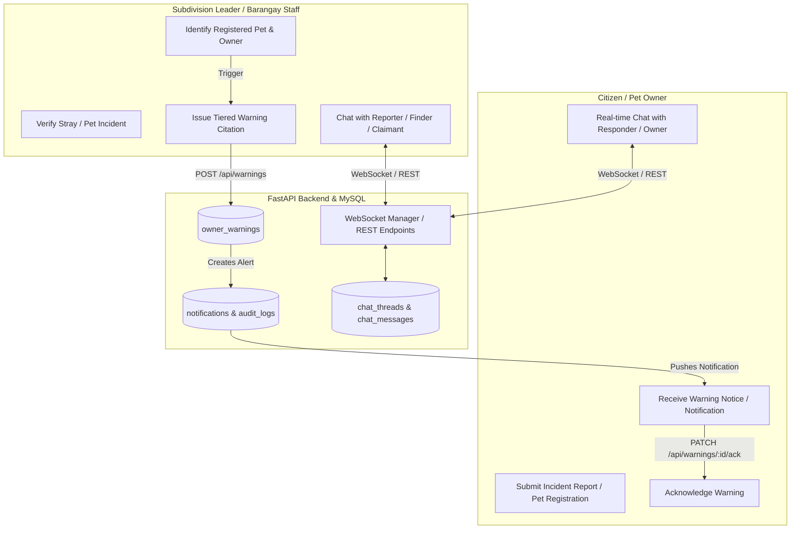

# StraySafe 2.0: Warning System & Context-Bound Messaging Implementation Guide

This guide provides the comprehensive, step-by-step architectural specification and code implementation plan for two key features in **StraySafe 2.0**:
1. **Pet Owner Warning & Citation System** (Responsible Pet Ownership Governance)
2. **Context-Bound Direct Messaging System** (Real-Time In-App Coordination)

---

## 📑 Table of Contents
1. [Architecture & System Flow](#1-architecture--system-flow)
2. [Feature 1: Pet Owner Warning System](#2-feature-1-pet-owner-warning-system)
   - [Database Schema](#21-database-schema-owner_warnings)
   - [Backend Implementation (FastAPI)](#22-backend-implementation)
   - [Frontend Implementation (React + Vite)](#23-frontend-implementation)
3. [Feature 2: Context-Bound Messaging System](#3-feature-2-context-bound-messaging-system)
   - [Database Schema](#31-database-schema-chat_threads--chat_messages)
   - [Backend WebSocket & REST Implementation](#32-backend-websocket--rest-implementation)
   - [Frontend Chat Drawer & UI Integration](#33-frontend-implementation)
4. [Step-by-Step Execution Plan](#4-step-by-step-execution-plan)
5. [Plain English Explanation (Non-Technical Summary)](#5-plain-english-explanation-non-technical-summary)
   - [Why are these features important?](#51-why-are-these-features-important)
   - [How the Warning System Works in Real Life](#52-how-the-warning-system-works-in-real-life)
   - [How the Messaging System Works in Real Life](#53-how-the-messaging-system-works-in-real-life)
   - [Why "Context-Bound" Chat is Better Than Open Social Chat](#54-why-context-bound-chat-is-better-than-open-social-chat)
   - [Quick Summary for Presentations / Thesis Defense](#55-quick-summary-for-presentations--thesis-defense)

---

## 1. Architecture & System Flow



---

## 2. Feature 1: Pet Owner Warning System

### 2.1 Database Schema (`owner_warnings`)

Add the following table definition to `Database.txt` and run it in MySQL:

```sql
-- =========================================
-- TABLE: OWNER_WARNINGS
-- =========================================
DROP TABLE IF EXISTS `owner_warnings`;
CREATE TABLE `owner_warnings` (
  `warning_id` INT NOT NULL AUTO_INCREMENT,
  `user_id` INT NOT NULL,                          -- Pet Owner being warned
  `pet_id` INT DEFAULT NULL,                       -- Associated registered pet (if identified)
  `report_id` INT DEFAULT NULL,                    -- Incident report serving as proof/evidence
  `issued_by` INT NOT NULL,                        -- Leader or Barangay Staff ID
  `warning_level` ENUM('Notice', '1st Warning', '2nd Warning', 'Final Notice / Escalation') NOT NULL DEFAULT '1st Warning',
  `violation_type` ENUM(
      'Free-Roaming Unleashed', 
      'Nuisance / Aggressive Behavior', 
      'Overdue Vaccination', 
      'Repeated Impoundment Retrieval', 
      'Other'
  ) NOT NULL DEFAULT 'Free-Roaming Unleashed',
  `description` TEXT NOT NULL,                     -- Specific details (e.g. "Spotted near Block 5 Lot 12")
  `fine_amount` DECIMAL(10,2) DEFAULT 0.00,        -- Optional fine amount for final notices per local ordinance
  `status` ENUM('Pending', 'Acknowledged', 'Appealed', 'Resolved') NOT NULL DEFAULT 'Pending',
  `acknowledged_at` TIMESTAMP NULL DEFAULT NULL,
  `created_at` TIMESTAMP NULL DEFAULT CURRENT_TIMESTAMP,
  `updated_at` TIMESTAMP NULL DEFAULT CURRENT_TIMESTAMP ON UPDATE CURRENT_TIMESTAMP,
  PRIMARY KEY (`warning_id`),
  KEY `fk_warnings_user` (`user_id`),
  KEY `fk_warnings_pet` (`pet_id`),
  KEY `fk_warnings_report` (`report_id`),
  KEY `fk_warnings_issuer` (`issued_by`),
  CONSTRAINT `fk_warnings_user` FOREIGN KEY (`user_id`) REFERENCES `users` (`user_id`) ON DELETE CASCADE,
  CONSTRAINT `fk_warnings_pet` FOREIGN KEY (`pet_id`) REFERENCES `pets` (`pet_id`) ON DELETE SET NULL,
  CONSTRAINT `fk_warnings_report` FOREIGN KEY (`report_id`) REFERENCES `reports` (`report_id`) ON DELETE SET NULL,
  CONSTRAINT `fk_warnings_issuer` FOREIGN KEY (`issued_by`) REFERENCES `users` (`user_id`) ON DELETE CASCADE
) ENGINE=InnoDB DEFAULT CHARSET=utf8mb4 COLLATE=utf8mb4_0900_ai_ci;
```

---

### 2.2 Backend Implementation

#### 1. SQLAlchemy Model: `backend/app/models/warning.py`
```python
from sqlalchemy import Column, Integer, String, Text, Numeric, Enum, ForeignKey, TIMESTAMP, func
from sqlalchemy.orm import relationship
from app.database.session import Base

class OwnerWarning(Base):
    __tablename__ = "owner_warnings"

    warning_id = Column(Integer, primary_key=True, index=True)
    user_id = Column(Integer, ForeignKey("users.user_id", ondelete="CASCADE"), nullable=False)
    pet_id = Column(Integer, ForeignKey("pets.pet_id", ondelete="SET NULL"), nullable=True)
    report_id = Column(Integer, ForeignKey("reports.report_id", ondelete="SET NULL"), nullable=True)
    issued_by = Column(Integer, ForeignKey("users.user_id", ondelete="CASCADE"), nullable=False)
    warning_level = Column(Enum('Notice', '1st Warning', '2nd Warning', 'Final Notice / Escalation'), default='1st Warning')
    violation_type = Column(Enum('Free-Roaming Unleashed', 'Nuisance / Aggressive Behavior', 'Overdue Vaccination', 'Repeated Impoundment Retrieval', 'Other'), default='Free-Roaming Unleashed')
    description = Column(Text, nullable=False)
    fine_amount = Column(Numeric(10, 2), default=0.00)
    status = Column(Enum('Pending', 'Acknowledged', 'Appealed', 'Resolved'), default='Pending')
    acknowledged_at = Column(TIMESTAMP, nullable=True)
    created_at = Column(TIMESTAMP, server_default=func.now())
    updated_at = Column(TIMESTAMP, server_default=func.now(), onupdate=func.now())

    # Relationships
    owner = relationship("User", foreign_keys=[user_id])
    issuer = relationship("User", foreign_keys=[issued_by])
    pet = relationship("Pet", foreign_keys=[pet_id])
    report = relationship("Report", foreign_keys=[report_id])
```

#### 2. Pydantic Schemas: `backend/app/schemas/warning.py`
```python
from pydantic import BaseModel
from typing import Optional, Literal
from datetime import datetime

class WarningCreate(BaseModel):
    user_id: int
    pet_id: Optional[int] = None
    report_id: Optional[int] = None
    warning_level: Literal['Notice', '1st Warning', '2nd Warning', 'Final Notice / Escalation']
    violation_type: Literal['Free-Roaming Unleashed', 'Nuisance / Aggressive Behavior', 'Overdue Vaccination', 'Repeated Impoundment Retrieval', 'Other']
    description: str
    fine_amount: Optional[float] = 0.0

class WarningResponse(BaseModel):
    warning_id: int
    user_id: int
    pet_id: Optional[int]
    report_id: Optional[int]
    issued_by: int
    warning_level: str
    violation_type: str
    description: str
    fine_amount: float
    status: str
    acknowledged_at: Optional[datetime]
    created_at: datetime
    
    # Nested detail summaries
    owner_name: Optional[str] = None
    pet_name: Optional[str] = None
    issuer_name: Optional[str] = None

    class Config:
        from_attributes = True
```

#### 3. API Router: `backend/app/routes/warnings.py`
Endpoints to expose:
- `POST /api/warnings` — Issue a new warning (Leaders & Barangay Staff only). Auto-creates an in-app `notification` and an `audit_log`.
- `GET /api/warnings/my-warnings` — Citizen views all warnings issued to their account.
- `GET /api/warnings/user/{user_id}` — View warning history for a resident.
- `GET /api/warnings/pet/{pet_id}` — View warnings linked to a specific pet.
- `PATCH /api/warnings/{warning_id}/acknowledge` — Resident marks the warning as acknowledged.

---

### 2.3 Frontend Implementation

#### 1. "Issue Warning Modal" for Subdivision Leaders & Barangay Staff
In `frontend/src/pages/Subd_Leaders/` and `frontend/src/pages/Barangay_Staff/`:
- Add a button **"⚠️ Issue Owner Warning"** in the **Report Detail Modal** or **Pet Record View**.
- Form inputs:
  - Select Owner / Resident (pre-filled if linked to a registered pet).
  - Warning Tier (`Notice`, `1st Warning`, `2nd Warning`, `Final Notice / Escalation`).
  - Violation Category (`Free-Roaming Unleashed`, `Nuisance`, etc.).
  - Remarks / Incident Description.
  - Checkbox: *Attach incident photos from this report as evidence*.

#### 2. Resident Dashboard Banner & Warning Modal
In `frontend/src/pages/citizen/ResiHomePage.tsx` and `ResidentPet.tsx`:
- Show an alert banner when `pending_warnings > 0`:
  > ⚠️ **Official Community Notice**: You have 1 unacknowledged warning regarding pet **Max** (Free-Roaming Unleashed). [Click here to view & acknowledge].
- Clicking opens a formal notice dialog with report evidence and an **"I Acknowledge This Notice"** button.

---

## 3. Feature 2: Context-Bound Messaging System

### 3.1 Database Schema (`chat_threads` & `chat_messages`)

```sql
-- =========================================
-- TABLE: CHAT_THREADS
-- =========================================
DROP TABLE IF EXISTS `chat_threads`;
CREATE TABLE `chat_threads` (
  `thread_id` INT NOT NULL AUTO_INCREMENT,
  `thread_type` ENUM('Report', 'Pet_Claim', 'Direct') NOT NULL DEFAULT 'Report',
  `related_id` INT DEFAULT NULL,                   -- report_id or claim_id
  `created_by` INT NOT NULL,                       -- Initiator user_id
  `recipient_id` INT NOT NULL,                     -- Target user_id
  `title` VARCHAR(255) DEFAULT NULL,               -- e.g. "Report #42 Inquiry"
  `is_closed` TINYINT(1) DEFAULT 0,                -- Closed when report/claim is resolved
  `created_at` TIMESTAMP NULL DEFAULT CURRENT_TIMESTAMP,
  `updated_at` TIMESTAMP NULL DEFAULT CURRENT_TIMESTAMP ON UPDATE CURRENT_TIMESTAMP,
  PRIMARY KEY (`thread_id`),
  KEY `fk_threads_creator` (`created_by`),
  KEY `fk_threads_recipient` (`recipient_id`),
  CONSTRAINT `fk_threads_creator` FOREIGN KEY (`created_by`) REFERENCES `users` (`user_id`) ON DELETE CASCADE,
  CONSTRAINT `fk_threads_recipient` FOREIGN KEY (`recipient_id`) REFERENCES `users` (`user_id`) ON DELETE CASCADE
) ENGINE=InnoDB DEFAULT CHARSET=utf8mb4 COLLATE=utf8mb4_0900_ai_ci;

-- =========================================
-- TABLE: CHAT_MESSAGES
-- =========================================
DROP TABLE IF EXISTS `chat_messages`;
CREATE TABLE `chat_messages` (
  `message_id` INT NOT NULL AUTO_INCREMENT,
  `thread_id` INT NOT NULL,
  `sender_id` INT NOT NULL,
  `message_text` TEXT NOT NULL,
  `media_url` VARCHAR(255) DEFAULT NULL,
  `is_read` TINYINT(1) DEFAULT 0,
  `sent_at` TIMESTAMP NULL DEFAULT CURRENT_TIMESTAMP,
  PRIMARY KEY (`message_id`),
  KEY `fk_messages_thread` (`thread_id`),
  KEY `fk_messages_sender` (`sender_id`),
  CONSTRAINT `fk_messages_sender` FOREIGN KEY (`sender_id`) REFERENCES `users` (`user_id`) ON DELETE CASCADE,
  CONSTRAINT `fk_messages_thread` FOREIGN KEY (`thread_id`) REFERENCES `chat_threads` (`thread_id`) ON DELETE CASCADE
) ENGINE=InnoDB DEFAULT CHARSET=utf8mb4 COLLATE=utf8mb4_0900_ai_ci;
```

---

### 3.2 Backend WebSocket & REST Implementation

#### 1. WebSocket Connection Manager: `backend/app/utils/websocket_manager.py`
```python
from fastapi import WebSocket
from typing import Dict, List

class ConnectionManager:
    def __init__(self):
        # Maps user_id -> List of active WebSocket connections
        self.active_connections: Dict[int, List[WebSocket]] = {}

    async def connect(self, user_id: int, websocket: WebSocket):
        await websocket.accept()
        if user_id not in self.active_connections:
            self.active_connections[user_id] = []
        self.active_connections[user_id].append(websocket)

    def disconnect(self, user_id: int, websocket: WebSocket):
        if user_id in self.active_connections:
            if websocket in self.active_connections[user_id]:
                self.active_connections[user_id].remove(websocket)
            if not self.active_connections[user_id]:
                del self.active_connections[user_id]

    async def send_personal_message(self, message: dict, user_id: int):
        if user_id in self.active_connections:
            for connection in self.active_connections[user_id]:
                await connection.send_json(message)

manager = ConnectionManager()
```

#### 2. Chat Router: `backend/app/routes/chat.py`
- `POST /api/chat/threads` — Get or create a thread for a specific Report or Pet Claim.
- `GET /api/chat/threads` — List all active threads for the current logged-in user with unread counts.
- `GET /api/chat/threads/{thread_id}/messages` — Get paginated message history for a thread.
- `POST /api/chat/threads/{thread_id}/messages` — REST endpoint to post a message (fallback).
- `PATCH /api/chat/threads/{thread_id}/read` — Mark all incoming messages in the thread as read.
- `websocket /ws/chat/{user_id}` — Real-time bidirectional socket for live message delivery and typing indicators.

---

### 3.3 Frontend Implementation

#### 1. Chat Drawer Component: `frontend/src/components/chat/ChatDrawer.tsx`
Create a reusable slide-over drawer or popup chat widget:
- **Header:** Thread subject (e.g. *"Inquiry on Report #28 – Injured Dog"*), counterpart user avatar & role badge, close button.
- **Message Body:** Bubble messages with sender avatar, timestamp, image preview support, and read checkmarks.
- **Input Footer:** Text input, photo upload icon, and send button.

#### 2. Integration Points
- **On Report Cards:** A **"💬 Chat with Reporter"** button for Subdivision Leaders / Rescuers.
- **On Pet Claims:** A **"💬 Chat with Claimant / Owner"** button for Barangay Holding Staff.
- **Navbar:** A **💬 Messages** icon with a red badge displaying the count of total unread messages.

---

## 4. Step-by-Step Execution Plan

### Phase 1: Database Setup
1. Update `Database.txt` with the SQL tables for `owner_warnings`, `chat_threads`, and `chat_messages`.
2. Execute the table creation statements in your local `straysafe_db` database.

### Phase 2: Backend Development
1. Create models in `backend/app/models/warning.py` and `backend/app/models/chat.py`.
2. Create schemas in `backend/app/schemas/warning.py` and `backend/app/schemas/chat.py`.
3. Implement route handlers in `backend/app/routes/warnings.py` and `backend/app/routes/chat.py`.
4. Register the new routers in `backend/app/main.py`.

### Phase 3: Frontend Development
1. Create warning creation modal in Leader & Barangay dashboards.
2. Build citizen warning acknowledgment banner in `ResiHomePage.tsx` and `ResidentPet.tsx`.
3. Create `ChatDrawer.tsx` component and hook it into Report and Pet Claim detail views.
4. Add global unread message counter in the main top navigation.

### Phase 4: Testing & Verification
1. Log in as **Subdivision Leader** $\to$ Issue a warning on an incident report $\to$ Verify in database.
2. Log in as **Citizen (Pet Owner)** $\to$ Check notification and banner $\to$ Click "Acknowledge" $\to$ Verify status update.
3. Open two browser windows (Leader & Citizen) $\to$ Send live chat messages on an active report $\to$ Verify real-time message delivery and unread count badges.

---

## 5. Plain English Explanation (Non-Technical Summary)

This section explains the **Warning System** and the **Messaging System** in simple, everyday language without technical jargon. You can use these explanations for project presentations, user guides, or thesis defense questions.

---

### 5.1 Why are these features important?

In many communities, two common problems happen with stray animals:
1. **Pets Mistaken for Strays:** Many animals wandering around aren't homeless strays—they are pets whose owners leave their gates open or let them roam unleashed.
2. **Slow Coordination During Rescues:** When a citizen spots an injured or aggressive animal, the barangay team or rescuers often have trouble finding the exact spot or confirming the situation without a fast, private way to talk to the person who saw it.

These two features solve both problems directly.

---

### 5.2 How the Warning System Works in Real Life

Think of the Warning System like a **digital traffic ticket or formal friendly reminder** for pet owners:

#### Real-Life Scenario:
> **The Problem:** Mr. Santos has a dog named *Bantay*. Mr. Santos frequently leaves his gate open, and *Bantay* runs outside, barks aggressively at passing tricycles, and overturns neighbors' trash bins.

1. **A Neighbor Reports It:** A neighbor takes a photo of *Bantay* on the street and submits a report on StraySafe.
2. **The Leader Verifies the Pet:** The Subdivision Leader recognizes *Bantay* or matches the dog to Mr. Santos’s registered pet profile in StraySafe.
3. **Issuing the Warning:** Instead of sending animal control immediately to capture the dog, the Leader clicks **"Issue Owner Warning"** with the photo attached.
4. **The Owner Gets Notified:** Mr. Santos sees a yellow alert banner on his StraySafe app: 
   > *"Notice: Your pet Bantay was reported roaming without a leash on Block 3. Please secure your pet inside your gate."*
5. **Acknowledgment:** Mr. Santos clicks **"I Acknowledge"**, promising to keep his gate closed. This creates a clean digital record.
6. **The 3-Strike Fair Rule:**
   - **1st Time (Friendly Notice):** A polite reminder to keep pets inside.
   - **2nd Time (Formal Warning):** An official warning on the owner's permanent record.
   - **3rd Time (Escalation to Barangay):** The case is referred to the Barangay Captain or HOA Board for fines under local ordinances.

---

### 5.3 How the Messaging System Works in Real Life

Think of the Messaging System as a **focused, private walkie-talkie** between people who need to help an animal:

#### Scenario A: Live Rescue Coordination (Rescuer $\leftrightarrow$ Reporter)
> **The Problem:** A resident reports an injured puppy near the community basketball court. 20 minutes later, the Barangay Rescuer arrives, but the puppy is no longer there.

- **How Messaging Helps:** The Rescuer opens the report in the app and clicks **"Chat with Reporter"**:
  - *Rescuer:* *"Hello po! We are at the court now. Did the puppy move?"*
  - *Reporter:* *"Opo, it got scared and hid under the white van near the clubhouse!"*
- The puppy is found and rescued in minutes instead of the team leaving empty-handed.

#### Scenario B: Returning a Lost Pet (Finder $\leftrightarrow$ Pet Owner)
> **The Problem:** A neighbor finds a lost Shih Tzu with a StraySafe QR collar tag and scans it.

- **How Messaging Helps:** The finder taps **"Message Owner"** directly in StraySafe.
- They can talk, exchange a photo, and agree on a safe pick-up point **without giving away personal phone numbers publicly to strangers**.

---

### 5.4 Why "Context-Bound" Chat is Better Than Open Social Chat

| Feature | Open Social Chat (Messenger / WhatsApp) | StraySafe Context-Bound Chat |
| :--- | :--- | :--- |
| **Privacy** | Exposes private phone numbers and personal social profiles. | Protects privacy—communication stays inside the official system. |
| **Spam & Clutter** | Endless group chats, spam, and off-topic chatter. | Clean and focused—every chat belongs to one specific report or pet. |
| **Automatic Closure** | Chats stay open forever even after the problem is solved. | Chat automatically closes once the animal is rescued or returned home. |
| **Accountability** | Lost in private message logs. | Barangay officers have an official record of how an incident was handled. |

---

### 5.5 Quick Summary for Presentations / Thesis Defense

- 🛡️ **Warning System:** Promotes **responsible pet ownership** by giving community leaders a fair, 3-strike digital citation tool to prevent pets from becoming roaming strays.
- 💬 **Messaging System:** Enables **fast, private, and real-time coordination** between citizens and rescuers during emergency rescues and lost pet returns.

