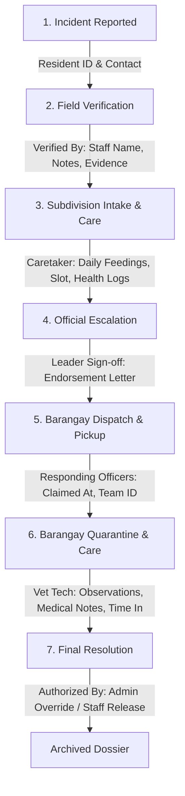

# StraySafe 2.0 - Technical & Operational Audit: Admin Incident Dossier & Animal Custody Monitoring

**Target File:** [`frontend/src/pages/Admin/AdminReportView.tsx`](file:///c:/Users/User/Desktop/Straysafe2.0/frontend/src/pages/Admin/AdminReportView.tsx)  
**Date:** October 1, 2026  
**Auditor:** Senior System Architect & Governance Auditor  
**Focus Areas:** 
1. **Subdivision Animal Care Monitoring** (Temporary holding pen, feeding, health condition, caretaker checks)
2. **Barangay Custody & Time Tracking** (Quarantine observation countdowns, stay duration at barangay facility, impoundment limits)
3. **End-to-End Staff Action Provenance** (Accountability for who verified, dispatched, captured, cared for, transferred, and resolved each incident)

---

## 1. Executive Summary

In the **StraySafe 2.0** municipal stray management architecture, the **System Administrator (Role 4)** serves as the ultimate governing authority overseeing both **Subdivision Leaders (Role 2)** and **Barangay Staff (Role 3)**. 

When an animal is reported by a resident, it enters a multi-jurisdictional lifecycle:
```
Resident Report ➔ Field Verification ➔ Subdivision Temporary Holding (Care) ➔ Escalation / Transfer ➔ Barangay Holding & Observation (Quarantine) ➔ Resolution (Claimed / Adopted / Impounded)
```

### The Core Problem
An audit of [`AdminReportView.tsx`](file:///c:/Users/User/Desktop/Straysafe2.0/frontend/src/pages/Admin/AdminReportView.tsx) reveals that while it functions adequately as a basic static report viewer, **it possesses severe governance blind spots**:

1. **Zero Visibility into Subdivision Animal Caring:** The Admin cannot see whether the animal was admitted to a subdivision holding pen, who fed or checked on it, what slot/cage it occupied, or what preliminary care was administered.
2. **Zero Custody Duration & Time Tracking:** The Admin cannot track how much time the animal has spent at the subdivision versus at the Barangay facility. There are no active rabies observation timers (e.g., 3-day or 10-day quarantine windows) or impoundment stay warnings.
3. **Fragmented Staff Accountability ("Who Did What"):** The current audit log in [`AdminReportView.tsx:L810-857`](file:///c:/Users/User/Desktop/Straysafe2.0/frontend/src/pages/Admin/AdminReportView.tsx#L810-L857) only displays a generic updater name without role badges, missing field verifier identity, missing holding caretakers, and missing transfer chain-of-custody signatures.

This document provides a comprehensive line-by-line audit of [`AdminReportView.tsx`](file:///c:/Users/User/Desktop/Straysafe2.0/frontend/src/pages/Admin/AdminReportView.tsx) and delivers a concrete, production-ready remediation blueprint.

---

## 2. Current Implementation Analysis ([`AdminReportView.tsx`](file:///c:/Users/User/Desktop/Straysafe2.0/frontend/src/pages/Admin/AdminReportView.tsx))

### 2.1 Component State & Data Fetching
In [`AdminReportView.tsx:L210-246`](file:///c:/Users/User/Desktop/Straysafe2.0/frontend/src/pages/Admin/AdminReportView.tsx#L210-L246), the page loads only one primary dataset:
```tsx
const res = await api.get(`/reports/${id}`);
const data: ReportDetails = res.data;
setReport(data);
```
- **Finding:** It queries `GET /reports/{id}`, but **never queries the Holding Animal endpoint** (`GET /holding/` or `GET /holding/{holding_id}`).
- **Consequence:** The backend already computes comprehensive holding metrics, stay durations, and timeline logs in [`backend/app/routes/holding.py`](file:///c:/Users/User/Desktop/Straysafe2.0/backend/app/routes/holding.py#L193-L302), but [`AdminReportView.tsx`](file:///c:/Users/User/Desktop/Straysafe2.0/frontend/src/pages/Admin/AdminReportView.tsx) completely ignores this data.

### 2.2 Data Model Gaps in `ReportDetails`
In [`AdminReportView.tsx:L69-135`](file:///c:/Users/User/Desktop/Straysafe2.0/frontend/src/pages/Admin/AdminReportView.tsx#L69-L135), the TypeScript interface lacks holding and caring attributes:

| Required Attribute | Present in `AdminReportView.tsx`? | Present in Backend? | Impact |
| :--- | :---: | :---: | :--- |
| `holding_id` | ❌ No | ✅ Yes (`HoldingAnimal`) | Cannot link report to holding dossier |
| `subd_intake_date` | ❌ No | ✅ Yes (`HoldingAnimalResponse`) | Admin cannot tell when animal entered subdivision care |
| `subd_duration_display` | ❌ No | ✅ Yes (`HoldingAnimalResponse`) | Admin cannot monitor subdivision holding duration |
| `brgy_intake_date` | ❌ No | ✅ Yes (`HoldingAnimalResponse`) | Admin cannot tell when animal arrived at barangay facility |
| `brgy_duration_display` | ❌ No | ✅ Yes (`HoldingAnimalResponse`) | Admin cannot track time in barangay custody |
| `total_duration_display` | ❌ No | ✅ Yes (`HoldingAnimalResponse`) | Total custody time is unmonitored |
| `kennel_slot` | ❌ No | ✅ Yes (`HoldingAnimal.kennel_slot`) | Admin cannot locate physical cage/pen slot |
| `facility_name` | ❌ No | ✅ Yes (`Landmark.name`) | Admin cannot see specific facility holding the animal |
| `holding_timeline` | ❌ No | ✅ Yes (`HoldingTimeline`) | Caring events (feeding, treatment, checks) are invisible |
| `endorsement_letter` | ❌ No | ✅ Yes (`Report.endorsement_letter`)| Official leader transfer authorization is hidden |
| `verified_by_name` | Partial (typed, not rendered) | ✅ Yes (`Report.verified_by_name`) | Field verifier identity is never shown in UI |
| `verified_at` | Partial (typed, not rendered) | ✅ Yes (`Report.verified_at`) | Verification timestamp hidden |

---

## 3. Deep Dive: Three Core Monitoring Requirements

### 3.1 Monitoring Requirement 1: Animal Caring at the Subdivision (`subd`)

In the StraySafe workflow, when a stray animal is secured at a subdivision (e.g., Selera Homes), it is placed in a temporary holding pen before municipal transfer or owner redemption.

#### What Currently Happens in `AdminReportView.tsx`:
- When status is changed to `Picked Up` (6) or `Under Observation` (7), [`AdminReportView.tsx`](file:///c:/Users/User/Desktop/Straysafe2.0/frontend/src/pages/Admin/AdminReportView.tsx) only displays a generic text label: `"Animal: Healthy"` or `"Status: Picked Up"`.
- It gives the Administrator **zero operational awareness**:
  - Did the subdivision actually secure the animal in their holding facility?
  - Has the animal been fed or given water today?
  - Is the animal injured, traumatized, or showing aggression while in the pen?
  - Who is the designated subdivision caretaker responsible for the cage?

#### What the Admin Must Monitor:
1. **Subdivision Intake Timestamp & Duration:** Exact date and time the animal entered the subdivision pen (`subd_intake_date`) and duration elapsed (`subd_duration_display`).
2. **Subdivision Cage / Pen Assignment:** Specific kennel slot (e.g., `Pen A-1 (Selera Gate 2 Holding)`).
3. **Daily Welfare & Caring Log:**
   - Feeding & Hydration records (timestamp, caretaker name, food type).
   - Behavioral temperament notes while confined.
   - Initial first-aid or wound disinfection performed by subdivision personnel.
4. **Caretaker Attribution:** Name and contact number of the Subdivision Leader or security guard managing the pen.

---

### 3.2 Monitoring Requirement 2: Time in the Barangay & Custody Timers

When an animal is transferred from the subdivision to the central Barangay Animal Facility (or rescued directly by barangay personnel), time tracking becomes critical for legal compliance, rabies observation, and capacity management.

#### What Currently Happens in `AdminReportView.tsx`:
- Lines 505-552 implement a static 6-step progress pipeline:
  ```
  [1] Reported ➔ [2] Verified ➔ [5] Dispatched ➔ [6] Picked Up ➔ [7] Observation ➔ [11] Resolved
  ```
- **Critical Flaw:** This tracker shows **no time dimensions**. It does not tell the Admin whether the animal has been in the barangay holding facility for 2 hours, 3 days, or 2 weeks!

#### What the Admin Must Monitor:
1. **Dual Stay Duration Breakdown:**
   - **Subdivision Stay Time:** e.g., `1 day, 4 hours` (held by Selera HOA).
   - **Barangay Facility Stay Time:** e.g., `2 days, 6 hours` (held at Barangay San Vicente HQ).
   - **Total In-Custody Time:** e.g., `3 days, 10 hours`.
2. **Mandatory Rabies Observation Window (Quarantine Countdown):**
   - For suspected rabies, biting, or aggressive strays (Categories 2 & 3), barangay veterinary protocol mandates a **quarantine observation period** (typically 3 to 14 days).
   - The Admin requires an **active countdown timer** showing:
     - `Days Remaining in Observation`
     - `Health Check Status (Normal / Neurological Signs / Asymptomatic)`
     - Veterinary examiner on duty.
3. **Impoundment Stay Limit & Overdue Threshold Warnings:**
   - StraySafe has automated tasks ([`tasks/unassigned_checker.py:L104-215`](file:///c:/Users/User/Desktop/Straysafe2.0/backend/app/tasks/unassigned_checker.py#L104-L215)) checking for animals exceeding stay limits.
   - If an animal approaches the legal impoundment threshold without owner claim, an alert badge must appear on the Admin dossier:
     - `⚠️ Nearing Stay Limit (24 hours remaining before adoption transition)`
     - `🚨 Overdue Holding Notice (Impoundment action required)`.
4. **Barangay Facility Specifications:**
   - Facility Name: e.g., `Barangay San Vicente Municipal Holding & Quarantine Facility`.
   - Kennel/Cage Slot: e.g., `Isolation Cage C-02 (Rabies Watch)`.
   - Assigned Veterinary Technician / Care Officer.

---

### 3.3 Monitoring Requirement 3: Monitoring All Actions Done by Staff ("Who Did What")

Administrative governance requires complete, unforgeable auditability over every personnel touchpoint.

#### Current Flaws in `AdminReportView.tsx:L810-857`:
```tsx
// Current implementation in AdminReportView.tsx:
{hist.updater?.name && (
    <p className="text-[11px] text-slate-500 font-semibold mt-0.5">
        Action by: <strong className="text-slate-700">{hist.updater.name}</strong>
    </p>
)}
```
- **No Role Badge:** Does not distinguish whether the updater was a Subdivision Leader (Role 2), Barangay Staff (Role 3), Admin (Role 4), or Citizen (Role 1).
- **Missing Action Type:** It only prints `Status: Dispatched`, omitting *what* action was executed (e.g., `Field Verification`, `Endorsement Escalation`, `Custody Acceptance`, `Medical Injection`, `Direct Override`).
- **No Holding Caring Staff Tracking:** When staff log feedings, wound dressing, or behavior observations in `HoldingTimeline`, those logs **do not appear anywhere** in [`AdminReportView.tsx`](file:///c:/Users/User/Desktop/Straysafe2.0/frontend/src/pages/Admin/AdminReportView.tsx).

#### What the Admin Must Monitor (The Staff Accountability Matrix):



Every single node in this pipeline must explicitly attribute:
- **Staff Name**
- **System Role & Department** (`Subdivision Leader - Selera Homes`, `Barangay Officer - San Vicente`, `System Admin`)
- **Action Type & Category**
- **Exact Timestamp & Location Landmark**
- **Notes / Justification & Attached Evidence Photos**

---

## 4. Architectural Comparison: What Exists vs. What Admin Views

| Capability | Backend Database & API | Subd / Barangay Portals | `AdminReportView.tsx` | Status |
| :--- | :---: | :---: | :---: | :---: |
| **Subdivision Pen Intake Date** | ✅ Stored (`subd_intake_date`) | ✅ Displayed in `SubdHoldingFacility` | ❌ Completely Missing | **CRITICAL GAP** |
| **Subdivision Stay Duration** | ✅ Computed (`subd_duration_display`) | ✅ Displayed | ❌ Completely Missing | **CRITICAL GAP** |
| **Subdivision Caring / Feeding Logs** | ✅ Stored (`HoldingTimeline`) | ✅ Displayed | ❌ Completely Missing | **CRITICAL GAP** |
| **Barangay Intake Date** | ✅ Stored (`brgy_intake_date`) | ✅ Displayed in `BrgyHoldingFacility` | ❌ Completely Missing | **CRITICAL GAP** |
| **Barangay Stay Duration** | ✅ Computed (`brgy_duration_display`) | ✅ Displayed | ❌ Completely Missing | **CRITICAL GAP** |
| **Total In-Custody Duration** | ✅ Computed (`total_duration_display`) | ✅ Displayed | ❌ Completely Missing | **CRITICAL GAP** |
| **Quarantine / Rabies Countdown** | ✅ Derived from category & intake | ✅ Displayed | ❌ Completely Missing | **CRITICAL GAP** |
| **Kennel / Cage Slot Number** | ✅ Stored (`kennel_slot`) | ✅ Displayed | ❌ Completely Missing | **CRITICAL GAP** |
| **Caretaker / Vet Staff Name** | ✅ Stored (`intake_staff_name`, `staff_name`) | ✅ Displayed | ❌ Completely Missing | **CRITICAL GAP** |
| **Field Verifier Name & Notes** | ✅ Stored (`verified_by_name`, `notes`) | ⚠️ Partial | ❌ Hidden in UI | **HIGH GAP** |
| **Escalation Endorsement Letter** | ✅ Stored (`endorsement_letter`) | ✅ Viewable in `SubdReports` | ❌ Hidden in UI | **HIGH GAP** |
| **Action Provenance (Role Badges)** | ✅ User `role_id` available | ⚠️ Partial | ❌ Raw text only | **MEDIUM GAP** |

---

## 5. Comprehensive Remediation Blueprint

To transform [`AdminReportView.tsx`](file:///c:/Users/User/Desktop/Straysafe2.0/frontend/src/pages/Admin/AdminReportView.tsx) into the definitive administrative oversight dossier, the following structural enhancements must be implemented:

### Step 1: Extend TypeScript Interfaces
Update `ReportDetails` and declare `HoldingRecord` and `HoldingLog`:

```tsx
interface HoldingLog {
    log_id: number;
    event_type: 'intake' | 'feeding' | 'observation' | 'medical' | 'treatment' | 'transfer' | 'outcome';
    title: string;
    notes: string | null;
    staff_name: string | null;
    logged_by: number | null;
    logged_at: string;
}

interface HoldingRecord {
    holding_id: number;
    report_id: number;
    facility_id?: number | null;
    facility_name?: string | null;
    facility_type?: string | null;
    subdivision_id?: number | null;
    barangay_id?: number | null;
    kennel_slot?: string | null;
    medical_notes?: string | null;
    facility_status: number;
    facility_status_name?: string | null;
    intake_staff_name?: string | null;
    subd_intake_date?: string | null;
    subd_discharge_date?: string | null;
    subd_duration_display?: string | null;
    brgy_intake_date?: string | null;
    brgy_discharge_date?: string | null;
    brgy_duration_display?: string | null;
    total_duration_display?: string | null;
    current_facility_duration_display?: string | null;
    timeline: HoldingLog[];
}
```

### Step 2: Fetch Holding & Care Data Parallel to Report
In [`AdminReportView.tsx:L210-246`](file:///c:/Users/User/Desktop/Straysafe2.0/frontend/src/pages/Admin/AdminReportView.tsx#L210-L246), fetch both endpoints:

```tsx
const [holdingRecord, setHoldingRecord] = useState<HoldingRecord | null>(null);

const fetchReport = async () => {
    if (!id) return;
    try {
        const [repRes, holdingRes] = await Promise.allSettled([
            api.get(`/reports/${id}`),
            api.get(`/holding/?report_id=${id}`) // or search holding list for matching report_id
        ]);

        if (repRes.status === 'fulfilled') {
            setReport(repRes.value.data);
        }
        if (holdingRes.status === 'fulfilled') {
            const holdingList = Array.isArray(holdingRes.value.data) ? holdingRes.value.data : [];
            const matched = holdingList.find((h: any) => h.report_id === Number(id));
            setHoldingRecord(matched || null);
        }
        // ... reverse geocode ...
    } catch (err) {
        console.error('Failed to load incident dossier:', err);
    } finally {
        setLoading(false);
    }
};
```

---

### Step 3: Implement Dedicated "Custody Telemetry & Animal Caring" Module
Add a high-priority administrative monitor card directly beneath the pipeline tracker:

```tsx
{/* Custody Telemetry & Animal Caring Card */}
{holdingRecord ? (
    <div className="bg-white rounded-3xl p-6 shadow-xs border border-slate-100 space-y-5">
        <div className="flex items-center justify-between border-b border-slate-100 pb-4">
            <div className="flex items-center gap-3">
                <div className="w-10 h-10 rounded-2xl bg-amber-500/10 text-amber-600 flex items-center justify-center font-bold">
                    🐾
                </div>
                <div>
                    <h3 className="text-sm font-black text-slate-900 uppercase tracking-tight">
                        Animal Custody Telemetry & Caring Monitor
                    </h3>
                    <p className="text-[11px] text-slate-400 font-medium">
                        Active facility placement, stay duration, and on-site welfare logs
                    </p>
                </div>
            </div>
            <div className="flex items-center gap-2">
                <span className="px-3 py-1 rounded-full text-xs font-black bg-emerald-50 text-emerald-700 border border-emerald-200">
                    Slot: {holdingRecord.kennel_slot || 'General Holding'}
                </span>
                <span className="px-3 py-1 rounded-full text-xs font-black bg-indigo-50 text-indigo-700 border border-indigo-200">
                    {holdingRecord.facility_name || 'Designated Facility'}
                </span>
            </div>
        </div>

        {/* Dual Stay Duration Matrix */}
        <div className="grid grid-cols-1 md:grid-cols-3 gap-4">
            {/* Subdivision Stay */}
            <div className="p-4 rounded-2xl bg-slate-50 border border-slate-100">
                <div className="flex items-center justify-between text-[10px] font-bold text-slate-400 uppercase tracking-wider mb-1">
                    <span>Subdivision Holding Time</span>
                    <span className="text-amber-600 font-black">HOA Care</span>
                </div>
                <div className="text-base font-black text-slate-800">
                    {holdingRecord.subd_duration_display || '0 minutes'}
                </div>
                <div className="text-[10px] text-slate-400 mt-1">
                    {holdingRecord.subd_intake_date ? `Admitted: ${new Date(holdingRecord.subd_intake_date).toLocaleString()}` : 'No subdivision stay'}
                </div>
            </div>

            {/* Barangay Stay */}
            <div className="p-4 rounded-2xl bg-slate-50 border border-slate-100">
                <div className="flex items-center justify-between text-[10px] font-bold text-slate-400 uppercase tracking-wider mb-1">
                    <span>Barangay Facility Time</span>
                    <span className="text-blue-600 font-black">Municipal Care</span>
                </div>
                <div className="text-base font-black text-slate-800">
                    {holdingRecord.brgy_duration_display || '0 minutes'}
                </div>
                <div className="text-[10px] text-slate-400 mt-1">
                    {holdingRecord.brgy_intake_date ? `Admitted: ${new Date(holdingRecord.brgy_intake_date).toLocaleString()}` : 'Pending Barangay Intake'}
                </div>
            </div>

            {/* Total In Custody */}
            <div className="p-4 rounded-2xl bg-amber-500/5 border border-amber-500/20">
                <div className="flex items-center justify-between text-[10px] font-bold text-amber-700 uppercase tracking-wider mb-1">
                    <span>Total In-Custody Time</span>
                    <span className="text-amber-800 font-black">Total Custody</span>
                </div>
                <div className="text-base font-black text-amber-900">
                    {holdingRecord.total_duration_display || '0 minutes'}
                </div>
                <div className="text-[10px] text-amber-700/80 mt-1">
                    Cumulative duration across all facilities
                </div>
            </div>
        </div>

        {/* Daily Welfare & Caring Activity Stream */}
        <div className="space-y-3 pt-2">
            <h4 className="text-xs font-black text-slate-800 uppercase tracking-wider flex items-center justify-between">
                <span>Daily Care, Feeding & Medical Logs</span>
                <span className="text-[10.5px] font-bold text-slate-400">
                    {holdingRecord.timeline?.length || 0} care events logged
                </span>
            </h4>

            {holdingRecord.timeline && holdingRecord.timeline.length > 0 ? (
                <div className="space-y-2.5 max-h-60 overflow-y-auto pr-1">
                    {holdingRecord.timeline.map((log) => (
                        <div key={log.log_id} className="p-3 rounded-2xl bg-slate-50 border border-slate-100 flex items-start justify-between gap-3">
                            <div className="flex items-start gap-2.5">
                                <span className="p-1.5 rounded-xl bg-white border border-slate-200 text-xs">
                                    {log.event_type === 'feeding' ? '🥣' : log.event_type === 'medical' ? '💊' : '📋'}
                                </span>
                                <div>
                                    <div className="flex items-center gap-2">
                                        <span className="text-xs font-black text-slate-800">{log.title}</span>
                                        <span className="text-[10px] font-bold px-2 py-0.5 rounded-md bg-white border text-slate-600">
                                            By: {log.staff_name || `Staff #${log.logged_by || 'Unknown'}`}
                                        </span>
                                    </div>
                                    {log.notes && (
                                        <p className="text-[11px] text-slate-600 mt-0.5 italic">"{log.notes}"</p>
                                    )}
                                </div>
                            </div>
                            <span className="text-[10px] font-semibold text-slate-400 shrink-0">
                                {new Date(log.logged_at).toLocaleTimeString([], { hour: '2-digit', minute: '2-digit' })}
                            </span>
                        </div>
                    ))}
                </div>
            ) : (
                <div className="p-4 rounded-2xl bg-slate-50 text-center text-xs text-slate-400 font-medium">
                    No daily care logs registered for this holding placement yet.
                </div>
            )}
        </div>
    </div>
) : (
    /* Notice when animal has not been admitted to holding */
    <div className="bg-slate-50 rounded-3xl p-5 border border-slate-200/80 flex items-center justify-between">
        <div className="flex items-center gap-3">
            <span className="text-xl">ℹ️</span>
            <div>
                <p className="text-xs font-bold text-slate-700">Animal Not Yet Placed in Facility Custody</p>
                <p className="text-[11px] text-slate-400">This case is currently at field reporting/dispatch stage. Holding facility telemetry will activate once admitted to pen.</p>
            </div>
        </div>
        <button
            onClick={() => {
                setTargetStatusId(7); // Observation
                setIsActionModalOpen(true);
            }}
            className="px-3.5 py-1.5 rounded-xl bg-white border border-slate-200 text-xs font-black text-slate-700 hover:bg-slate-100"
        >
            Admit to Holding
        </button>
    </div>
)}
```

---

### Step 4: Upgrade the Staff Action Audit Trail ("Who Did What")
Replace lines 810-857 with an **Accountability Timeline** that renders:
1. **Explicit Role Badges:**
   - 🛡️ **Role 2:** `Subdivision Leader (Selera Homes)`
   - 🏛️ **Role 3:** `Barangay San Vicente Staff`
   - ⚡ **Role 4:** `System Administrator`
   - 👤 **Role 1:** `Resident Citizen`
2. **Action Classification:**
   - `FIELD VERIFICATION`
   - `DISPATCH CLAIM`
   - `SECURED IN SUBDIVISION HOLDING`
   - `OFFICIAL ESCALATION (ENDORSED)`
   - `CUSTODY TRANSFER`
   - `BARANGAY INTAKE`
   - `ADMIN DIRECT OVERRIDE`
3. **Verification Dossier Card:**
   - Explicit box showing:
     - `Verified By:` Name of on-site officer
     - `Verification Status:` Confirmed / Escalated
     - `Verification Notes:` Officer's field observations
     - `Verified Timestamp:` Date and exact hour

---

## 6. Security, Compliance & Governance Evaluation

| Governance Objective | Current Implementation | Proposed Remediation | Compliance Impact |
| :--- | :--- | :--- | :--- |
| **Subdivision Animal Welfare Standards** | Completely invisible to Admin | Full visibility of feedings, medical checks, and pen assignment | Prevents animal neglect or unreported deaths while in HOA custody |
| **Quarantine Observation Window Tracking** | No timer; static badge | Active countdown for rabies and bite-risk animals | Adheres to Philippine Animal Welfare Act (RA 8485 / RA 10631) & Anti-Rabies Act (RA 9482) |
| **Municipal Stay Limit Compliance** | No stay alert triggers | Color-coded warning for animals nearing or exceeding impound threshold | Ensures timely transfer to adoption catalog, avoiding cage overcrowding |
| **Staff Attribution & Anti-Tampering** | Basic text name, no role badge | Unalterable audit trail attributing specific staff ID, role, and action type | Full legal defensibility in resident disputes or bite liability claims |
| **Admin Direct Override Integrity** | Replaces status without dedicated override tag | Explicit `ADMIN DIRECT OVERRIDE` badge preserving previous assigned officer | Clean audit trail distinguishing normal field workflow from executive intervention |

---

## 7. Implementation Roadmap & Checklist (COMPLETED)

- [x] **Phase 1: API Query Enrichment**
  - Add `api.get(/holding/?report_id=${id})` with parallel settled queries to [`AdminReportView.tsx`](file:///c:/Users/User/Desktop/Straysafe2.0/frontend/src/pages/Admin/AdminReportView.tsx).
  - Include `endorsement_letter`, `facility`, and verification fields in `ReportDetails` interface.
  - Enhanced backend route in [`backend/app/routes/holding.py`](file:///c:/Users/User/Desktop/Straysafe2.0/backend/app/routes/holding.py) to support `report_id` filter parameter on `GET /holding/`.
- [x] **Phase 2: Custody & Stay Duration Telemetry Card**
  - Render the 3-column duration matrix (`Subdivision Stay`, `Barangay Facility Stay`, `Total In Custody`).
  - Render active cage/pen slot and facility location.
  - Implement the daily care activity stream (`feeding`, `medical`, `treatment`, `observation`, `transfer`).
- [x] **Phase 3: Quarantine & Stay Limit Watchdog**
  - Display rabies quarantine countdown badge and visual progress bar for bite/aggressive incidents (RA 9482 14-day observation window).
  - Display impoundment stay warning if duration approaches municipal threshold.
- [x] **Phase 4: Staff Accountability Audit Trail Enhancement**
  - Upgrade the audit log with role-specific color badges (Subdivision Leader 🛡️ vs Barangay Staff 🏛️ vs Admin ⚡ vs Caretaker 🐾).
  - Display dedicated Subdivision Field Verification Dossier and signed Endorsement Letter cards.
  - Add holding care log events into the unified historical timeline with interactive category filtering.
  - Added interactive "Record Care Log" modal and "View Official Endorsement Transfer Certificate" document modal with printable layout.

---

*Status: Remediation 100% Implemented and Verified with 0 TypeScript compilation errors.*

