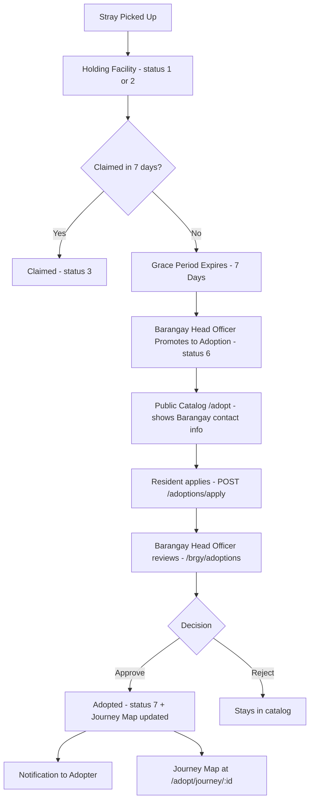

# StraySafe 2.0 — Adoption Feature Implementation Guide

> **Purpose:** Step-by-step implementation guide for the Holding Facility to Public Adoption Portal pipeline (Feature #2 from RECOMMENDED_FEATURES.md).
> **Approach:** 4 phases, ordered by dependency. Each phase is independently deployable.
> **Estimated total effort:** ~3-5 hours of sessions with Antigravity + your review time
> **Last Updated:** 2026-09-16
> **Architecture Note:** Adoption is strictly and exclusively a **Barangay responsibility** (Barangay Staff / Barangay Head Officer and System Admin). Subdivision Leaders do not manage adoptions or approve applications.

---

## Business Rules (Decided — Do Not Change Without Review)

> [!IMPORTANT]
> These rules are finalized. All implementation must conform to them exactly.

### Time Periods

| Period | Duration | What Happens |
|:---|:---|:---|
| **Impound / Grace Period** | 7 days from `intake_date` | Animal is held. Owner can claim anytime. No adoption listing allowed yet. |
| **For Adoption window** | No hard deadline | Once promoted by Barangay Head Officer, stays listed until adopted, transferred, or staff removes it. |
| **Staff reminder alert** | After 21 days in status=6 with no applications | System (or nightly job) flags the animal so Barangay staff can re-evaluate. |
| **Post-approval pickup window** | No hard system deadline | Barangay staff manually coordinate pickup. No auto-cancellation. |

---

### Owner Claim Rules

**While animal is in status 1–2 (Impound Period — 7 days):**
- ✅ Owner can claim at any time. No proof required (staff discretion).
- Setting `facility_status=3` (Claimed) discharges the animal.

**While animal is listed "For Adoption" (status=6):**
- ✅ Owner CAN still come forward and claim the animal.
- **Proof required:** Owner must provide vet records, registration documents, or photos as evidence.
- Barangay staff reviews the claim on a case-by-case basis.
- If verified: `facility_status` reverts to `3` (Claimed), all Pending adoption applications are cancelled with a notification ("Animal has been claimed by its owner."), and the animal is removed from the catalog.
- This action is logged in the HoldingTimeline as `event_type='owner_claim_reversal'`.

**Once animal is fully adopted (status=7 — physically handed over):**
- ❌ The adoption is **legally final**. The system cannot reverse it.
- The system **actively maintains a Custody Trail** for every animal — staff can look up exactly where any animal went at any time (see Custody Trail section below).
- If an original owner comes forward, staff use the **"Late Owner Claim"** action in the system (not a manual process):
  1. Staff opens the animal's Custody Trail page
  2. Staff clicks **"Log Late Owner Claim"** → a modal opens
  3. Staff records: owner's name, contact number, date of claim, and any proof provided
  4. The system logs this in HoldingTimeline as `event_type='late_owner_claim'`
  5. The system reveals the **adopter's name and contact number only** (never home address) on screen — staff reads this out to the owner or prints a slip
  6. Admin receives an in-app notification of the late claim event for records
- The system **never exposes the adopter's home address** to any third party — contact number only.
- No reversal of the adoption. The owner contacts the adopter privately if they wish.

> [!CAUTION]
> The adopter's home address (from the adoption application) must **NEVER** be shown on the Late Owner Claim screen. Only name + contact number. This is enforced at the API response level — the `GET /adoptions/late-claim-info/{holding_id}` endpoint returns only `adopter_name` and `adopter_contact_no`.

---

### Custody Trail — System Requirement (Core Feature)

> [!IMPORTANT]
> The Custody Trail is **not optional**. Every animal that passes through the system must have a complete, searchable record of everywhere it has been and who currently has it.

The system must track and display the following for every animal:

| Stage | What is Recorded | Stored In |
|:---|:---|:---|
| Original sighting | GPS coordinates, landmark, date, reporting citizen | `reports` table |
| Subdivision facility intake | Facility name, intake date, staff name | `holding_timeline` (event_type='intake') |
| Barangay facility transfer | Facility name, transfer date, staff name | `holding_timeline` (event_type='transfer') |
| Medical treatments | Treatment description, date, staff | `holding_timeline` (event_type='medical') |
| Listed for adoption | Date promoted, Barangay staff who promoted | `holding_animals.promoted_at` + `holding_animals.promoted_by` |
| Owner claim (if occurred) | Claim date, owner name (manual entry by staff) | `holding_timeline` (event_type='owner_claim_reversal') |
| Adoption approved | Date, approving Barangay authority name and role | `adoptions.reviewed_at` + `adoptions.reviewer_role` |
| Late owner claim attempt | Owner name, contact, date, proof description | `holding_timeline` (event_type='late_owner_claim') |

**Who can see the full Custody Trail:**
- Subdivision Leader (own subdivision animals — read-only historical visibility)
- Barangay Head Officer (all animals in their barangay)
- Admin (all animals)

**What the public sees at `/adopt/journey/:id`:**
- Location pins on a Leaflet map (sighting → facilities → adopted)
- Dates and facility names only
- Adopter shown as first name + last initial only (e.g. "Juan D.")
- No personal contact info, no home address

**New endpoint required for late claim info:**
```
GET /adoptions/late-claim-info/{holding_id}
Auth: Barangay Staff / Admin only
Returns: { adopter_name, adopter_contact_no }
NEVER returns: address, living_space, reason, or any other application field
```

---

### Application Rules

| Rule | Decision |
|:---|:---|
| Duplicate application (same resident, same animal, status=Pending) | ❌ Blocked — 400 error |
| Resident applies for multiple **different** animals simultaneously | ✅ Allowed — no limit |
| Application auto-expiry | None — applications stay Pending until Barangay staff acts |
| When one application is Approved | All other Pending applications for the **same animal** are auto-Rejected with message "Another applicant was approved." |
| When owner claims a For Adoption animal | All Pending applications for that animal are auto-Cancelled with message "Animal has been claimed by its owner." |

---

### Adoption Reversal / Edge Cases

| Scenario | System Behavior | Custody Trail Entry |
|:---|:---|:---|
| Adopter approved but never picks up | Barangay staff cancels approval via UI, re-lists animal (`facility_status` → 6). No auto-cancellation. | `event_type='adoption_cancelled'` in holding_timeline |
| Animal dies while listed For Adoption | Barangay staff sets `facility_status=4` (Deceased). All Pending apps auto-cancelled with notification. | `event_type='outcome'` logged |
| Animal transferred while For Adoption | Barangay staff sets `facility_status=5` (Transferred). All Pending apps auto-cancelled with notification. | `event_type='transfer'` logged with destination facility |
| Admin removes from catalog (no reason) | `facility_status` reverts to `2` (Healthy). All Pending apps cancelled. | `event_type='status_change'` logged |
| Original owner claims while For Adoption | `facility_status` → 3 (Claimed). All Pending apps cancelled. Removed from catalog. | `event_type='owner_claim_reversal'` logged with proof description |
| Original owner shows up post-adoption | Adoption legally final. Barangay staff logs Late Owner Claim. System shows adopter contact number only. | `event_type='late_owner_claim'` logged with owner details |

---

### Transfer Behavior & Jurisdiction Handover

> [!NOTE]
> Since adoption is exclusively handled by the **Barangay**, animals held at subdivision-level holding facilities must be transferred to the Barangay facility when their 7-day impound period elapses without owner claim.

**The adoption path:**

```
Stray Sighting / Local Intake
  → 7-Day Grace Period in Holding Facility
  → Unclaimed after 7 days
  → Handed over / Transferred to Barangay Animal Care Facility (if initially at subdivision)
  → Barangay Head Officer promotes animal to Adoption Catalog (facility_status = 6)
  → Resident submits application via /adopt/apply/:id
  → Barangay Head Officer reviews and approves/rejects via /brgy/adoptions
  → On approval: facility_status = 7 (Adopted/Released) and Custody Trail Journey Map updated
```

---

## Key Design Decisions (Read First)

> [!IMPORTANT]
> These three decisions define the core behavior of the adoption feature. Read before implementing.

### 1. Adoption is Exclusively a Barangay Responsibility

Adoption authority is strictly centralized at the **Barangay level** (`role_id=3`, specifically **Barangay Head Officer**, and System Admin `role_id=4`). **Subdivisions do NOT manage adoptions or approve applications.**

Subdivisions are responsible only for initial community reporting, localized rescue/temporary holding, and transferring animals to the Barangay facility. Once an animal completes the 7-day grace period, all adoption cataloging, promotion, and application approvals are handled solely by Barangay Animal Services.

| Role | Adoption Authority |
|:---|:---|
| **Barangay Head Officer** (role_id=3, is_head_officer=True) | **Full Adoption Authority**: Promotes to catalog (`status 6`), reviews applications, approves/rejects adoptions (`status 7`) |
| **Regular Barangay Staff** (role_id=3, is_head_officer=False) | **View-Only**: Can view adoption applications and catalog at `/brgy/adoptions`, but cannot approve or reject |
| **Admin** (role_id=4) | **Full Administrative Access**: System-wide access to promote, review, and approve adoptions |
| **Subdivision Leader** (role_id=2) | ❌ **No Access**: Cannot promote animals, review adoption applications, or access adoption management routes |
| **Citizen / Resident** (role_id=1) | **Applicant Only**: Browses public `/adopt` catalog, applies via `/adopt/apply/:id`, and tracks via `/adopt/applications` |

**Backend jurisdiction check helper:**
```python
def _can_manage_adoption(current_user: User, animal: HoldingAnimal, db: Session) -> bool:
    # 1. System Admin always has full override
    if current_user.role_id == 4:
        return True
    
    # 2. Exclusively Barangay Head Officer has approval & promotion authority
    if current_user.role_id == 3 and current_user.is_head_officer:
        report = db.query(Report).filter(Report.report_id == animal.report_id).first()
        if not report:
            return False
        # If report originated from a subdivision, ensure it belongs to this Barangay
        if report.subdivision and report.subdivision.barangay_id != current_user.barangay_id:
            return False
        return True
        
    # Subdivision Leaders (role_id=2) and regular staff (is_head_officer=False) are DENIED
    return False
```

**Frontend routes:**
- `/brgy/adoptions` — Exclusively for Barangay Staff / Head Officer adoption management
- ❌ No `/subd/adoptions` route exists. Subdivision Leaders do not have an adoptions management portal.

---

### 2. Catalog Listing Must Show Barangay Contact Information

Each card on the public `/adopt` catalog page displays:

| Field | Source |
|:---|:---|
| Intake Staff Name | `users.name` via `holding_animals.intake_staff_id` |
| Intake Staff Phone | `users.phone` via `holding_animals.intake_staff_id` |
| Facility Name | `landmarks.name` via `report.facility_id` or `HoldingTimeline` |
| Facility Contact | `barangays.contact_no` |
| Managing Unit | `barangay_name` (e.g. "Barangay San Vicente Animal Care Services") |

This allows residents to contact the Barangay Animal Care facility directly before submitting an application.

---

### 3. Animal Journey Map — Full Trail with New Owner Info

After adoption (`facility_status=7`), a Leaflet map page at `/adopt/journey/:holding_id` shows every location in the animal's life:

| Pin Color | Location | Detail Shown |
|:---|:---|:---|
| Red | Original sighting | Address/landmark, date reported |
| Orange | Initial holding facility | Facility name, intake date |
| Blue | Barangay holding facility | Facility name, transfer date |
| Green | Adopted | "Adopted by Juan D. on Sep 10" (public) / Full name + contact (staff only) |

**Privacy rule for the green pin:** Public view shows first name + last initial only. Barangay Staff/Admin view shows full adopter name and contact info. No GPS coordinates for the adopter's home.

**New endpoint required:** `GET /adoptions/journey/{holding_id}`

---

## Feature Overview

Animals in the holding facility unclaimed after 7 days are promoted to a public Adoption Catalog exclusively by Barangay Animal Services. Residents browse and apply.



---

## Current State

| Component | Status | Notes |
|:---|:---|:---|
| holding_animals table | EXISTS | Has facility_status FK, intake_staff_id, report relation |
| facility_status table | EXISTS | 1=Need Treatment 2=Healthy 3=Claimed 4=Deceased 5=Transferred |
| adoptions table | MISSING | Must be created with reviewer_role ENUM('Barangay Head Officer','Barangay Staff','Admin') |
| facility_status 6 For Adoption | MISSING | Append as status_id=6 |
| facility_status 7 Adopted/Released | MISSING | Append as status_id=7 |
| Backend route adoptions.py | MISSING | Must be created (Barangay-exclusive management) |
| Barangay-only approval logic | MISSING | Gated to is_head_officer=True and Admin |
| Contact info in catalog response | MISSING | intake_staff phone, facility name, barangay managing unit |
| Animal Journey Map endpoint | MISSING | GET /adoptions/journey/:id |
| Frontend /adopt catalog page | MISSING | Public adoption catalog with contact info display |
| Frontend /adopt/journey/:id map | MISSING | Leaflet map with journey pins |
| Frontend /brgy/adoptions page | MISSING | Barangay adoption management (Head Officer approves) |
| Frontend /subd/adoptions page | OMITTED | Subdivisions do not handle adoptions |
| Promote to Adoption button | MISSING | In Barangay holding facility UI, Head Officer only |

> [!IMPORTANT]
> `/brgy/adoptions` is the only adoption management portal. Regular Barangay Staff (`is_head_officer=False`) see a read-only view with a notice banner, while the **Barangay Head Officer** has full Approve/Reject controls.

---

## Progress Tracker

| Phase | Tasks | Status |
|:---|:---|:---|
| Phase 1 - Database | DB-1, DB-2 | Not started |
| Phase 2 - Backend API | API-1 thru API-5 | Not started |
| Phase 3 - Frontend | FE-1 thru FE-6 | Not started |
| Phase 4 - Automation | AUTO-1 thru AUTO-3 | Not started |

---

## Phase 1 - Database Schema (~15 min)

### Task DB-1 - Add New Facility Statuses and Adoptions Table

**Est:** ~10 min

- [ ] **1.** Add two new `facility_status` rows in MySQL:
  ```sql
  INSERT INTO facility_status (status_id, status_name) VALUES
      (6, 'For Adoption'),
      (7, 'Adopted/Released');
  ```

- [ ] **2.** Create the `adoptions` table (reviewer_role restricted to Barangay / Admin):
  ```sql
  CREATE TABLE adoptions (
    adoption_id     INT NOT NULL AUTO_INCREMENT,
    holding_id      INT NOT NULL,
    applicant_id    INT NOT NULL,
    status          ENUM('Pending','Approved','Rejected') NOT NULL DEFAULT 'Pending',
    full_name       VARCHAR(150) NOT NULL,
    address         TEXT NOT NULL,
    contact_no      VARCHAR(20) NOT NULL,
    has_other_pets  TINYINT(1) NOT NULL DEFAULT 0,
    living_space    ENUM('House with yard','Apartment','Condo','Other') NOT NULL DEFAULT 'House with yard',
    reason          TEXT NOT NULL,
    reviewed_by     INT DEFAULT NULL,
    reviewer_role   ENUM('Barangay Head Officer','Barangay Staff','Admin') DEFAULT NULL,
    review_notes    TEXT DEFAULT NULL,
    reviewed_at     DATETIME DEFAULT NULL,
    created_at      DATETIME NOT NULL DEFAULT CURRENT_TIMESTAMP,
    updated_at      DATETIME NOT NULL DEFAULT CURRENT_TIMESTAMP ON UPDATE CURRENT_TIMESTAMP,
    PRIMARY KEY (adoption_id),
    CONSTRAINT fk_adoption_holding   FOREIGN KEY (holding_id)   REFERENCES holding_animals (holding_id) ON DELETE CASCADE,
    CONSTRAINT fk_adoption_applicant FOREIGN KEY (applicant_id) REFERENCES users (user_id) ON DELETE CASCADE,
    CONSTRAINT fk_adoption_reviewer  FOREIGN KEY (reviewed_by)  REFERENCES users (user_id) ON DELETE SET NULL
  ) ENGINE=InnoDB DEFAULT CHARSET=utf8mb4 COLLATE=utf8mb4_unicode_ci;
  ```

- [ ] **3.** Add columns to `holding_animals` for catalog and journey tracking:
  ```sql
  ALTER TABLE holding_animals
    ADD COLUMN adoption_catalog_notes TEXT DEFAULT NULL AFTER medical_notes,
    ADD COLUMN promoted_at            DATETIME DEFAULT NULL AFTER adoption_catalog_notes,
    ADD COLUMN promoted_by            INT DEFAULT NULL AFTER promoted_at,
    ADD CONSTRAINT fk_ha_promoted_by FOREIGN KEY (promoted_by) REFERENCES users (user_id) ON DELETE SET NULL;
  ```

Verify: `SHOW TABLES` shows `adoptions`. `SELECT * FROM facility_status` shows 7 rows. `DESCRIBE holding_animals` shows new columns.

---

### Task DB-2 - Add SQLAlchemy Models

**Est:** ~5 min
**File:** `backend/app/models/report.py` - append after `HoldingTimeline` class

- [ ] **1.** Add `Adoption` model to `backend/app/models/report.py`
- [ ] **2.** Update `HoldingAnimal` model - add `adoption_catalog_notes`, `promoted_at`, `promoted_by` fields
- [ ] **3.** Add `reviewer_role` field to the `Adoption` model (Enum: `'Barangay Head Officer'`, `'Barangay Staff'`, `'Admin'`)

Verify: `from app.models.report import Adoption` prints `adoptions` as the tablename.

---

## Phase 2 - Backend API (~1 hour)

### Task API-1 - Create Pydantic Schemas

**Est:** ~10 min
**File:** Create `backend/app/schemas/adoption.py` [NEW]

Key schemas to create:

**AdoptionApplyRequest** - holding_id, full_name, address, contact_no, has_other_pets, living_space, reason

**AdoptionReviewRequest** - decision (Approved/Rejected), review_notes

**AdoptionResponse** - full adoption record including reviewer_role

**CatalogAnimalResponse** - public-safe animal profile including:
- intake_staff_name, intake_staff_contact (staff phone)
- facility_name, facility_contact (barangay contact_no)
- managing_unit (e.g. "Barangay San Vicente Animal Care Services")
- sighting_lat, sighting_lng (for initial journey map pin)

**JourneyPin** - label, description, latitude, longitude, date, pin_color

**AnimalJourneyResponse** - full journey including:
- pins list (ordered chronologically)
- is_adopted flag
- adopter_name_public (first name + last initial only for public)
- adopter_date, adopter_area (general area only - no exact address for public)

**PromoteToAdoptionRequest** - adoption_catalog_notes

Verify: `from app.schemas.adoption import CatalogAnimalResponse` resolves without error.

---

### Task API-2 - Create the Adoptions Router

**Est:** ~25 min
**File:** Create `backend/app/routes/adoptions.py` [NEW]

**Endpoint Summary:**

| Method | Path | Auth | Who Can Call |
|:---|:---|:---|:---|
| GET | `/adoptions/catalog` | Public | Anyone |
| GET | `/adoptions/catalog/{holding_id}` | Public | Anyone |
| GET | `/adoptions/journey/{holding_id}` | Optional | Public (partial data); Staff (full adopter info) |
| POST | `/adoptions/promote/{holding_id}` | Required | **Barangay Head Officer** (role 3 + head) / Admin (role 4) |
| POST | `/adoptions/apply` | Required | Resident (role_id=1) |
| GET | `/adoptions/my-applications` | Required | Resident (own only) |
| GET | `/adoptions/applications` | Required | **Barangay Staff / Head Officer** / Admin |
| PUT | `/adoptions/review/{adoption_id}` | Required | **Barangay Head Officer** (role 3 + head) / Admin (role 4) |

**Key business rules:**

- [ ] **1.** All promote and review actions must call `_can_manage_adoption()`:
  - Subdivision Leaders (`role_id=2`): Always returns `403 Forbidden`
  - Regular Barangay Staff (`role_id=3`, `is_head_officer=False`): Returns `403 Forbidden` for approve/reject/promote
  - Barangay Head Officer (`role_id=3`, `is_head_officer=True`): Permitted for animals in their barangay
  - Admin (`role_id=4`): Permitted system-wide

- [ ] **2.** `GET /adoptions/catalog` must populate contact info fields on each animal:
  - `intake_staff_name` and `intake_staff_contact` from `animal.intake_staff.name` and `.phone`
  - `facility_name` from Landmark via `report.facility_id` or `HoldingTimeline`
  - `facility_contact` from `barangay.contact_no`
  - `managing_unit`: Barangay name (e.g. "Barangay San Vicente Animal Care")
  - `sighting_lat` and `sighting_lng` from `report.latitude` and `.longitude`

- [ ] **3.** `GET /adoptions/journey/{holding_id}` builds ordered pins:
  - Pin 1 (red) - Original sighting: `report.latitude/longitude`, `report.landmark`, `report.created_at`
  - Pins 2+ (orange/blue) - Facility moves from `HoldingTimeline` intake/transfer events with facility coords from `Landmark`
  - Final pin (green) - Adoption: no GPS coords (privacy), adopter name redacted for public, full for staff

- [ ] **4.** Public vs staff data for journey endpoint:
  - No token or Resident token: adopter shown as "Juan D." (first name + last initial), area shown as general barangay/city only
  - Barangay Staff / Admin token: full adopter name and contact number shown

- [ ] **5.** `PUT /adoptions/review/{adoption_id}` - on Approved:
  - Set `facility_status=7` and `discharge_date=now()` on `HoldingAnimal`
  - Auto-reject all other Pending applications for same `holding_id`
  - Record `reviewer_role` ('Barangay Head Officer' or 'Admin')

- [ ] **6.** `GET /adoptions/applications` - filter by Barangay jurisdiction:
  - Barangay Staff / Head Officer: only applications for animals within their barangay
  - Admin: all applications

Verify: `GET /adoptions/catalog` returns 200 with contact info fields. `POST /adoptions/promote/{id}` called by Subdivision Leader returns 403 Forbidden.

---

### Task API-3 - Register the Router in main.py

**Est:** ~2 min
**File:** `backend/app/main.py`

- [ ] Add import: `from app.routes import adoptions`
- [ ] Register after the holding router: `app.include_router(adoptions.router)`

Verify: `GET /docs` shows `/adoptions/*` endpoints in Swagger UI.

---

### Task API-4 - Add Optional Auth Helper

**Est:** ~5 min
**File:** `backend/app/utils/auth.py`

The journey endpoint needs optional auth - public access returns redacted data; staff token returns full adopter details.

- [ ] **1.** Add `get_optional_user` dependency if not already present:
  ```python
  def get_optional_user(request: Request, db: Session = Depends(get_db)) -> Optional[User]:
      try:
          token = request.headers.get("Authorization", "").replace("Bearer ", "")
          if not token:
              return None
          return get_current_user_from_token(token, db)
      except Exception:
          return None
  ```

---

### Task API-5 - Verify Holding List Shows For Adoption Animals

**Est:** ~3 min
**File:** `backend/app/routes/holding.py`

- [ ] Confirm `RESOLVED_STATUSES = {3, 4, 5}` - status 6 is not in this set, so For Adoption animals appear in staff holding lists.
- [ ] Add status labels: `6: "For Adoption"` and `7: "Adopted/Released"` to label mappings.

---

## Phase 3 - Frontend (~2 hours)

### Task FE-1 - Public Adoption Catalog Page (/adopt)

**Est:** ~35 min
**File:** Create `frontend/src/pages/citizen/AdoptionCatalog.tsx` [NEW]

- [ ] **1.** Page layout: Hero banner + filter bar (All / Dogs / Cats) + responsive card grid
- [ ] **2.** Each card shows:
  - Photo (first report_media item or default paw avatar)
  - Animal name, type, breed, color, size
  - Staff public description (`adoption_catalog_notes`)
  - **Barangay contact info section (required):**
    - Facility name and contact number
    - Intake staff name and phone
    - Managing unit (Barangay name)
  - Two buttons: "View Journey Map" and "Apply to Adopt"
- [ ] **3.** "View Journey Map" navigates to `/adopt/journey/:holding_id` (public, no login needed)
- [ ] **4.** "Apply to Adopt" navigates to `/adopt/apply/:holding_id` if logged in; else to `/login` with return path
- [ ] **5.** Add route: `Route path="/adopt" element={<AdoptionCatalog />}`

---

### Task FE-2 - Animal Journey Map Page (/adopt/journey/:id)

**Est:** ~35 min
**File:** Create `frontend/src/pages/citizen/AnimalJourneyMap.tsx` [NEW]

- [ ] **1.** Fetch `GET /adoptions/journey/:holding_id` on mount
- [ ] **2.** Render Leaflet map with colored pins:
  - Red pin - Original sighting location
  - Orange pin - Initial holding facility
  - Blue pin - Barangay holding facility
  - Green pin - Adopted (no GPS pin; popup: "Adopted by Juan D.")
  - Connect pins with a dashed polyline showing chronological journey
- [ ] **3.** Add route: `Route path="/adopt/journey/:id" element={<AnimalJourneyMap />}`

---

### Task FE-3 - Adoption Application Form (/adopt/apply/:id)

**Est:** ~25 min
**File:** Create `frontend/src/pages/citizen/AdoptionApplyForm.tsx` [NEW]

- [ ] **1.** Show animal summary at top (`GET /adoptions/catalog/:id`)
- [ ] **2.** Form fields: Full Name, Home Address, Contact Number, Has other pets (Yes/No radio), Living Space (select), Reason (textarea min 20 chars)
- [ ] **3.** On submit: `POST /adoptions/apply` → success toast → redirect to `/adopt/applications`
- [ ] **4.** Add route (Citizen only): `Route path="/adopt/apply/:id" - ProtectedRoute allowedRoles={[1]}`

---

### Task FE-4 - My Adoption Applications (/adopt/applications)

**Est:** ~20 min
**File:** Create `frontend/src/pages/citizen/MyAdoptionApplications.tsx` [NEW]

- [ ] **1.** Fetch `GET /adoptions/my-applications` - display user's submitted applications with status badges (Pending, Approved, Rejected)
- [ ] **2.** Add route (Citizen only): `Route path="/adopt/applications" - ProtectedRoute allowedRoles={[1]}`
- [ ] **3.** Add "My Adoption Applications" to Resident navigation sidebar

---

### Task FE-5 - Barangay Adoption Management (/brgy/adoptions)

**Est:** ~35 min
**File:** Create `frontend/src/pages/Barangay_Staff/BrgyAdoptions.tsx` [NEW]

> [!IMPORTANT]
> This is the sole adoption management page in the system. Approve/Reject buttons are ONLY enabled for users with `is_head_officer=True`. Regular Barangay Staff see a read-only list with a notice banner.

- [ ] **1.** Two-tab layout:
  - **Applications Tab:** Filterable (Pending / Approved / Rejected) with applicant info, living space, reason, and review actions
  - **Catalog Tab:** All animals currently listed "For Adoption" in the Barangay
- [ ] **2.** Role gate action buttons on `is_head_officer`:
  ```typescript
  const canApprove = currentUser.role_id === 3 && currentUser.is_head_officer;
  ```
- [ ] **3.** Non-head staff see informative notice:
  *"You can view adoption applications. Official approval and rejection actions are reserved for the Barangay Head Officer."*
- [ ] **4.** Approve Modal: notes textarea + Approve button → sets `facility_status=7`, triggers notification, updates custody journey
- [ ] **5.** Reject Modal: reason textarea + Reject button → auto-notifies applicant
- [ ] **6.** Add route: `Route path="/brgy/adoptions" - ProtectedRoute allowedRoles={[3]}`
- [ ] **7.** Add "Adoptions" link to **Barangay Staff sidebar** (`frontend/src/components/BrgySidebar.tsx`)

---

### Task FE-6 - Promote to Adoption Button in Holding Facility UI

**Est:** ~20 min
**File:** Modify existing Barangay Staff holding facility page

- [ ] **1.** Show button only when all conditions are met:
  ```typescript
  import { differenceInDays } from 'date-fns';
  const daysSinceIntake = differenceInDays(new Date(), new Date(animal.intake_date));
  const canPromote =
    animal.facility_status === 2 &&
    daysSinceIntake >= 7 &&
    ((currentUser.role_id === 3 && currentUser.is_head_officer) || currentUser.role_id === 4);
  ```
  *(Subdivision Leaders `role_id === 2` are strictly excluded from promotion)*
- [ ] **2.** Clicking opens confirmation modal: public description textarea (`adoption_catalog_notes`) + Confirm button
- [ ] **3.** On success: calls `POST /adoptions/promote/:holding_id`, animal receives `facility_status=6`

---

## Phase 4 - Automation and Polish (~30 min)

### Task AUTO-1 - Nightly Auto-Promotion Job (Optional)

**Est:** ~15 min
**File:** Create `backend/app/tasks/adoption_auto_promote.py` [NEW]

- [ ] Automatic promotion of unclaimed Healthy animals (intake >= 7 days) at 2:00 AM daily
- [ ] Logs promotion in HoldingTimeline as `event_type='promoted_to_adoption'`

---

### Task AUTO-2 - In-App Notification on Approval/Rejection

**Est:** ~10 min
**File:** `backend/app/routes/adoptions.py`

- [ ] On approval: create Notification for applicant — "Adoption Application Approved! Visit the Barangay Animal Facility for handover."
- [ ] On rejection: create Notification for applicant — "Adoption Application Update" with reason notes

---

### Task AUTO-3 - Add Navigation Links

**Est:** ~5 min

- [ ] Add "Adopt a Pet" to public landing page nav bar
- [ ] Add "Adoptions" to Barangay Staff sidebar (`frontend/src/components/BrgySidebar.tsx` → `/brgy/adoptions`)
- [ ] ❌ Confirm NO "Adoptions" link in Subdivision Leader sidebar (`frontend/src/components/SubdSidebar.tsx`)
- [ ] Add "My Applications" to Resident navigation menu (`/adopt/applications`)

---

## Verification Checklist

- [ ] `SELECT * FROM facility_status` shows 7 rows including For Adoption (6) and Adopted/Released (7)
- [ ] `adoptions` table exists with `reviewer_role` ENUM('Barangay Head Officer','Barangay Staff','Admin')
- [ ] `holding_animals` contains `adoption_catalog_notes`, `promoted_at`, `promoted_by` columns
- [ ] `GET /adoptions/catalog` (public) returns 200 with Barangay contact info
- [ ] `GET /adoptions/journey/{id}` (public) shows redacted adopter name ("Juan D.")
- [ ] `GET /adoptions/journey/{id}` (staff token) returns full adopter details
- [ ] Subdivision Leader attempts promote: `POST /adoptions/promote/{id}` → **403 Forbidden**
- [ ] Subdivision Leader attempts review: `PUT /adoptions/review/{id}` → **403 Forbidden**
- [ ] Regular Barangay Staff (`is_head_officer=False`) attempts review → **403 Forbidden**
- [ ] Barangay Head Officer (`is_head_officer=True`) promotes animal → `facility_status=6`
- [ ] Resident submits application → 201 Created
- [ ] Duplicate Pending application from same user → 400 error
- [ ] Barangay Head Officer approves application → `facility_status=7`, other Pending apps auto-rejected
- [ ] Journey map green pin appears after approval
- [ ] Resident receives in-app notification on approval/rejection
- [ ] `/adopt` catalog displays Barangay contact information on each card
- [ ] `/brgy/adoptions`: non-head staff see read-only list with notice banner; head officer sees action buttons
- [ ] ❌ Confirm `/subd/adoptions` does not exist and Subdivision sidebar has no adoptions link

---

## File Change Summary

| Action | File | Notes |
|:---|:---|:---|
| MODIFY | `Database3.3.txt` (or migration) | Add `adoptions` DDL (reviewer_role without Subd Leader), 2 facility_status rows, 3 holding_animals columns |
| MODIFY | `backend/app/models/report.py` | Add `Adoption` model (Barangay/Admin reviewer), update `HoldingAnimal` |
| NEW | `backend/app/schemas/adoption.py` | Schemas with Barangay managing unit and journey responses |
| NEW | `backend/app/routes/adoptions.py` | Barangay-exclusive promote, review, journey, and catalog logic |
| MODIFY | `backend/app/main.py` | Register adoptions router |
| MODIFY | `backend/app/utils/auth.py` | Optional auth helper for journey map |
| MODIFY | `backend/app/routes/holding.py` | Status labels for 6 and 7 |
| NEW | `frontend/src/pages/citizen/AdoptionCatalog.tsx` | Public catalog with Barangay contact information |
| NEW | `frontend/src/pages/citizen/AnimalJourneyMap.tsx` | Leaflet journey map |
| NEW | `frontend/src/pages/citizen/AdoptionApplyForm.tsx` | Resident application form |
| NEW | `frontend/src/pages/citizen/MyAdoptionApplications.tsx` | Resident application tracking |
| NEW | `frontend/src/pages/Barangay_Staff/BrgyAdoptions.tsx` | Centralized Barangay adoption management portal |
| MODIFY | Holding facility staff page | Promote to Adoption button (Barangay Head Officer only) |
| MODIFY | `frontend/src/App.tsx` (or AppRoutes.tsx) | Register `/adopt`, `/adopt/journey/:id`, `/adopt/apply/:id`, `/adopt/applications`, `/brgy/adoptions` |
| MODIFY | `frontend/src/components/BrgySidebar.tsx` | Add Adoptions link (`/brgy/adoptions`) |
| MODIFY | `frontend/src/components/SubdSidebar.tsx` | Ensure NO Adoptions link exists |
| MODIFY | Resident navigation | Add My Applications link |
| NEW | `backend/app/tasks/adoption_auto_promote.py` | (Optional) Nightly cron for unclaimed animals |

---

*Based on RECOMMENDED_FEATURES.md Feature #2 - Holding Facility to Public Adoption Portal Pipeline*  
*Last Updated: 2026-09-16 (Updated: Adoption centralized exclusively to Barangay)*
