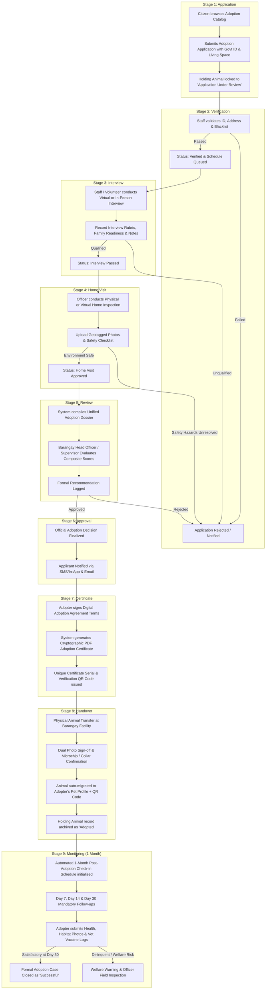
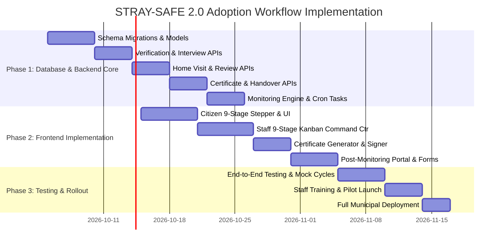

STRAY-SAFE 2.0: Adoption Workflow Implementation Plan
Document Version: 2.0.0  
Target System: STRAY-SAFE 2.0 Municipal Stray Animal Management & Pet Welfare System  
Workflow Sequence: `Application → Verification → Interview → Home Visit → Review → Approval → Certificate → Handover → Monitoring`
---
1. Executive Summary
This specification outlines the comprehensive technical architecture and end-to-end implementation plan for the 9-Stage Adoption Lifecycle in STRAY-SAFE 2.0.
The goal of this workflow is to transition rescued and impounded stray animals from holding facilities into safe, thoroughly vetted, and permanent adoptive homes. The system enforces strict animal welfare screening, transparent multi-stage verification, cryptographic certificate issuance, seamless pet registry auto-transfer, and proactive post-adoption welfare monitoring.
---
2. End-to-End Workflow Architecture

---
3. Detailed 9-Stage Specification & Technical Requirements
Stage 1: Application
Primary Actor: Citizen / Adopter
Trigger: Citizen submits application from `/adoptions/catalog/:holdingId`
Entry Conditions:
Animal must be in `facility_status = 3` (`Adoption Ready`) or `4` (`Promoted for Adoption`).
Applicant must have an active, email/phone-verified STRAY-SAFE citizen account.
Applicant cannot have more than 2 pending adoption applications simultaneously.
Payload & Data Collected:
`holding_id`: ID of the animal being adopted.
`full_name`, `contact_no`, `address`, `barangay_id`, `subdivision_id`.
`id_type` (e.g., Driver's License, UMID, Passport, Barangay ID), `id_number`, and `id_photo_url` (uploaded to Cloudinary with secure transformations).
`living_space`: `House with yard`, `Townhouse`, `Apartment`, `Condo`, `Farm/Rural`, `Other`.
`ownership_status`: `Owned`, `Rented (Pet Allowed)`, `Rented (Pet Conditional)`.
`has_other_pets`: Boolean + details of existing pets (species, neuter/spay status, vaccination status).
`household_members_count` and confirmation of all members' agreement.
`reason_for_adoption` and primary caretaker details.
System Operations:
Creates record in `adoptions` with `status = 'Application_Submitted'`.
Emits timeline log in `adoption_timeline_logs`.
Sends immediate in-app confirmation notification to the applicant.
---
Stage 2: Verification
Primary Actor: Barangay Animal Welfare Staff / Admin (Automated + Manual)
Objective: Validate applicant authenticity, residency, and blacklist history.
Verification Checks:
Blacklist / Abuse Check: Automatic query against municipal animal cruelty and repeat surrender logs.
Identity & Residency Check: Staff compares uploaded ID name/photo with system profile and barangay voter/resident database.
Landlord / HOA Pet Rule Compliance: For apartments/rented spaces, verify pet permission documentation.
Holding Animal Status Lock: Holding animal status updated to `In Adoption Review` to avoid conflicting applications.
Outcomes:
Pass: Status updated to `Verification_Passed` → Trigger Stage 3 scheduling.
Needs Correction: Status set to `Verification_Incomplete` → Request additional documentation.
Fail: Status set to `Rejected` with reason code (e.g., `BLACKLISTED`, `FRAUDULENT_ID`, `HOA_PROHIBITED`).
---
Stage 3: Interview
Primary Actor: Barangay Welfare Officer / Adoption Counselor & Applicant
Objective: Assess readiness, pet care knowledge, budget capabilities, and expectations.
Format: In-person at Barangay Hall or digital video conference (integrated meeting link).
Evaluation Matrix & Scoring Rubric (1–5 points each):
Animal Care Knowledge & Daily Routine (Diet, exercise, grooming, medical needs).
Financial Preparedness (Food budget, regular vaccination, emergency vet care).
Household Stability & Lifestyle Match (Work hours, noise tolerance, travel plans).
Emergency Contingency Plan (Designated caregiver if adopter falls ill/travels).
System Operations:
Staff records appointment in `adoption_interviews`.
Generates calendar reminder notifications (SMS/Push 24h & 2h prior).
Staff submits rubric evaluation and qualitative interview notes.
Pass Criteria: Minimum composite score of 70% with no critical red flags.
Status transitions to `Interview_Passed`.
---
Stage 4: Home Visit
Primary Actor: Field Inspection Officer / Subdivision Leader
Objective: Validate physical habitat safety, containment, and space suitability.
Format: Physical on-site visit or Virtual Video Inspection with live GPS tagging.
Safety Inspection Checklist:
[ ] Perimeter & Gate Security: Fencing height adequate, no escape gaps, secure latches.
[ ] Shelter & Protection: Adequate shade, weather protection, dry sleeping area.
[ ] Hazard Elimination: No open poison/chemicals, exposed wires, or fall hazards.
[ ] Existing Animal Compatibility: Interaction with current household pets assessed.
Deliverables:
Minimum 3 geotagged photos/videos uploaded to `adoption_home_visits`.
Field Officer sign-off report with pass/conditional/fail recommendation.
Status transitions to `Home_Visit_Approved`.
---
Stage 5: Review
Primary Actor: Barangay Head Officer / Supervisor / Welfare Committee
Objective: Comprehensive dossier assessment before granting final legal custody approval.
Compilation of Dossier:
Consolidated view displaying:
Application & ID verification scores.
Interview notes and rubric breakdown.
Home visit photographic evidence and inspector notes.
Animal health card, vaccination logs, and behavioral profile from `holding_animals`.
Action:
Reviewer enters formal justification summary.
Status transitions to `Review_Completed`.
---
Stage 6: Approval
Primary Actor: Barangay Executive Authority / Authorized Approver
Outcomes:
Approved: Status set to `Approved`. Animal reserved exclusively for adopter. Automated pickup appointment notification sent.
Conditionally Approved: Requires minor remedy (e.g., install gate lock within 3 days).
Rejected: Status set to `Rejected`. Detailed explanation provided in audit log and citizen notification. Animal released back to public catalog.
---
Stage 7: Certificate
Primary Actor: System (Automated) & Adopter
Objective: Legal transfer agreement and issuance of tamper-evident adoption certificate.
Protocol:
Adopter reviews and digitally signs the STRAY-SAFE Municipal Adoption Agreement:
Commitment to humane treatment and non-abandonment.
Agreement to spay/neuter and maintain rabies vaccinations.
Consent to periodic post-adoption monitoring checks.
System generates PDF Adoption Certificate containing:
Certificate Serial (e.g., `STRAYSAFE-CERT-2026-00482`).
Adopter Name, Barangay, and Adoption Date.
Animal Microchip/Tag ID, Name, Breed, Color, Estimated Age.
Cryptographic SHA-256 validation hash.
Public Verification QR Code linking to `https://straysafe.gov.ph/verify/certificate/:hash`.
Official digital municipal seal and signature stamp.
Status transitions to `Certificate_Issued`.
---
Stage 8: Handover
Primary Actor: Barangay Holding Staff & Adopter (Dual Confirmation)
Objective: Physical handover of the animal, provision of starter kit/medical records, and digital asset synchronization.
Execution Steps:
Adopter arrives at holding facility with digital certificate on smartphone.
Staff scans certificate QR code to open Handover Execution Portal.
Physical inspection of animal with adopter; review of medical history and vaccination records.
Handover confirmation:
Staff captures handover photo (Adopter + Animal + Staff).
Adopter confirms receipt on mobile screen.
Automated Database Synchronization:
A new `Pet` record is automatically created under the adopter's account in `pets` table.
Unique Pet QR Code and digital pet profile generated instantly.
`HoldingAnimal` status updated to `Adopted` (`facility_status = 5`), and archived.
Status transitions to `Handover_Completed`.
---
Stage 9: Monitoring (1 Month Duration)
Primary Actor: Adopter (Self-Reporting) & Barangay Animal Welfare Compliance Team
Objective: Ensure smooth transition, animal welfare, and health compliance during the critical 1-month (30-day) post-adoption period.
Monitoring Schedule & Milestones (1 Month Total):
Milestone	Window	Submission Requirements	Verification Action
Day 7 (Week 1)	Day 5–8	Adaptation photo, feeding update, behavioral notes	Staff desktop review
Day 14 (Week 2)	Day 12–16	Home interaction photo, environment check, health update	Staff review & optional check-in call
Day 30 (Month 1 Final)	Day 28–35	3 photos (animal at home/play), initial vet visit/vaccine log, final questionnaire	Full clearance & Formal Case Closure as 'Successful'
Non-Compliance & Welfare Incident Escalation:
Automated SMS/Push alerts sent at -2 days, on due date, and +2 days overdue.
If a milestone is overdue by 5 days: Case flagged as `Monitoring_Delinquent`.
If delinquency reaches 10 days or citizen reports mistreatment: Automated dispatch of Animal Welfare Inspector for physical audit.
When Day 30 milestone passes with satisfactory evaluation: Case officially marked `Monitoring_Completed_Closed`.
---
4. Database Schema & Data Models
4.1 Enhanced Adoption Model (`adoptions`)
```sql
-- Updated PostgreSQL schema for adoptions table
ALTER TABLE adoptions 
  ADD COLUMN current_stage VARCHAR(50) NOT NULL DEFAULT 'Application',
  ADD COLUMN application_stage_status VARCHAR(50) NOT NULL DEFAULT 'Submitted',
  ADD COLUMN agreement_signed_at TIMESTAMP NULL,
  ADD COLUMN agreement_signature_url VARCHAR(500) NULL,
  ADD COLUMN certificate_id INT NULL,
  ADD COLUMN handover_location VARCHAR(255) NULL,
  ADD COLUMN handover_photo_url VARCHAR(500) NULL,
  ADD COLUMN post_monitoring_status VARCHAR(50) NOT NULL DEFAULT 'Not_Started';
```
4.2 New Supporting Tables
```sql
-- Stage 2 & 3: Verification & Interviews
CREATE TABLE adoption_verifications (
    verification_id SERIAL PRIMARY KEY,
    adoption_id INT NOT NULL REFERENCES adoptions(adoption_id) ON DELETE CASCADE,
    verified_by INT REFERENCES users(user_id) ON DELETE SET NULL,
    id_match_status VARCHAR(50) NOT NULL, -- 'Matched', 'Mismatched', 'Unclear'
    residency_status VARCHAR(50) NOT NULL, -- 'Resident_Confirmed', 'Non_Resident', 'Unknown'
    blacklist_checked BOOLEAN NOT NULL DEFAULT FALSE,
    is_blacklisted BOOLEAN NOT NULL DEFAULT FALSE,
    verification_notes TEXT NULL,
    verified_at TIMESTAMP DEFAULT CURRENT_TIMESTAMP
);

CREATE TABLE adoption_interviews (
    interview_id SERIAL PRIMARY KEY,
    adoption_id INT NOT NULL REFERENCES adoptions(adoption_id) ON DELETE CASCADE,
    interviewer_id INT REFERENCES users(user_id) ON DELETE SET NULL,
    scheduled_at TIMESTAMP NOT NULL,
    interview_mode VARCHAR(50) NOT NULL DEFAULT 'In-Person', -- 'In-Person', 'Video_Call'
    meeting_link VARCHAR(500) NULL,
    score_care_knowledge INT CHECK (score_care_knowledge BETWEEN 1 AND 5),
    score_financial_readiness INT CHECK (score_financial_readiness BETWEEN 1 AND 5),
    score_environment_suitability INT CHECK (score_environment_suitability BETWEEN 1 AND 5),
    total_score NUMERIC(5,2) NULL,
    recommendation VARCHAR(50) NOT NULL, -- 'Recommended', 'Conditional', 'Not_Recommended'
    interview_notes TEXT NULL,
    conducted_at TIMESTAMP NULL
);

-- Stage 4: Home Visits
CREATE TABLE adoption_home_visits (
    visit_id SERIAL PRIMARY KEY,
    adoption_id INT NOT NULL REFERENCES adoptions(adoption_id) ON DELETE CASCADE,
    inspector_id INT REFERENCES users(user_id) ON DELETE SET NULL,
    visit_type VARCHAR(50) NOT NULL DEFAULT 'Physical', -- 'Physical', 'Virtual'
    scheduled_date TIMESTAMP NOT NULL,
    is_fencing_secure BOOLEAN NOT NULL DEFAULT FALSE,
    is_shelter_adequate BOOLEAN NOT NULL DEFAULT FALSE,
    hazard_free BOOLEAN NOT NULL DEFAULT FALSE,
    checklist_notes TEXT NULL,
    gps_latitude NUMERIC(10,8) NULL,
    gps_longitude NUMERIC(11,8) NULL,
    visit_photos JSONB DEFAULT '[]'::jsonb, -- Array of photo URLs with timestamps
    inspection_result VARCHAR(50) NOT NULL DEFAULT 'Pending', -- 'Passed', 'Needs_Fix', 'Failed'
    conducted_at TIMESTAMP NULL
);

-- Stage 7: Digital Certificates
CREATE TABLE adoption_certificates (
    certificate_id SERIAL PRIMARY KEY,
    adoption_id INT UNIQUE NOT NULL REFERENCES adoptions(adoption_id) ON DELETE CASCADE,
    certificate_number VARCHAR(100) UNIQUE NOT NULL,
    verification_hash VARCHAR(64) UNIQUE NOT NULL, -- SHA-256
    pdf_url VARCHAR(500) NOT NULL,
    qr_code_url VARCHAR(500) NOT NULL,
    issued_by INT REFERENCES users(user_id) ON DELETE SET NULL,
    issued_at TIMESTAMP DEFAULT CURRENT_TIMESTAMP
);

-- Stage 9: Post-Adoption Monitoring Logs (1-Month Lifecycle)
CREATE TABLE adoption_monitoring_logs (
    log_id SERIAL PRIMARY KEY,
    adoption_id INT NOT NULL REFERENCES adoptions(adoption_id) ON DELETE CASCADE,
    milestone_name VARCHAR(50) NOT NULL, -- 'Day_7', 'Day_14', 'Day_30'
    due_date DATE NOT NULL,
    submitted_at TIMESTAMP NULL,
    status VARCHAR(50) NOT NULL DEFAULT 'Pending', -- 'Pending', 'Submitted', 'Approved', 'Delinquent', 'Escalated'
    health_status VARCHAR(100) NULL, -- 'Healthy', 'Minor_Illness', 'Under_Treatment'
    photos JSONB DEFAULT '[]'::jsonb,
    vet_record_url VARCHAR(500) NULL,
    adopter_notes TEXT NULL,
    reviewed_by INT REFERENCES users(user_id) ON DELETE SET NULL,
    review_notes TEXT NULL,
    reviewed_at TIMESTAMP NULL
);

-- Comprehensive Audit Trail
CREATE TABLE adoption_timeline_logs (
    timeline_id SERIAL PRIMARY KEY,
    adoption_id INT NOT NULL REFERENCES adoptions(adoption_id) ON DELETE CASCADE,
    stage VARCHAR(50) NOT NULL,
    action VARCHAR(100) NOT NULL,
    performed_by INT REFERENCES users(user_id) ON DELETE SET NULL,
    notes TEXT NULL,
    created_at TIMESTAMP DEFAULT CURRENT_TIMESTAMP
);
```
---
5. REST API Endpoints Specification
5.1 Citizen Application & Self-Service Endpoints
Method	Endpoint	Description	Role Required
`POST`	`/api/adoptions/apply`	Submit Stage 1 adoption application with ID & details	Citizen (Role 1)
`GET`	`/api/adoptions/my-applications`	Fetch all adoption applications with 9-stage tracker	Citizen (Role 1)
`GET`	`/api/adoptions/:adoptionId/certificate`	Download digital adoption certificate & verification QR	Citizen (Role 1)
`POST`	`/api/adoptions/:adoptionId/agreement/sign`	Sign digital terms of adoption agreement	Citizen (Role 1)
`POST`	`/api/adoptions/:adoptionId/handover/confirm`	Citizen confirmation upon receiving pet	Citizen (Role 1)
`GET`	`/api/adoptions/:adoptionId/monitoring`	Get monitoring milestone schedule and submissions	Citizen (Role 1)
`POST`	`/api/adoptions/:adoptionId/monitoring/:milestoneId`	Submit post-adoption photos and health check-in	Citizen (Role 1)
5.2 Staff & Admin Workflow Management Endpoints
Method	Endpoint	Description	Role Required
`GET`	`/api/adoptions/pipeline`	Kanban/Table view of all adoptions grouped by 9 stages	Staff / Admin
`POST`	`/api/adoptions/:adoptionId/verify`	Submit Stage 2 Verification results & blacklist check	Staff / Admin
`POST`	`/api/adoptions/:adoptionId/interview/schedule`	Schedule Stage 3 interview (In-Person / Video)	Staff / Admin
`POST`	`/api/adoptions/:adoptionId/interview/evaluate`	Submit Stage 3 interview rubric score and notes	Staff / Admin
`POST`	`/api/adoptions/:adoptionId/home-visit/schedule`	Schedule Stage 4 Home Visit inspection	Staff / Admin
`POST`	`/api/adoptions/:adoptionId/home-visit/evaluate`	Upload Stage 4 inspection checklist & geotagged photos	Staff / Admin
`POST`	`/api/adoptions/:adoptionId/review/submit`	Submit Stage 5 consolidated case review	Staff / Admin
`POST`	`/api/adoptions/:adoptionId/approve`	Final Stage 6 Approval / Rejection decision	Staff / Admin
`POST`	`/api/adoptions/:adoptionId/certificate/generate`	Trigger Stage 7 PDF certificate & QR generation	Staff / Admin
`POST`	`/api/adoptions/:adoptionId/handover/complete`	Complete Stage 8 physical handover & auto-register Pet	Staff / Admin
`GET`	`/api/adoptions/monitoring/dashboard`	Dashboard of all active post-monitoring cases & overdue alerts	Staff / Admin
`POST`	`/api/adoptions/monitoring/:logId/review`	Review & approve citizen's 7/14/30-day submission	Staff / Admin
---
6. Frontend UI/UX Architecture
6.1 Citizen Portal Experience
Interactive 9-Stage Progress Stepper:
Visual step indicator at top of `/citizen/my-adoptions/:id` showing exact progress:
`[1. Applied] → [2. Verified] → [3. Interview] → [4. Home Visit] → [5. In Review] → [6. Approved] → [7. Certificate] → [8. Handover] → [9. Monitoring]`
Real-time status badges with estimated completion times and assigned officer contact.
Dynamic Certificate View & Digital Wallet Card:
High-resolution SVG/Canvas certificate preview with official municipal watermark.
1-click PDF download and printable Pet Adoption Card with QR code.
Post-Monitoring Check-in Portal:
Milestone countdown widgets with push notification reminders.
Multi-photo drag-and-drop uploader with image preview, medical note logger, and vet clinic tagging.
6.2 Barangay Command Center (Adoption Pipeline)
9-Stage Kanban Board (`/brgy/adoptions`):
Columns representing each active stage with card dragging/quick action buttons.
Quick filters by priority, species, overdue milestones, and barangay zone.
Integrated Evaluation Drawer:
Sliding panel with scoring sliders (1–5) and auto-calculated weighted grade.
Embedded Google Maps preview showing applicant residence and GPS-verified home visit location.
Mobile-Optimized Home Visit Form:
PWA-friendly camera capture for field officers inspecting fencing and shelter conditions.
Offline-first cache syncing when inspecting areas with poor mobile signal.
---
7. System Automation, Background Jobs & Security
7.1 Background Scheduled Jobs (Celery / APScheduler)
```python
# Periodic Cron Tasks for Adoption Lifecycle
@scheduler.scheduled_job('cron', hour=8, minute=0)
def check_adoption_monitoring_deadlines():
    """
    1. Identifies monitoring milestones due within 2 days -> Sends reminder notifications.
    2. Identifies monitoring milestones overdue > 3 days -> Marks as 'Delinquent' and alerts staff.
    3. Auto-closes completed 1-month monitoring cases after Day 30 verification.
    """
    pass

@scheduler.scheduled_job('cron', hour=9, minute=0)
def notify_upcoming_interviews_and_visits():
    """
    Sends automated SMS/Push reminders for interviews and home visits scheduled for today.
    """
    pass
```
7.2 Data Privacy & Security Guardrails
ID Document Redaction: Government IDs stored in private cloud buckets with pre-signed temporary URLs (max 15-min validity).
Public Journey Map Masking: Public animal history maps only display adopter initials (e.g., `Maria S.`) and general barangay zone; complete addresses and phone numbers are strictly restricted to authorized staff.
Tamper-Proof Certificates: Every certificate generates an immutable SHA-256 hash stored in PostgreSQL and validated at `/verify/certificate/:hash`.
---
8. Phased Implementation Roadmap

---
9. Verification & Acceptance Criteria
Sequence Enforcement: The system must strictly enforce that an application cannot bypass preceding stages (e.g., cannot issue Certificate without Review and Approval).
Automatic Pet Synchronization: Completing the Stage 8 Handover must instantly create a corresponding entry in the `pets` table and assign a valid Pet QR Code without manual double entry.
Audit Completeness: Every status change across all 9 stages must generate an immutable log in `adoption_timeline_logs`.
Monitoring Compliance: Citizens receive clear reminders for Day 7, Day 14, and Day 30 submissions, and delinquent cases automatically trigger alerts on the Barangay Staff dashboard with full case closure upon Day 30 approval.