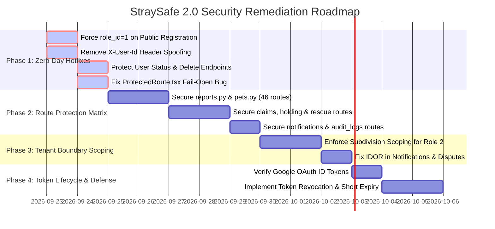

# StraySafe 2.0 — Comprehensive Security & Authentication Architecture Audit

**Audit Date:** September 2026  
**Document Version:** 2.0 (Full System Audit)  
**Target Architecture:** FastAPI (Python 3.12) + SQLAlchemy ORM + React (TypeScript / Vite) + MySQL  
**Scope:** Authentication Flow, Authorization Controls, API Endpoint Security, Identity Management, Session Lifecycle, Data Isolation & Multi-Tenancy  
**Status:** High & Critical Vulnerabilities Identified — Remediation Required  

---

## 1. Executive Summary

A comprehensive architectural and penetration-oriented security audit of the **StraySafe 2.0** repository was conducted. While the application implements foundational security utilities (such as bcrypt password hashing, JWT creation/decoding, and initial rate-limiting), **severe systemic vulnerabilities exist across the backend API, identity validation layer, and frontend session guards**.

Most critically, **the authorization layer is decoupled from almost all endpoint handlers**:
1. **Unprotected Core CRUD Operations:** Over 80% of backend endpoints (including destructive operations in reports, pet registries, holding facilities, claims, and rescue dispatches) possess **zero authentication checks**.
2. **Arbitrary User Impersonation via Header Spoofing:** Multiple modules explicitly inspect and trust the unauthenticated `X-User-Id` HTTP request header, allowing an attacker to impersonate any administrator or officer without a valid password or JWT.
3. **Unverified OAuth Identity Spoofing:** The Google authentication endpoint accepts arbitrary email addresses without validating the Google ID token signature with Google OAuth servers.
4. **Instant Admin Account Provisioning:** Public user registration blindly accepts client-supplied `role_id` and `is_head_officer` fields, allowing anyone to self-provision a System Administrator account.
5. **Fail-Open Frontend Route Guard:** The React route guard (`ProtectedRoute.tsx`) catches network errors and falls back to granting authorized access to protected views based on unverified browser storage.

### Vulnerability Summary by Severity

| Severity Level | Identified Issues | Primary Threat Vector |
| :--- | :---: | :--- |
| 🔴 **CRITICAL** | **5** | Anonymous record deletion, arbitrary role escalation, unverified OAuth spoofing, `X-User-Id` impersonation, unauthenticated account deletion |
| 🟠 **HIGH** | **3** | Fail-open frontend route guard, widespread IDOR across tenant boundaries, 7-day stateless JWT without server-side revocation |
| 🟡 **MEDIUM** | **3** | Unsigned Cloudinary upload presets, XSS-susceptible `localStorage` token storage, detailed internal database error disclosures |
| 🔵 **LOW** | **2** | Hardcoded CORS development domains, missing HTTP security headers |

---

## 2. OWASP API Security Top 10 (2023) Compliance Mapping

| OWASP API Risk | StraySafe 2.0 Status | Affected Components / Root Cause |
| :--- | :---: | :--- |
| **API1:2023 Broken Object Level Authorization (BOLA)** | ❌ **FAIL** | Endpoints in `reports.py`, `pets.py`, `notifications.py`, `holding.py`, and `claims.py` do not verify that the requester owns or is assigned to the requested entity. |
| **API2:2023 Broken Authentication** | ❌ **FAIL** | Core CRUD routes completely omit `Depends(get_current_user)`. `POST /auth/google` accepts unverified email strings. 7-day token lifetime with no revocation. |
| **API3:2023 Broken Object Property Level Authorization** | ❌ **FAIL** | Mass assignment vulnerability in `POST /users/` allows public callers to set `role_id: 4` and `is_head_officer: true`. |
| **API4:2023 Unrestricted Resource Consumption** | ⚠️ **PARTIAL** | Rate limiting is implemented on `/auth/login` (`5/minute`), but missing on report creation, image uploads, search queries, and batch match operations. |
| **API5:2023 Broken Function Level Authorization (BFLA)** | ❌ **FAIL** | Administrative functions (`DELETE /users/{id}`, `DELETE /pets/{id}/permanent`, `PATCH /users/{id}/status`) lack role checks (`role_id == 4`). |
| **API6:2023 Unrestricted Access to Sensitive Business Flows** | ❌ **FAIL** | Pet ownership claims, dispute arbitrations, and rescue dispatches can be triggered and resolved anonymously without staff verification. |
| **API7:2023 Server-Side Request Forgery (SSRF)** | 🛡️ **PASS** | Cloudinary integration uploads local multipart buffers; no open URL fetchers are exposed to end users. |
| **API8:2023 Security Misconfiguration** | ⚠️ **PARTIAL** | CORS origins hardcoded to local development ports; database exceptions leak SQL schema structure. |
| **API9:2023 Improper Inventory Management** | ⚠️ **PARTIAL** | Legacy upload routes coexist with new validation utilities; redundant endpoints without centralized versioning. |
| **API10:2023 Unsafe Consumption of APIs** | ❌ **FAIL** | `X-User-Id` request headers from untrusted clients are parsed directly into session identities. |

---

## 3. Deep-Dive Vulnerability Analysis

---

### [CRITICAL-01] Universal Absence of Authentication Dependencies on Core CRUD Handlers
* **File References:**  
  - [`backend/app/routes/reports.py`](file:///c:/Users/user/Straysafe2.0/backend/app/routes/reports.py)
  - [`backend/app/routes/pets.py`](file:///c:/Users/user/Straysafe2.0/backend/app/routes/pets.py)
  - [`backend/app/routes/holding.py`](file:///c:/Users/user/Straysafe2.0/backend/app/routes/holding.py)
  - [`backend/app/routes/claims.py`](file:///c:/Users/user/Straysafe2.0/backend/app/routes/claims.py)
  - [`backend/app/routes/rescue.py`](file:///c:/Users/user/Straysafe2.0/backend/app/routes/rescue.py)
  - [`backend/app/routes/notifications.py`](file:///c:/Users/user/Straysafe2.0/backend/app/routes/notifications.py)
  - [`backend/app/routes/announcements.py`](file:///c:/Users/user/Straysafe2.0/backend/app/routes/announcements.py)
  - [`backend/app/routes/audit_logs.py`](file:///c:/Users/user/Straysafe2.0/backend/app/routes/audit_logs.py)
* **CVSS v3.1 Score:** **9.8** (`CVSS:3.1/AV:N/AC:L/PR:N/UI:N/S:U/C:H/I:H/A:H`)

#### Technical Mechanism:
While `backend/app/utils/auth.py` provides `get_current_user`, `get_current_resident`, and `get_current_staff_or_admin`, these dependencies are **completely omitted from almost all route declarations**.

```python
# reports.py (Line 1444) — NO AUTH CHECK
@router.delete("/{report_id}")
def delete_report(report_id: int, req: Request, db: Session = Depends(get_db)):
    # Deletes report, associated matches, claims, media, and records!

# pets.py (Line 914) — NO AUTH CHECK
@router.delete("/{pet_id}/permanent")
def delete_pet_record(pet_id: int, db: Session = Depends(get_db)):
    # Purges pet and ownership data permanently!

# claims.py (Line 196) — NO AUTH CHECK
@router.patch("/{claim_id}/status", response_model=PetClaimResponse)
def update_claim_status(claim_id: int, payload: PetClaimStatusUpdate, db: Session = Depends(get_db)):
    # Approves/rejects animal ownership claims without identity check!

# audit_logs.py (Line 31) — NO AUTH CHECK
@router.get("/", response_model=List[AuditLogResponse])
def get_audit_logs(db: Session = Depends(get_db)):
    # Exposes all internal administrative logs to anonymous callers!
```

#### Exploit Demonstration:
An anonymous external attacker can wipe a live incident report with zero credentials:
```bash
curl -X DELETE "http://localhost:8000/reports/42"
```

---

### [CRITICAL-02] Arbitrary User & Admin Impersonation via `X-User-Id` Header
* **File References:**  
  - [`backend/app/routes/pets.py#L70-L92`](file:///c:/Users/user/Straysafe2.0/backend/app/routes/pets.py#L70-L92)
  - [`backend/app/routes/matches.py#L52`](file:///c:/Users/user/Straysafe2.0/backend/app/routes/matches.py#L52)
  - [`backend/app/utils/audit.py#L21-L24`](file:///c:/Users/user/Straysafe2.0/backend/app/utils/audit.py#L21-L24)
* **CVSS v3.1 Score:** **9.8** (`CVSS:3.1/AV:N/AC:L/PR:N/UI:N/S:U/C:H/I:H/A:H`)

#### Technical Mechanism:
In `pets.py` and `matches.py`, custom helper routines resolve the acting user by prioritizing the unauthenticated `X-User-Id` HTTP request header above JWT verification:
```python
# backend/app/routes/pets.py (lines 70-76)
actor_id_str = req.headers.get("x-user-id") or req.headers.get("X-User-Id")
if actor_id_str:
    try:
        user = db.query(User).filter(User.user_id == int(actor_id_str)).first()
        if user:
            return user
    except ValueError:
        pass
```
Additionally, `backend/app/utils/audit.py` extracts the actor identity from this header:
```python
# backend/app/utils/audit.py (lines 21-24)
if not actor_id:
    actor_id_str = request.headers.get("x-user-id") or request.headers.get("X-User-Id")
    if actor_id_str and actor_id_str.isdigit():
        actor_id = int(actor_id_str)
```

#### Exploit Demonstration:
An attacker sends a request with header `X-User-Id: 1` to assign pet ownership, override match disputes, or forge system audit trails under the identity of the Primary System Administrator:
```bash
curl -X POST "http://localhost:8000/pets/15/assign-owner?owner_id=99" \
     -H "X-User-Id: 1"
```

---

### [CRITICAL-03] Privilege Escalation via Open User Registration (Mass Assignment)
* **File Reference:** [`backend/app/routes/users.py#L181-L225`](file:///c:/Users/user/Straysafe2.0/backend/app/routes/users.py#L181-L225)
* **CVSS v3.1 Score:** **9.8** (`CVSS:3.1/AV:N/AC:L/PR:N/UI:N/S:U/C:H/I:H/A:H`)

#### Technical Mechanism:
`POST /users/` receives a Pydantic `UserCreate` model and calls `model_dump()`, inserting all fields into the `User` database record. The schema allows callers to supply `role_id` and `is_head_officer`. The backend does not force `role_id = 1` (Resident) on public registrations:
```python
@router.post("/", response_model=UserResponse)
def create_user(user_in: UserCreate, req: Request, db: Session = Depends(get_db)):
    ...
    user_data = user_in.model_dump()
    user_data["password"] = hashed_password
    ...
    db_user = User(**user_data)
    db.add(db_user)
    db.commit()
```

#### Exploit Demonstration:
Any internet user can immediately register an account with System Administrator privileges:
```bash
curl -X POST "http://localhost:8000/users/" \
     -H "Content-Type: application/json" \
     -d '{
       "name": "Malicious Admin",
       "email": "attacker@evil.com",
       "password": "Password123!",
       "role_id": 4,
       "is_head_officer": true
     }'
```

---

### [CRITICAL-04] Unauthenticated User Status Tampering & Permanent Account Deletion
* **File Reference:** [`backend/app/routes/users.py#L291-L343`](file:///c:/Users/user/Straysafe2.0/backend/app/routes/users.py#L291-L343)
* **CVSS v3.1 Score:** **9.1** (`CVSS:3.1/AV:N/AC:L/PR:N/UI:N/S:U/C:N/I:H/A:H`)

#### Technical Mechanism:
While `PUT /users/{user_id}` checks `current_user = Depends(get_current_user)`, the adjacent administrative management routes **have no authentication dependency at all**:
```python
# backend/app/routes/users.py: Line 291
@router.patch("/{user_id}/status", response_model=UserResponse)
def update_user_status(user_id: int, status_in: str, req: Request, db: Session = Depends(get_db)):
    # NO AUTHENTICATION CHECK! Allows deactivating or activating any user.

# backend/app/routes/users.py: Line 315
@router.delete("/{user_id}")
def delete_user(user_id: int, req: Request, db: Session = Depends(get_db)):
    # NO AUTHENTICATION CHECK! Allows deleting any user account.
```

#### Exploit Demonstration:
An unauthenticated attacker can deactivate the administrator or delete staff accounts:
```bash
curl -X PATCH "http://localhost:8000/users/1/status?status_in=Inactive"
curl -X DELETE "http://localhost:8000/users/2"
```

---

### [CRITICAL-05] Unverified Google OAuth Identity Spoofing
* **File References:**  
  - [`backend/app/routes/auth.py#L164-L245`](file:///c:/Users/user/Straysafe2.0/backend/app/routes/auth.py#L164-L245)
  - [`backend/app/schemas/auth.py#L36-L42`](file:///c:/Users/user/Straysafe2.0/backend/app/schemas/auth.py#L36-L42)
* **CVSS v3.1 Score:** **9.8** (`CVSS:3.1/AV:N/AC:L/PR:N/UI:N/S:U/C:H/I:H/A:H`)

#### Technical Mechanism:
`POST /auth/google` accepts a `GoogleAuthRequest` containing `email`, `name`, `google_id`, and `credential`. However, the backend **never validates the Google JWT (`credential`) cryptographic signature against Google's public JWKS keys**. It directly queries the database by the raw email string:
```python
@router.post("/google", response_model=LoginResponse)
def google_auth(request: GoogleAuthRequest, req: Request, db: Session = Depends(get_db)):
    email_clean = request.email.strip().lower()
    user = db.query(User).filter(User.email == email_clean).first()
    # If user exists, issues JWT access token without ANY Google signature verification!
```

#### Exploit Demonstration:
An attacker issues a POST request supplying the target victim's email. The backend immediately responds with a valid StraySafe JWT token for that user:
```bash
curl -X POST "http://localhost:8000/auth/google" \
     -H "Content-Type: application/json" \
     -d '{
       "email": "victim_resident@gmail.com",
       "name": "Victim"
     }'
```

---

### [HIGH-01] Frontend Route Guard Fail-Open Security Model
* **File Reference:** [`frontend/src/components/ProtectedRoute.tsx#L66-L89`](file:///c:/Users/user/Straysafe2.0/frontend/src/components/ProtectedRoute.tsx#L66-L89)
* **CVSS v3.1 Score:** **7.5** (`CVSS:3.1/AV:N/AC:L/PR:N/UI:N/S:U/C:H/I:N/A:N`)

#### Technical Mechanism:
When `verify()` calls `/auth/verify-session`, if a network timeout, server error, or offline state occurs, the `catch` block executes fallback logic:
```typescript
} catch (err: any) {
    if (err?.response?.status === 401 || err?.response?.status === 403) {
        clearAuthStorage();
        if (isMounted) setStatus('unauthorized');
    } else {
        // Network glitch or server error fallback
        try {
            const parsedUser = JSON.parse(rawUser);
            const roleId = parsedUser.role_id;
            if (isMounted) {
                setUserRole(roleId);
                if (allowedRoles.includes(roleId)) {
                    setStatus('authorized'); // <-- CRITICAL FAIL-OPEN BYPASS
                }
            }
        } catch { ... }
    }
}
```

#### Exploit Demonstration:
1. User visits `/admin/login`.
2. In browser DevTools console: `localStorage.setItem('admin_user', JSON.stringify({ user_id: 1, role_id: 4 })); localStorage.setItem('access_token', 'fake');`
3. Sets DevTools network mode to "Offline" or blocks `/auth/verify-session`.
4. Navigates to `/admin/dashboard`.
5. The portal marks the session as `authorized` and displays the Admin UI.

---

### [HIGH-02] Broken Multi-Tenant Boundary Enforcement & Insecure Direct Object References (IDOR)
* **File References:**  
  - [`backend/app/routes/notifications.py#L10`](file:///c:/Users/user/Straysafe2.0/backend/app/routes/notifications.py#L10)
  - [`backend/app/routes/reports.py`](file:///c:/Users/user/Straysafe2.0/backend/app/routes/reports.py)
* **CVSS v3.1 Score:** **7.1** (`CVSS:3.1/AV:N/AC:L/PR:L/UI:N/S:U/C:H/I:L/A:N`)

#### Technical Mechanism:
1. **User Notification Scoping:** `GET /notifications/user/{user_id}` returns all notifications for any arbitrary user without verifying if `current_user.user_id == user_id`.
2. **Subdivision Jurisdiction Leaks:** Subdivision Leaders (`role_id = 2`) are authorized to manage reports and assign custody, but backend endpoints do not restrict them to `report.subdivision_id == current_user.subdivision_id`. A leader in Subdivision A can modify records originating in Subdivision B.

---

### [HIGH-03] Excessive JWT Token Lifetime & Stateless Logout
* **File References:**  
  - [`backend/app/utils/auth.py#L23`](file:///c:/Users/user/Straysafe2.0/backend/app/utils/auth.py#L23)
  - [`frontend/src/utils/api.ts#L18`](file:///c:/Users/user/Straysafe2.0/frontend/src/utils/api.ts#L18)
* **CVSS v3.1 Score:** **6.5** (`CVSS:3.1/AV:N/AC:L/PR:L/UI:N/S:U/C:H/I:N/A:N`)

#### Technical Mechanism:
- `ACCESS_TOKEN_EXPIRE_DAYS = 7` (168 hours). There is no refresh token rotation mechanism.
- Frontend logout merely runs `localStorage.removeItem('access_token')`.
- No backend token revocation list or database `revoked_tokens` table exists. If a token is compromised via network logging, intermediate proxies, or browser inspection, it remains valid on the server for 7 full days.

---

### [MEDIUM-01] Client-Side Token Storage Vulnerable to XSS
* **File Reference:** [`frontend/src/utils/api.ts#L12-L35`](file:///c:/Users/user/Straysafe2.0/frontend/src/utils/api.ts#L12-L35)
* **Technical Mechanism:** JWT tokens and user objects are stored in `window.localStorage`. If any third-party script, dependency injection, or XSS vector executes JavaScript in the browser context, all stored credentials can be stolen via `document.defaultView.localStorage`.

---

### [MEDIUM-02] Unsigned Cloudinary Preset & Inconsistent Upload File Validation
* **File References:**  
  - `frontend/src/utils/cloudinaryUpload.ts`
  - [`backend/app/routes/users.py#L344-L368`](file:///c:/Users/user/Straysafe2.0/backend/app/routes/users.py#L344-L368)
* **Technical Mechanism:**
  - Frontend scripts bundle an unsigned Cloudinary upload preset (`VITE_CLOUDINARY_UPLOAD_PRESET`). Anyone can extract this preset and upload arbitrary files directly to the project's Cloudinary storage quota.
  - Endpoints like `POST /users/{user_id}/profile-picture` take raw `UploadFile` without file size limits, MIME magic byte verification, or rate limits.

---

### [MEDIUM-03] Internal Schema Disclosure in Error Payloads
* **File References:** Throughout route catch blocks (`except Exception as e: raise HTTPException(status_code=400, detail=f"Database error: {str(e)}")`).
* **Technical Mechanism:** Raw SQLAlchemy exceptions expose internal database table names, foreign key constraints, and SQL syntax errors directly to API clients.

---

## 4. Complete Route Module Security Inventory

Below is the verified audit status of all 17 FastAPI route modules:

| Router Module | Route Count | Current Auth State | Dominant Vulnerabilities | Required Protection Level |
| :--- | :---: | :---: | :--- | :--- |
| [`routes/auth.py`](file:///c:/Users/user/Straysafe2.0/backend/app/routes/auth.py) | 5 | Partial | Unverified Google OAuth; no token revocation | Add OAuth token signature verification + logout blacklist |
| [`routes/users.py`](file:///c:/Users/user/Straysafe2.0/backend/app/routes/users.py) | 9 | Broken | Open admin creation (`POST /`); unauthenticated status/delete | Enforce `role_id=1` on signup; require Admin for status & delete |
| [`routes/reports.py`](file:///c:/Users/user/Straysafe2.0/backend/app/routes/reports.py) | 26 | **None (0%)** | Anonymous report deletion, custody transfer, dispute reviews | Apply `Depends(get_current_user)` and role-based guards |
| [`routes/pets.py`](file:///c:/Users/user/Straysafe2.0/backend/app/routes/pets.py) | 20 | **Spoofable** | `X-User-Id` spoofing header; unauthenticated permanent purge | Remove `X-User-Id` header parsing; Admin-only permanent purge |
| [`routes/rescue.py`](file:///c:/Users/user/Straysafe2.0/backend/app/routes/rescue.py) | 6 | **None (0%)** | Unauthenticated team assignment & status tampering | Require Staff/Admin for team assignment and state transitions |
| [`routes/holding.py`](file:///c:/Users/user/Straysafe2.0/backend/app/routes/holding.py) | 6 | **None (0%)** | Unauthenticated facility intake, discharge, and status edits | Require Staff/Admin (`role_id in [2, 3, 4]`) |
| [`routes/claims.py`](file:///c:/Users/user/Straysafe2.0/backend/app/routes/claims.py) | 5 | **None (0%)** | Unauthenticated claim approval, rejection, and verification | Require Resident for filing; Staff/Admin for approval |
| [`routes/notifications.py`](file:///c:/Users/user/Straysafe2.0/backend/app/routes/notifications.py) | 9 | **None (0%)** | IDOR: Any user can read any other user's private alerts | Restrict to `current_user.user_id == target_user_id` or Admin |
| [`routes/announcements.py`](file:///c:/Users/user/Straysafe2.0/backend/app/routes/announcements.py) | 9 | **None (0%)** | Public creation, modification, and deletion of broadcasts | Public read; creation/edit strictly restricted to Staff/Admin |
| [`routes/audit_logs.py`](file:///c:/Users/user/Straysafe2.0/backend/app/routes/audit_logs.py) | 1 | **None (0%)** | System audit logs readable by unauthenticated callers | Restrict strictly to System Admin (`role_id == 4`) |
| [`routes/matches.py`](file:///c:/Users/user/Straysafe2.0/backend/app/routes/matches.py) | 9 | **Spoofable** | `X-User-Id` header usage; unauthenticated dispute resolution | Remove header fallback; enforce JWT identity |
| [`routes/pet_qr.py`](file:///c:/Users/user/Straysafe2.0/backend/app/routes/pet_qr.py) | 6 | Partial | Generation/download endpoints lack owner validation | Public scan view open; QR generation restricted to Pet Owner |
| [`routes/landmarks.py`](file:///c:/Users/user/Straysafe2.0/backend/app/routes/landmarks.py) | 5 | Secured | Properly checks `current_user` | None (Compliant) |
| [`routes/adoptions.py`](file:///c:/Users/user/Straysafe2.0/backend/app/routes/adoptions.py) | 12 | Secured | Properly checks `current_user` & `get_current_staff_or_admin` | Add IDOR scoping on application viewing |
| [`routes/chat.py`](file:///c:/Users/user/Straysafe2.0/backend/app/routes/chat.py) | 14 | Secured | Checks `current_user` | Ensure non-participant cannot read private thread messages |
| [`routes/warnings.py`](file:///c:/Users/user/Straysafe2.0/backend/app/routes/warnings.py) | 6 | Secured | Checks `current_user` | Verify recipient ownership on warning acknowledge |

---

## 5. Role-Based Access Control (RBAC) Matrix

StraySafe 2.0 defines 5 distinct user privilege levels:

| Role ID | Role Name | Intended Scope & Responsibilities |
| :---: | :--- | :--- |
| **1** | **Resident (Citizen)** | Report stray/lost pets, track own reports, register owned pets, submit ownership claims, chat with rescue teams. |
| **2** | **Subdivision Leader** | Verify reports within their specific subdivision, coordinate local rescues, issue local alerts. |
| **3** | **Barangay Staff** | Manage all reports, rescue teams, and holding facilities across the entire barangay. |
| **4** | **System Administrator** | Full cross-system administrative access, user account management, permanent deletions, system audit logs. |
| **3 / 5 (`is_head_officer: true`)** | **Barangay Head Officer** | Manage barangay staff assignments, oversee jurisdiction-wide escalated incidents. |

### Endpoint Authorization Enforcement Matrix

| Feature / Action | Public / Anon | Role 1 (Resident) | Role 2 (Subd Leader) | Role 3 (Brgy Staff) | Role 4 (Admin) | Head Officer |
| :--- | :---: | :---: | :---: | :---: | :---: | :---: |
| **View Public Announcements & Stray Map** | ✅ | ✅ | ✅ | ✅ | ✅ | ✅ |
| **Scan Pet QR Code** | ✅ | ✅ | ✅ | ✅ | ✅ | ✅ |
| **Public User Registration** | ✅ (Role 1 Only) | ❌ | ❌ | ❌ | ❌ | ❌ |
| **Submit Stray / Lost Pet Report** | ❌ | ✅ | ✅ | ✅ | ✅ | ✅ |
| **Edit / Delete Own Report** | ❌ | ✅ (Own Only) | ✅ (Own Only) | ✅ (All) | ✅ (All) | ✅ (All) |
| **Force Delete Any Report** | ❌ | ❌ | ❌ | ❌ | ✅ | ❌ |
| **Verify Incident / False Alarm** | ❌ | ❌ | ✅ (Own Subd) | ✅ (Barangay) | ✅ (All) | ✅ (Barangay) |
| **Transfer Report Custody** | ❌ | ❌ | ✅ (Own Subd) | ✅ (Barangay) | ✅ (All) | ✅ (Barangay) |
| **Assign Pet Owner** | ❌ | ❌ | ✅ (Unassigned) | ✅ (Unassigned) | ✅ (Any) | ✅ (Unassigned) |
| **Permanently Purge Pet Record** | ❌ | ❌ | ❌ | ❌ | ✅ | ❌ |
| **Manage Holding Facilities** | ❌ | ❌ | ❌ | ✅ | ✅ | ✅ |
| **Dispatch / Assign Rescue Team** | ❌ | ❌ | ✅ (Own Subd) | ✅ | ✅ | ✅ |
| **View System Audit Logs** | ❌ | ❌ | ❌ | ❌ | ✅ | ❌ |
| **Deactivate / Delete User Account** | ❌ | ❌ | ❌ | ❌ | ✅ | ❌ |
| **Create Staff / Officer Account** | ❌ | ❌ | ❌ | ❌ | ✅ | ✅ (Staff Only) |

---

## 6. Target Architecture & Remediation Specifications

---

### Specification 1: Standardized FastAPI Role Dependencies
**Target File:** [`backend/app/utils/auth.py`](file:///c:/Users/user/Straysafe2.0/backend/app/utils/auth.py)

Add granular role verification dependencies:
```python
from fastapi import Depends, HTTPException, status
from app.models.user import User

def require_admin(current_user: User = Depends(get_current_user)) -> User:
    """Enforces that the authenticated user is a System Administrator (role_id = 4)."""
    if current_user.role_id != 4:
        raise HTTPException(
            status_code=status.HTTP_403_FORBIDDEN,
            detail="Access forbidden: System Administrator privileges required."
        )
    return current_user

def require_staff_or_admin(current_user: User = Depends(get_current_user)) -> User:
    """Enforces that the user is a Subdivision Leader (2), Barangay Staff (3), or Admin (4)."""
    if current_user.role_id not in [2, 3, 4]:
        raise HTTPException(
            status_code=status.HTTP_403_FORBIDDEN,
            detail="Access forbidden: Staff or Administrator privileges required."
        )
    return current_user

def require_barangay_head_or_admin(current_user: User = Depends(get_current_user)) -> User:
    """Enforces that the user is an Admin or a Barangay Head Officer."""
    if current_user.role_id == 4:
        return current_user
    if current_user.role_id in [3, 5] and current_user.is_head_officer:
        return current_user
    raise HTTPException(
        status_code=status.HTTP_403_FORBIDDEN,
        detail="Access forbidden: Barangay Head Officer or Administrator privileges required."
    )
```

---

### Specification 2: Elimination of `X-User-Id` Header Spoofing
**Target Files:**  
- [`backend/app/routes/pets.py`](file:///c:/Users/user/Straysafe2.0/backend/app/routes/pets.py)
- [`backend/app/routes/matches.py`](file:///c:/Users/user/Straysafe2.0/backend/app/routes/matches.py)
- [`backend/app/utils/audit.py`](file:///c:/Users/user/Straysafe2.0/backend/app/utils/audit.py)

**Required Change:**  
Completely purge all inspections of `req.headers.get("x-user-id")`. All actor identifications MUST be derived strictly from `current_user: User = Depends(get_current_user)` or `get_optional_user(request, db)`.

In `backend/app/utils/audit.py`:
```python
# REMOVE THIS INSECURE CODE:
# actor_id_str = request.headers.get("x-user-id") ...

# REPLACE WITH:
if not actor_id and request:
    auth_header = request.headers.get("Authorization")
    if auth_header and auth_header.startswith("Bearer "):
        token = auth_header.split(" ")[1]
        payload = decode_access_token(token)
        if payload and payload.get("user_id"):
            actor_id = int(payload["user_id"])
```

---

### Specification 3: Hardening User Registration
**Target File:** [`backend/app/routes/users.py`](file:///c:/Users/user/Straysafe2.0/backend/app/routes/users.py)

**Required Change:**  
In `POST /users/`, strictly hardcode `role_id = 1` (Resident) and `is_head_officer = False`. Create a separate administrative route `POST /admin/users/create-staff` requiring `Depends(require_admin)` for staff provisioning.

```python
@router.post("/", response_model=UserResponse)
def create_user(user_in: UserCreate, req: Request, db: Session = Depends(get_db)):
    if db.query(User).filter(User.email == user_in.email).first():
        raise HTTPException(status_code=400, detail="Email already registered")
    
    hashed_password = get_password_hash(user_in.password)
    user_data = user_in.model_dump()
    user_data["password"] = hashed_password
    
    # CRITICAL: Force default Resident role for public registrations
    user_data["role_id"] = 1
    user_data["is_head_officer"] = False
    
    # Clean position inputs
    user_data.pop("position", None)
    user_data.pop("position_name", None)
    user_data["position_id"] = None
    
    db_user = User(**user_data)
    db.add(db_user)
    db.commit()
    db.refresh(db_user)
    ...
```

---

### Specification 4: Server-Side Google OAuth Token Verification
**Target File:** [`backend/app/routes/auth.py`](file:///c:/Users/user/Straysafe2.0/backend/app/routes/auth.py)

**Required Change:**  
Validate the incoming Google JWT `credential` using Google's verification library (`google.oauth2.id_token`):

```python
from google.oauth2 import id_token
from google.auth.transport import requests as google_requests

GOOGLE_CLIENT_ID = os.getenv("GOOGLE_CLIENT_ID")

@router.post("/google", response_model=LoginResponse)
def google_auth(request: GoogleAuthRequest, req: Request, db: Session = Depends(get_db)):
    if not request.credential:
        raise HTTPException(status_code=400, detail="Google credential token missing")
    
    try:
        # Cryptographically verify the Google ID token
        idinfo = id_token.verify_oauth2_token(
            request.credential, 
            google_requests.Request(), 
            GOOGLE_CLIENT_ID
        )
        email_clean = idinfo['email'].strip().lower()
    except Exception as e:
        raise HTTPException(status_code=401, detail=f"Invalid Google OAuth token: {str(e)}")
    
    # Proceed with verified email...
```

---

### Specification 5: Fail-Closed Frontend Route Guard
**Target File:** [`frontend/src/components/ProtectedRoute.tsx`](file:///c:/Users/user/Straysafe2.0/frontend/src/components/ProtectedRoute.tsx)

**Required Change:**  
Delete the unverified `localStorage` fallback in the `catch` block. If the server cannot authenticate the session, access MUST be denied:

```typescript
} catch (err: any) {
    console.error('ProtectedRoute verification failed:', err);
    clearAuthStorage();
    if (isMounted) {
        setUserRole(null);
        setStatus('unauthorized'); // STRICT FAIL-CLOSED
    }
}
```

---

### Specification 6: Token Lifecycle & Revocation
1. Reduce `ACCESS_TOKEN_EXPIRE_DAYS` from `7` to `1` day (or implement 60-minute access tokens with rotating refresh tokens).
2. Create a database model `RevokedToken(jti, revoked_at, expires_at)`.
3. Provide `POST /auth/logout` endpoint that writes the token's unique identifier (`jti`) to the revocation table.
4. Update `get_current_user` in `auth.py` to check `RevokedToken` table before returning the user.

---

## 7. Penetration Testing & Automated Verification Procedures

Run the following test scenarios to verify security posture before and after remediation:

### Test Suite 1: Anonymous Endpoint Access (Should return 401 Unauthorized)
```bash
# 1. Unauthenticated Report Deletion
curl -i -X DELETE "http://localhost:8000/reports/1"
# Expected: HTTP/1.1 401 Unauthorized

# 2. Unauthenticated Permanent Pet Purge
curl -i -X DELETE "http://localhost:8000/pets/1/permanent"
# Expected: HTTP/1.1 401 Unauthorized

# 3. Unauthenticated User Deletion
curl -i -X DELETE "http://localhost:8000/users/1"
# Expected: HTTP/1.1 401 Unauthorized

# 4. Unauthenticated User Status Deactivation
curl -i -X PATCH "http://localhost:8000/users/1/status?status_in=Inactive"
# Expected: HTTP/1.1 401 Unauthorized
```

### Test Suite 2: Privilege Escalation & Header Spoofing (Should fail)
```bash
# 1. Attempt Admin Registration
curl -i -X POST "http://localhost:8000/users/" \
     -H "Content-Type: application/json" \
     -d '{"name":"Hacker","email":"hack@test.com","password":"Password123!","role_id":4}'
# Verify DB record: MUST have role_id = 1

# 2. Attempt X-User-Id Spoofing
curl -i -X POST "http://localhost:8000/pets/1/assign-owner?owner_id=2" \
     -H "X-User-Id: 1"
# Expected: HTTP/1.1 401 Unauthorized (Header must be ignored)
```

---

## 8. Prioritized Implementation Roadmap



| Priority | Sprint | Target Deliverable | Responsible Layer |
| :---: | :---: | :--- | :--- |
| **P0** | **Sprint 1 (Day 1)** | Block admin signup; remove `X-User-Id` spoofing; secure user status/delete; fix `ProtectedRoute.tsx` | Backend + Frontend |
| **P1** | **Sprint 1 (Days 2–3)** | Enforce `Depends(get_current_user)` across `reports.py`, `pets.py`, `rescue.py`, `holding.py`, `claims.py` | Backend API |
| **P2** | **Sprint 2 (Days 4–5)** | Lock `audit_logs.py` to Admin; fix notification IDOR; enforce subdivision scoping for Role 2 leaders | Backend Authorization |
| **P3** | **Sprint 2 (Days 6–7)** | Server-side Google OAuth token verification; JWT token revocation table; reduce token expiry | Backend Auth Engine |

---

*End of Security and Authentication Audit Report.*
